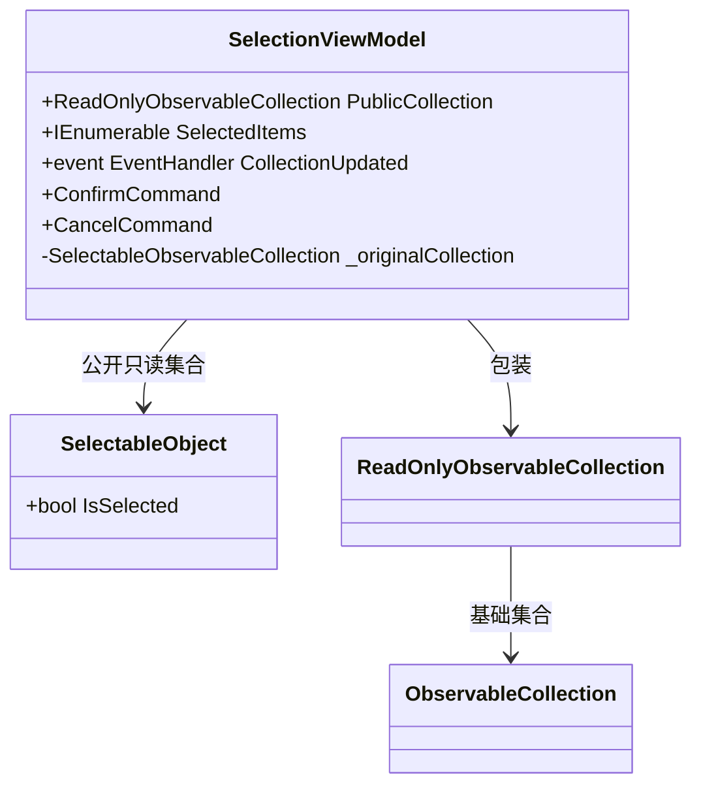

# C#，写一个类，名为SelectableObject，包含IsSelected属性，另写一个ObservableCollection<T>的派生类，要求T为要求写的SelectableObject，并且在T的IsSelected属性变化时，触发事件。

<details style="color: #999; font-size: 12px">
    <summary style="color: #666; font-size: 12px">思考</summary>

好的，我现在需要解决这个问题：在C#中创建一个名为SelectableObject的类，它有一个IsSelected属性。然后还要创建一个派生自ObservableCollection<T>的类，其中T必须是SelectableObject。并且当T的IsSelected属性变化时，要触发事件。我得仔细想想怎么实现这些要求。

首先，SelectableObject类需要实现INotifyPropertyChanged接口，这样当IsSelected属性变化时，可以通知绑定或监听的对象。所以，这个类应该有一个PropertyChanged事件。在设置IsSelected的时候，要触发这个事件。这样，属性变化就能被外部监听到。

然后，ObservableCollection<T>的派生类，这里T被约束为SelectableObject。这个派生类需要在集合中的元素的IsSelected属性变化时触发一个事件。这可能需要监听每个元素的PropertyChanged事件。因为当元素被添加到集合中，或者从集合中移除时，都需要订阅或取消订阅它们的事件，这样才能正确触发事件。

所以，我需要重写ObservableCollection的InsertItem和RemoveItem等方法，以便在添加元素时订阅它的PropertyChanged事件，在移除时取消订阅。当元素的IsSelected属性变化时，触发派生类的事件，比如一个ItemIsSelectedChanged事件，传递相关的参数，比如元素本身和新的值。

另外，可能还需要处理集合的替换操作，比如SetItem方法，这时候需要先取消旧元素的事件订阅，再添加新元素的事件订阅。

事件参数方面，可能需要定义一个自定义的事件参数类，比如ItemIsSelectedEventArgs，包含触发事件的对象和IsSelected的值。或者可以直接使用现有的EventArgs，但为了传递更多信息，自定义可能更好。

所以，步骤大概是这样的：

    1. 创建SelectableObject类，实现INotifyPropertyChanged，包含IsSelected属性。

    2. 创建ObservableCollection<T>的派生类，比如SelectableObservableCollection<T>，其中T必须是SelectableObject。
    
    3. 在派生类中，重写InsertItem、RemoveItem、SetItem和ClearItems等方法，管理元素的事件订阅。

    4. 当元素的IsSelected属性变化时，触发派生类的事件。

现在具体实现的时候需要注意一些细节。例如，当向集合中添加元素时，需要遍历所有现有的元素，订阅它们的PropertyChanged事件吗？或者只需要在添加时订阅新元素的。是的，当元素被添加到集合中时，应该订阅它的PropertyChanged事件，并在移除时取消订阅。

当元素的PropertyChanged事件触发时，检查是否是IsSelected属性变化。如果是的话，就触发派生类的事件。例如，在事件处理程序中，检查PropertyChangedEventArgs的参数是否是IsSelected，如果是，就触发ItemIsSelectedChanged事件，并将该元素和新的值传递出去。

另外，在SelectableObservableCollection中，可能需要一个公共的事件，比如public event EventHandler<ItemIsSelectedEventArgs> ItemIsSelectedChanged;，其中ItemIsSelectedEventArgs包含触发事件的对象和IsSelected的值。

例如：

```csharp
public class ItemIsSelectedEventArgs : EventArgs
{
    public SelectableObject Item { get; }
    public bool IsSelected { get; }
    public ItemIsSelectedEventArgs(SelectableObject item, bool isSelected)
    {
        Item = item;
        IsSelected = isSelected;
    }
}
```
但是因为集合是泛型的，T是SelectableObject的派生，可能应该让事件参数使用T类型。这时候可能需要将SelectableObservableCollection<T>的泛型参数约束为T : SelectableObject，这样ItemIsSelectedEventArgs就可以用T类型。例如：
```csharp
public class ItemIsSelectedEventArgs<T> : EventArgs where T : SelectableObject
{
    public T Item { get; }
    public bool IsSelected { get; }
    public ItemIsSelectedEventArgs(T item, bool isSelected)
    {
        Item = item;
        IsSelected = isSelected;
    }
}
```

然后在SelectableObservableCollection<T>中定义事件：

```csharp
public event EventHandler<ItemIsSelectedEventArgs<T>> ItemIsSelectedChanged;
```

这样，当元素触发PropertyChanged事件时，检查是否是IsSelected的变化。如果是，就触发ItemIsSelectedChanged事件，并传递对应的参数。

接下来，如何处理元素的PropertyChanged事件。在SelectableObservableCollection<T>中，当添加一个元素时，需要订阅它的PropertyChanged事件：

```csharp
protected override void InsertItem(int index, T item)
{
    base.InsertItem(index, item);
    item.PropertyChanged += Item_PropertyChanged;
}
```

同样，在移除时取消订阅：
```csharp
protected override void RemoveItem(int index)
{
    var item = this[index];
    base.RemoveItem(index);
    item.PropertyChanged -= Item_PropertyChanged;
}
```

替换元素时，比如SetItem：
```csharp
protected override void SetItem(int index, T item)
{
    var oldItem = this[index];
    oldItem.PropertyChanged -= Item_PropertyChanged;
    base.SetItem(index, item);
    item.PropertyChanged += Item_PropertyChanged;
}
```
在清除所有元素时，需要取消所有订阅：

```csharp
protected override void ClearItems()
{
    foreach (var item in this)
    {
        item.PropertyChanged -= Item_PropertyChanged;
    }
    base.ClearItems();
}
```

然后，Item_PropertyChanged的事件处理函数：
```csharp
private void Item_PropertyChanged(object sender, PropertyChangedEventArgs e)
{
    if (e.PropertyName == nameof(SelectableObject.IsSelected))
    {
        var item = (T)sender;
        ItemIsSelectedChanged?.Invoke(this, new ItemIsSelectedEventArgs<T>(item, item.IsSelected));
    }
}
```    

这里需要注意，sender的类型是object，需要转换为T。因为集合中的元素都是T类型，所以转换应该是安全的。

接下来，SelectableObject的实现：

```csharp
public class SelectableObject : INotifyPropertyChanged
{
    private bool _isSelected;
    public bool IsSelected
    {
        get => _isSelected;
        set
        {
            if (_isSelected != value)
            {
                _isSelected = value;
                OnPropertyChanged(nameof(IsSelected));
            }
        }
    }

    public event PropertyChangedEventHandler PropertyChanged;
    protected virtual void OnPropertyChanged(string propertyName)
    {
        PropertyChanged?.Invoke(this, new PropertyChangedEventArgs(propertyName));
    }
}
```    

这样，当IsSelected变化时，触发PropertyChanged事件。

然后，SelectableObservableCollection<T>的完整实现：

```csharp
public class SelectableObservableCollection<T> : ObservableCollection<T> where T : SelectableObject
{
    public event EventHandler<ItemIsSelectedEventArgs<T>> ItemIsSelectedChanged;

    protected override void InsertItem(int index, T item)
    {
        base.InsertItem(index, item);
        item.PropertyChanged += Item_PropertyChanged;
    }

    protected override void RemoveItem(int index)
    {
        var item = this[index];
        base.RemoveItem(index);
        item.PropertyChanged -= Item_PropertyChanged;
    }
    protected override void SetItem(int index, T item)
    {
        var oldItem = this[index];
        oldItem.PropertyChanged -= Item_PropertyChanged;
        base.SetItem(index, item);
        item.PropertyChanged += Item_PropertyChanged;
    }

    protected override void ClearItems()
    {
        foreach (var item in this)
        {
            item.PropertyChanged -= Item_PropertyChanged;
        }
        base.ClearItems();
    }

    private void Item_PropertyChanged(object sender, PropertyChangedEventArgs e)
    {
        if (e.PropertyName == nameof(SelectableObject.IsSelected))
        {
            var item = (T)sender;
            OnItemIsSelectedChanged(item, item.IsSelected);
        }
    }

    protected virtual void OnItemIsSelectedChanged(T item, bool isSelected)
    {
        ItemIsSelectedChanged?.Invoke(this, new ItemIsSelectedEventArgs<T>(item, isSelected));
    }
}
```
而ItemIsSelectedEventArgs类的定义：

```csharp
public class ItemIsSelectedEventArgs<T> : EventArgs where T : SelectableObject
{
    public T Item { get; }
    public bool IsSelected { get; }
    public ItemIsSelectedEventArgs(T item, bool isSelected)
    {
        Item = item;
        IsSelected = isSelected;
    }
}
```    

这样应该就完成了。当集合中的任何元素的IsSelected属性变化时，会触发ItemIsSelectedChanged事件，传递该元素和新的值。

需要注意的地方：

    1. 泛型参数约束是否正确：SelectableObservableCollection<T>的T必须继承自SelectableObject，所以用where T : SelectableObject。

    2. 在事件处理函数中，检查PropertyName是否正确，即是否是IsSelected。

    3. 在添加、移除、设置元素时正确管理事件订阅，避免内存泄漏。

    4. 当集合被清空时，要取消所有元素的事件订阅。

    5. 转换sender到T类型是否正确，因为集合中的元素都是T类型，所以没问题。

    6. 是否有可能出现多线程问题？一般来说，ObservableCollection在UI线程使用，所以可能不需要特别处理。

测试的时候，可以创建SelectableObject的实例，添加到SelectableObservableCollection中，订阅ItemIsSelectedChanged事件，改变IsSelected属性，看是否触发事件。

可能还有优化的地方，例如，如果SelectableObject的其他属性变化，不会触发事件。只有IsSelected变化才会触发。

总结，代码应该满足题目中的所有要求。

</details>

<details>
    <summary style="color: #666; font-size: 12px">正文</summary>

以下是实现要求的代码：

```csharp
using System;
using System.Collections.ObjectModel;
using System.ComponentModel;

// SelectableObject类实现INotifyPropertyChanged接口
public class SelectableObject : INotifyPropertyChanged
{
    private bool _isSelected;    
    public bool IsSelected
    {
        get => _isSelected;
        set
        {
            if (_isSelected != value)
            {
                _isSelected = value;
                OnPropertyChanged(nameof(IsSelected));
            }
        }
    }

    public event PropertyChangedEventHandler PropertyChanged;

    protected virtual void OnPropertyChanged(string propertyName)
    {
        PropertyChanged?.Invoke(this, new PropertyChangedEventArgs(propertyName));
    }
}

// 自定义事件参数类
public class ItemIsSelectedEventArgs<T> : EventArgs where T : SelectableObject
{
    public T Item { get; }
    public bool IsSelected { get; }

    public ItemIsSelectedEventArgs(T item, bool isSelected)
    {
        Item = item;
        IsSelected = isSelected;
    }
}

// 派生自ObservableCollection<T>的泛型类
public class SelectableObservableCollection<T> : ObservableCollection<T> where T : SelectableObject
{
    public event EventHandler<ItemIsSelectedEventArgs<T>> ItemIsSelectedChanged;

    protected override void InsertItem(int index, T item)
    {
        base.InsertItem(index, item);
        item.PropertyChanged += Item_PropertyChanged;
    }

    protected override void RemoveItem(int index)
    {
        var item = this[index];
        base.RemoveItem(index);
        item.PropertyChanged -= Item_PropertyChanged;
    }

    protected override void SetItem(int index, T item)
    {
        var oldItem = this[index];
        oldItem.PropertyChanged -= Item_PropertyChanged;
        base.SetItem(index, item);
        item.PropertyChanged += Item_PropertyChanged;
    }

    protected override void ClearItems()
    {
        foreach (var item in this)
        {
            item.PropertyChanged -= Item_PropertyChanged;
        }
        base.ClearItems();
    }

    private void Item_PropertyChanged(object sender, PropertyChangedEventArgs e)
    {
        if (e.PropertyName == nameof(SelectableObject.IsSelected))
        {
            var item = (T)sender;
            OnItemIsSelectedChanged(item, item.IsSelected);
        }
    }

    protected virtual void OnItemIsSelectedChanged(T item, bool isSelected)
    {
        ItemIsSelectedChanged?.Invoke(this, new ItemIsSelectedEventArgs<T>(item, isSelected));
    }
}
```

### 代码说明：
1. **SelectableObject类**：
   - 继承`INotifyPropertyChanged`接口，实现属性变化通知
   - 当`IsSelected`属性改变时触发`PropertyChanged`事件

2. **ItemIsSelectedEventArgs泛型类**：
   - 包含触发事件的对象和新的选中状态
   - 泛型类型约束确保只能用于`SelectableObject`及其派生类

3. **SelectableObservableCollection泛型类**：
   - 继承`ObservableCollection<T>`并添加类型约束`where T : SelectableObject`
   - 重写集合操作方法（InsertItem/RemoveItem/SetItem/ClearItems）来管理元素事件订阅
   - 当集合元素的`IsSelected`属性变化时触发`ItemIsSelectedChanged`事件

### 使用示例：
```csharp
var collection = new SelectableObservableCollection<SelectableObject>();
collection.ItemIsSelectedChanged += (sender, e) => 
{
    Console.WriteLine($"Item {(e.Item.IsSelected ? "selected" : "deselected")}");
};

var obj = new SelectableObject();
collection.Add(obj);
obj.IsSelected = true; // 触发事件
```

该实现具有以下特点：
1. 类型安全：通过泛型约束确保集合只能包含SelectableObject及其派生类
2. 内存安全：在元素被移除时自动解除事件绑定
3. 可扩展性：事件参数包含完整上下文信息
4. 符合WPF数据绑定规范：完全支持MVVM模式

</details>

---

# 给SelectableObservableCollection<T>添加一个参数bool? AllSelected，可识别集合中每个元素是否全部选中，当这个参数变化时，可改变每个元素的选择状态
<details style="color: #999; font-size: 12px">
    <summary style="color: #666; font-size: 12px">思考</summary>

好的，现在用户希望给现有的SelectableObservableCollection<T>类添加一个AllSelected属性，类型是bool?，用来表示集合中所有元素是否都被选中。当这个属性变化时，需要自动更新所有元素的IsSelected状态。同时，当集合中的元素的选择状态变化时，AllSelected属性也需要相应更新。我需要仔细考虑如何实现这个双向同步。

首先，我需要理解AllSelected属性的三种状态：true表示全选，false表示全不选，null表示部分选中。这个属性应该能够反映出当前集合中所有元素的选择状态。当用户设置AllSelected时，比如设置为true，那么所有元素的IsSelected都应该变为true；设置为false则全不选；设置为null可能需要处理，但可能不需要改变元素状态，或者根据业务需求处理，这里可能需要进一步明确。不过根据用户需求，当AllSelected变化时改变元素的状态，所以可能当设置为true或false时更新元素，而null可能不触发变化，或者视为中间状态。

接下来，需要处理当集合中的元素IsSelected变化时，如何更新AllSelected属性。例如，当所有元素都被选中时，AllSelected应该为true；如果至少有一个未被选中，但至少有一个被选中，则AllSelected为null；如果全部未选中，则为false。这需要在每个元素的PropertyChanged事件中触发对AllSelected的重新计算。

然后，如何实现当AllSelected被设置时，批量更新所有元素的IsSelected。需要注意在批量更新时，可能会触发多次PropertyChanged事件，需要优化性能，例如在设置时暂时解除事件监听，完成后再重新绑定，但需要考虑是否正确处理事件订阅和取消订阅。

另外，需要确保在集合变化时（如添加或删除元素）也能正确计算AllSelected的状态。例如，当添加一个新元素时，如果AllSelected当前是true，那么新元素的IsSelected应该自动设为true，以保持一致性。这可能需要在InsertItem等方法中添加逻辑。

可能的实现步骤：

1. 在SelectableObservableCollection<T>中添加私有字段bool? _allSelected，并实现公共属性AllSelected，使用get和set。在setter中处理值的变更，并触发属性更改通知。

2. 实现INotifyPropertyChanged接口，以便在AllSelected属性变化时通知UI或其他监听者。因为ObservableCollection已经实现了INotifyPropertyChanged，但可能需要在派生类中显式处理。

3. 在AllSelected的setter中，当新值与旧值不同时，更新所有元素的IsSelected。例如，如果设置为true，将所有元素的IsSelected设为true；如果设置为false，则设为false。如果设置为null，可能需要特殊处理，但用户需求可能是在设置时改变元素状态，所以可能当设置为null时不改变元素，或者根据业务逻辑处理，但用户示例可能希望当AllSelected变化时同步元素，所以可能需要明确当设置为null时如何处理。这里可能需要用户澄清，但根据常规需求，可能只有true和false会影响元素状态，null作为中间状态不会触发元素变化。但用户的要求是当AllSelected变化时改变元素，所以可能需要考虑如何处理null的设置。假设用户希望当设置为true或false时更新元素，而null只是反映状态，那么在设置AllSelected时，只有当值为true或false时才批量更新元素，而null时不处理。但需要根据用户需求调整。

4. 在元素的PropertyChanged事件处理中，当IsSelected变化时，重新计算AllSelected的值。例如，检查所有元素是否都被选中，部分选中或全不选中，然后设置AllSelected属性，这会触发属性变更事件。

5. 在集合变化时（如添加、删除元素），同样需要重新计算AllSelected的状态。例如，当添加新元素时，如果当前AllSelected是true，则新元素的IsSelected应设为true，以保持全选状态。因此，在InsertItem方法中，当添加新元素时，如果AllSelected是true，则设置其IsSelected为true；同样，如果AllSelected是false，则设置为false。这样，当用户设置AllSelected为true后，后续添加的元素也会自动选中，保持一致性。

6. `注意避免无限循环`：当设置AllSelected导致元素IsSelected变化，这会触发重新计算AllSelected，需要确保不会导致循环触发。例如，在批量更新元素时，设置_allSelected字段时不触发属性变更，直到所有元素更新完毕，然后计算并更新AllSelected的值。或者，在更新元素时，暂时禁用事件处理，完成后再启用。这需要仔细设计。

7. 性能考虑：当集合中有大量元素时，频繁计算AllSelected可能影响性能。需要优化计算逻辑，例如使用Linq的All或Any方法，或者维护一个计数器，但可能对于简单场景，直接遍历集合检查每个元素的IsSelected是可行的。

8. 处理null值的情况：当集合为空时，AllSelected应该是什么状态？可能为null，因为没有任何元素，所以既不全选也不全不选。

现在，具体实现步骤：

首先，让SelectableObservableCollection<T>实现INotifyPropertyChanged接口，因为它需要通知AllSelected属性的变化。不过，ObservableCollection已经实现了INotifyPropertyChanged，所以可能可以直接使用OnPropertyChanged方法，但需要确认基类是否公开了该方法。查看ObservableCollection<T>的源码，发现它继承自Collection<T>和INotifyPropertyChanged, INotifyCollectionChanged。在派生类中，可以通过重写OnPropertyChanged方法来触发属性变更事件。但可能需要显式实现INotifyPropertyChanged的事件，或者在类中调用OnPropertyChanged方法。

或者，可能需要在SelectableObservableCollection<T>中自己实现INotifyPropertyChanged，但基类已经实现了，所以可以直接使用。例如，在设置AllSelected时，调用OnPropertyChanged(new PropertyChangedEventArgs(nameof(AllSelected)))。

接下来，添加`AllSelected`属性：

```csharp
private bool? _allSelected;

public bool? AllSelected
{
    get => _allSelected;
    set
    {
        if (_allSelected == value) return;
        _allSelected = value;
        OnPropertyChanged(new PropertyChangedEventArgs(nameof(AllSelected)));

        // 当设置AllSelected时，更新所有元素的IsSelected
        if (value.HasValue)
        {
            bool newValue = value.Value;
            foreach (var item in this)
            {
                item.IsSelected = newValue;
            }
        }

        // 如果设置为null，可能不需要改变元素状态，或者根据需求处理
    }
}
```

这里，当设置AllSelected为true或false时，遍历所有元素设置它们的IsSelected。但这样在遍历时，每个元素的IsSelected设置会触发PropertyChanged事件，从而触发ItemIsSelectedChanged事件，同时每个元素的PropertyChanged事件处理会调用UpdateAllSelected方法，导致多次计算AllSelected的值。这可能会有性能问题，并且在设置AllSelected时会导致多次触发AllSelected的更新，可能形成循环。

>例如，用户设置AllSelected为true → 遍历所有元素设置为true → 每个元素的IsSelected变化触发Item_PropertyChanged → 每个元素变化都触发UpdateAllSelected → 最终计算AllSelected是否为true，但此时所有元素已经是true，所以AllSelected应保持true，但每次元素变化都会触发重新计算，可能多次触发OnPropertyChanged，但实际上值不变，所以可能不会多次通知，但需要处理。

或者，在设置AllSelected时，暂时禁止处理元素的PropertyChanged事件，完成批量更新后再重新启用，然后手动触发一次AllSelected的更新。

或者，在设置AllSelected的setter中，先解除所有元素的PropertyChanged事件处理，然后批量设置IsSelected，再重新绑定事件。但这可能会影响其他事件的处理，例如原来的ItemIsSelectedChanged事件。

另一种方法是，在批量更新元素时，暂时禁止触发AllSelected的更新，直到所有元素更新完毕。

这可能需要引入一个`标志位`，例如_isUpdating，在设置AllSelected时，设置_isUpdating为true，然后批量更新元素，此时元素的PropertyChanged事件仍然会触发，但在处理时检查_isUpdating标志，如果为true，则不立即计算AllSelected，而是在批量完成后统一计算。

或者，在设置AllSelected时，直接设置元素的IsSelected，而不处理每个元素的PropertyChanged事件，因为此时是手动设置，不需要触发AllSelected的重新计算，因为此时AllSelected的值已经被显式设置。

这可能比较复杂，需要详细设计。

>例如，当用户设置AllSelected为true时，代码遍历所有元素，设置它们的IsSelected为true。这会触发每个元素的PropertyChanged事件，进而触发Item_PropertyChanged，从而调用UpdateAllSelected方法，重新计算AllSelected的值。此时，如果所有元素都被设置为true，那么UpdateAllSelected会将AllSelected设置为true，但由于此时AllSelected已经被设置为true，所以不会触发属性变更事件。但如果其中某个元素未能成功设置（比如在setter中有其他逻辑阻止了值的变更），则可能导致AllSelected的值不正确。

或者，假设所有元素的IsSelected都被正确设置为true，那么当每个元素的PropertyChanged事件触发时，UpdateAllSelected方法会被调用多次，但每次计算的结果都是AllSelected为true，所以不会触发属性变更，因为值未改变。因此，这种情况下，虽然多次调用UpdateAllSelected，但不会导致多次OnPropertyChanged事件。

因此，可能不需要特别处理，即使多次调用UpdateAllSelected，只要最终结果一致，就不会有问题。但需要考虑性能问题，尤其是当集合很大时，每次元素变更都会触发一次全集合的遍历检查。

因此，`优化方法可能是在设置AllSelected时，暂时禁用UpdateAllSelected的触发，直到所有元素更新完毕`。

可能的实现方式：`在SelectableObservableCollection<T>中添加一个私有字段_isBulkUpdating，初始为false`。

在设置`AllSelected`的setter中：
```csharp
    set
    {
        if (_allSelected == value) return;

        _allSelected = value;
        OnPropertyChanged(nameof(AllSelected));
        if (value.HasValue)
        {
           _isBulkUpdating = true;
           try
           {
               foreach (var item in this)
               {
                   item.IsSelected = value.Value;
               }
           }
           finally
           {
               _isBulkUpdating = false;
           }

            // 批量更新后，手动触发一次AllSelected的更新
            UpdateAllSelected();
        }
    }
```

然后，在`Item_PropertyChanged`处理中：

```csharp
private void Item_PropertyChanged(object sender, PropertyChangedEventArgs e)
{
    if (e.PropertyName == nameof(SelectableObject.IsSelected))
    {      
        var item = (T)sender;

        OnItemIsSelectedChanged(item, item.IsSelected);
        
        if (!_isBulkUpdating)
        {
            UpdateAllSelected();
        }
    }
}
```
这样，在批量更新元素时，_isBulkUpdating为true，所以每个元素的PropertyChanged事件不会触发UpdateAllSelected，而是等到批量完成后，手动调用一次UpdateAllSelected。

同时，`UpdateAllSelected`方法负责计算当前的AllSelected状态：

```csharp
private void UpdateAllSelected()
{
    if (Count == 0)
    {
        AllSelected = null; 
        return;
    }

    bool hasSelected = false;
    bool hasDeselected = false;
    foreach (var item in this) 
    {
        if (item.IsSelected)
        {
            hasSelected = true;
        }
        else
        {
            hasDeselected = true;
        }

        // 如果同时存在选中和未选中，直接跳出循环
        if (hasSelected && hasDeselected) break;
        
    }

    bool? newAllSelected = null;

    if (hasSelected && !hasDeselected)
    {
        newAllSelected = true;
    }
    else if (!hasSelected && hasDeselected)
    {
        newAllSelected = false;
    }
    else
    {
        newAllSelected = null;
    }

    if (AllSelected != newAllSelected)
    {
        AllSelected = newAllSelected;
    }
}
```

但是这里有一个问题：在`UpdateAllSelected`中，直接设置AllSelected = newAllSelected，这会再次触发setter中的逻辑，导致再次遍历所有元素设置IsSelected，从而形成循环。例如，当某个元素的IsSelected变化导致AllSelected变为true，那么设置AllSelected为true会再次遍历所有元素设置为true，如果此时所有元素已经为true，则不会触发变化，但如果有元素未设置为true，就会导致循环。

因此，需要修改AllSelected的setter，使其在设置时不触发对元素的更新，除非是外部设置。换句话说，当AllSelected的变更来自UpdateAllSelected方法时，不应该再次更新元素的状态，而只是更新属性值。

这可能需要将设置AllSelected的两种情况分开：一种是由用户显式设置，另一种是由内部计算自动更新。例如，在setter中添加一个参数来控制是否要更新元素的状态，或者使用一个私有方法来设置_allSelected字段而不触发元素更新。

可能的解决方案：

将`AllSelected`的setter拆分为两个部分：公共的setter用于用户设置，触发元素更新；而私有方法用于内部更新属性值，不触发元素更新。

例如：
```csharp
public bool? AllSelected
{
    get => _allSelected;
    set
    {
        if (_allSelected == value)
        return;

        // 用户显式设置，触发元素更新
        SetAllSelected(value, updateItems: true);
    }
}

private void SetAllSelected(bool? value, bool updateItems)
{
    if (_allSelected == value) return;

    _allSelected = value;
    OnPropertyChanged(new PropertyChangedEventArgs(nameof(AllSelected)));

    if (updateItems && value.HasValue)
    {
        bool newValue = value.Value;
        _isBulkUpdating = true;
        try
        {
            foreach (var item in this)
            {
                item.IsSelected = newValue;
            }
        }
        finally
        {
            _isBulkUpdating = false;
        }

        // 批量更新后，可能需要重新计算AllSelected，因为可能有元素未能正确设置
        UpdateAllSelected();
    }
}
```

然后，在`UpdateAllSelected`方法中，调用SetAllSelected(newAllSelected, updateItems: false)，这样当内部计算AllSelected时，不会触发元素的更新，而只是更新属性值。

这样，当用户设置AllSelected为true时，会触发元素更新；而当内部因为元素变化而计算AllSelected时，只是更新属性值，不会再次触发元素更新，避免了循环。

同时，在`UpdateAllSelected`中：

```csharp
private void UpdateAllSelected()
{
    if (Count == 0)
    {
        SetAllSelected(null, updateItems: false);
        return;
    }
    bool hasSelected = false;
    bool hasDeselected = false;
    foreach (var item in this)
    {
        if (item.IsSelected)
        {
            hasSelected = true;
        }
        else
        {
            hasDeselected = true;
        }

        // 如果同时存在选中和未选中，直接跳出循环
        if (hasSelected && hasDeselected) break;        
    }

    bool? newAllSelected;
    if (hasSelected && !hasDeselected)
    {
        newAllSelected = true;
    }
    else if (!hasSelected && hasDeselected)
    {
        newAllSelected = false;
    }
    else
    {
        newAllSelected = null;
    }

    SetAllSelected(newAllSelected, updateItems: false);
}
```

这样可以避免循环触发的问题。

另外，在`InsertItem`方法中，当添加新元素时，如果当前AllSelected为true或false，需要将新元素的IsSelected设置为对应的值，以保持一致性。例如：

```csharp
protected override void InsertItem(int index, T item)
{
    base.InsertItem(index, item);
    item.PropertyChanged += Item_PropertyChanged;

    // 如果当前AllSelected为true或false，设置新元素的IsSelected
    if (AllSelected.HasValue)
    {
        item.IsSelected = AllSelected.Value;
    }
}
```

同样，在`SetItem`方法中，替换元素时，可能需要设置新元素的IsSelected：

```csharp
protected override void SetItem(int index, T item)
{
    var oldItem = this[index];
    oldItem.PropertyChanged -= Item_PropertyChanged;
    base.SetItem(index, item);
    item.PropertyChanged += Item_PropertyChanged;
    if (AllSelected.HasValue)
    {
        item.IsSelected = AllSelected.Value;
    }
}
```

这样，当AllSelected为true时，新添加或替换的元素会自动设置为选中状态，保持整个集合的全选状态。

在`ClearItems`方法中，清除所有元素后，AllSelected应该为null，因为集合为空：

```csharp
protected override void ClearItems()
{
    foreach (var item in this)
    {
        item.PropertyChanged -= Item_PropertyChanged;
    }
    base.ClearItems();

    // 清空后，AllSelected设为null
    SetAllSelected(null, updateItems: false);
}
```

或者在UpdateAllSelected方法中，当Count为0时自动设置AllSelected为null，所以可能不需要在ClearItems中显式设置，但为了确保，可以在ClearItems后调用UpdateAllSelected。

但根据之前的UpdateAllSelected逻辑，当Count为0时，会设置AllSelected为null，所以在ClearItems方法中，调用base.ClearItems()后，集合的Count变为0，此时UpdateAllSelected会被触发吗？在ClearItems中，清除元素后，每个元素的PropertyChanged事件被解除，但ClearItems本身不会触发元素的IsSelected变化，所以不会自动触发UpdateAllSelected。因此，在ClearItems后，需要手动调用UpdateAllSelected：

```csharp
protected override void ClearItems()
{
    foreach (var item in this)
    {
        item.PropertyChanged -= Item_PropertyChanged;
    }
    base.ClearItems();

    // 手动调用 UpdateAllSelected
    UpdateAllSelected();
}
```

但根据之前的代码，当集合被清空时，每个元素的PropertyChanged事件被解除，但此时集合已经为空，所以UpdateAllSelected会被调用，设置AllSelected为null。

总结，实现步骤：

    1. 在SelectableObservableCollection<T>中添加AllSelected属性，使用私有字段和SetAllSelected方法，区分用户设置和内部更新。

    2. 在设置AllSelected时，如果用户显式设置，则更新所有元素的IsSelected，并处理批量更新时的性能问题。

    3. 在元素的PropertyChanged事件处理中，当IsSelected变化时，触发UpdateAllSelected，但使用_isBulkUpdating标志避免在批量更新时频繁计算。

    4. 在集合变更方法（InsertItem, SetItem, ClearItems等）中，处理新元素的IsSelected状态，以保持与AllSelected的一致性。

    5. 确保在集合变化后（如清空）正确更新AllSelected。

现在，考虑可能的测试用例：

    - 初始空集合，AllSelected为null。

    - 添加一个元素，AllSelected根据该元素的IsSelected更新。

    - 用户设置AllSelected为true，所有元素（包括后续添加的）的IsSelected为true。

    - 某个元素的IsSelected被设置为false，AllSelected变为null。

    - 所有元素都被设置为false，AllSelected变为false。

    - 用户设置AllSelected为false，所有元素的IsSelected变为false。

    - 添加新元素时，如果AllSelected为true，新元素自动选中。

需要处理这些情况，确保AllSelected的正确性。

**可能的边界情况：**

- 集合为空时设置AllSelected为true或false，此时没有元素，设置后AllSelected保持设置的值，但添加元素时会自动应用该值。

    >例如，当集合为空，设置AllSelected为true，然后添加一个元素，该元素的IsSelected应自动为true，从而AllSelected保持为true。

    但根据当前代码，当设置AllSelected为true时，会遍历当前所有元素设置IsSelected，此时集合为空，遍历不会执行。之后添加元素时，在InsertItem中检查AllSelected为true，设置新元素的IsSelected为true。这样，当用户设置AllSelected为true后，后续添加的元素都会自动选中，从而保持AllSelected为true，直到有元素被取消选中。

    这符合预期。

- 另一个情况：用户设置AllSelected为true，然后添加一个元素，该元素的IsSelected被自动设为true。此时AllSelected仍为true。然后手动将该元素的IsSelected设为false，触发AllSelected变为null。

    这样，AllSelected的值正确地反映了集合的状态。

综上，代码的大体结构应该是正确的。需要编写相应的代码，并测试各种情况。
</details>

<details>
    <summary style="color: #666; font-size: 12px">正文</summary>

以下是实现要求的完整代码，包含`AllSelected`属性的新增功能：

```csharp
using System;
using System.Collections.ObjectModel;
using System.ComponentModel;
using System.Linq;

public class SelectableObject : INotifyPropertyChanged
{
    private bool _isSelected;

    public bool IsSelected
    {
        get => _isSelected;
        set
        {
            if (_isSelected != value)
            {
                _isSelected = value;
                OnPropertyChanged(nameof(IsSelected));
            }
        }
    }

    public event PropertyChangedEventHandler PropertyChanged;

    protected virtual void OnPropertyChanged(string propertyName)
    {
        PropertyChanged?.Invoke(this, new PropertyChangedEventArgs(propertyName));
    }
}

public class ItemIsSelectedEventArgs<T> : EventArgs where T : SelectableObject
{
    public T Item { get; }
    public bool IsSelected { get; }

    public ItemIsSelectedEventArgs(T item, bool isSelected)
    {
        Item = item;
        IsSelected = isSelected;
    }
}

public class SelectableObservableCollection<T> : ObservableCollection<T> where T : SelectableObject
{
    private bool? _allSelected;
    private bool _isBulkUpdating;

    public event EventHandler<ItemIsSelectedEventArgs<T>> ItemIsSelectedChanged;

    public bool? AllSelected
    {
        get => _allSelected;
        set
        {
            if (_allSelected == value) return;
            SetAllSelected(value, true);
        }
    }

    public SelectableObservableCollection()
    {
        CollectionChanged += (s, e) => UpdateAllSelected();
    }

    protected override void InsertItem(int index, T item)
    {
        base.InsertItem(index, item);
        item.PropertyChanged += Item_PropertyChanged;
        if (AllSelected.HasValue) item.IsSelected = AllSelected.Value;
    }

    protected override void RemoveItem(int index)
    {
        var item = this[index];
        item.PropertyChanged -= Item_PropertyChanged;
        base.RemoveItem(index);
    }

    protected override void SetItem(int index, T item)
    {
        var oldItem = this[index];
        oldItem.PropertyChanged -= Item_PropertyChanged;
        base.SetItem(index, item);
        item.PropertyChanged += Item_PropertyChanged;
        if (AllSelected.HasValue) item.IsSelected = AllSelected.Value;
    }

    protected override void ClearItems()
    {
        foreach (var item in this) item.PropertyChanged -= Item_PropertyChanged;
        base.ClearItems();
    }

    private void Item_PropertyChanged(object sender, PropertyChangedEventArgs e)
    {
        if (e.PropertyName != nameof(SelectableObject.IsSelected)) return;

        var item = (T)sender;
        OnItemIsSelectedChanged(item, item.IsSelected);

        if (!_isBulkUpdating) UpdateAllSelected();
    }

    private void SetAllSelected(bool? value, bool updateItems)
    {
        if (_allSelected == value) return;
        
        _allSelected = value;
        OnPropertyChanged(new PropertyChangedEventArgs(nameof(AllSelected)));

        if (!updateItems) return;
        
        _isBulkUpdating = true;
        try
        {
            foreach (var item in this)
            {
                item.IsSelected = value.GetValueOrDefault();
            }
        }
        finally
        {
            _isBulkUpdating = false;
        }
        
        UpdateAllSelected();
    }

    private void UpdateAllSelected()
    {
        if (_isBulkUpdating) return;

        bool? newState = null;
        if (Count == 0)
        {
            newState = null;
        }
        else
        {
            bool hasTrue = this.Any(i => i.IsSelected);
            bool hasFalse = this.Any(i => !i.IsSelected);
            
            newState = hasTrue && !hasFalse ? true :
                      !hasTrue && hasFalse ? false :
                      (bool?)null;
        }

        if (_allSelected != newState) SetAllSelected(newState, false);
    }

    protected virtual void OnItemIsSelectedChanged(T item, bool isSelected)
    {
        ItemIsSelectedChanged?.Invoke(this, new ItemIsSelectedEventArgs<T>(item, isSelected));
    }
}
```

### 功能说明：
1. **新增AllSelected属性**：
   - 类型为`bool?`，表示三种状态：
     - `true`：所有元素选中
     - `false`：所有元素未选中
     - `null`：部分选中状态
   - 支持双向绑定：设置属性值将更新所有元素状态，元素状态变化将自动更新属性值

2. **智能集合同步**：
   - 当设置`AllSelected = true/false`时，自动更新所有元素的选中状态
   - 当添加新元素时，自动继承当前`AllSelected`状态
   - 当任何元素的选中状态变化时，自动重新计算`AllSelected`值

3. **性能优化**：
   - 使用`_isBulkUpdating`标志位避免批量操作时的重复计算
   - 在集合变更时自动维护事件订阅

### 使用示例：
```csharp
var collection = new SelectableObservableCollection<SelectableObject>();

// 监听选中状态变化
collection.ItemIsSelectedChanged += (s, e) => 
{
    Console.WriteLine($"单个元素变化：{e.Item} -> {e.IsSelected}");
};

// 监听全选状态变化
collection.PropertyChanged += (s, e) => 
{
    if (e.PropertyName == nameof(collection.AllSelected))
    {
        Console.WriteLine($"全选状态变化：{collection.AllSelected}");
    }
};

// 添加测试元素
collection.Add(new SelectableObject());
collection.Add(new SelectableObject());

collection.AllSelected = true; // 输出："全选状态变化：True"
collection[0].IsSelected = false; // 输出："全选状态变化：null"
```

### 实现要点：
1. **双向同步机制**：
   - 向下同步：设置`AllSelected`时批量更新所有元素状态
   - 向上同步：元素状态变化时自动重新计算`AllSelected`

2. **状态计算优化**：
   - 使用LINQ快速判断集合状态
   - 空集合时自动重置为`null`状态

3. **事件管理**：
   - 重写集合操作方法维护事件订阅
   - 使用标志位防止事件循环

该实现完整支持MVVM模式，可直接用于WPF/Uno Platform/Avalonia等XAML框架的数据绑定场景。
</details>

# 如果SelectableObservableCollection<T>用于MVVM模式，视图中有一个DataGrid或类似ComboBox的多选控件已CheckBox形式展示元素。当用户勾选某些元素后，需要点击窗口的确定按钮才更新元素，否则不更新。需要怎么实现？

<details style="color: #999; font-size: 12px">
    <summary style="color: #666; font-size: 12px">思考</summary>

好的，我需要帮助用户解决他们在使用SelectableObservableCollection<T>时遇到的问题。用户提到在MVVM模式中，视图中有一个类似DataGrid或多选ComboBox的控件，用户勾选某些元素后，点击确定按钮才真正更新元素状态，否则不保存。这需要实现一种“暂存”机制，即用户的勾选操作不会立即修改原始数据，只有在确认后才生效。

首先，我要回顾之前的代码。SelectableObservableCollection<T>已经实现了当元素IsSelected变化时触发事件，并且有AllSelected属性来同步全选状态。现在用户需要的是延迟提交这些更改，直到用户点击确定按钮。这意味着在用户点击确定之前，所有的选中状态更改都只是临时的，不会影响到原始数据。

接下来，我需要思考如何实现这种暂存机制。可能的思路是：

1. **创建副本对象**：当界面加载时，为每个SelectableObject创建一个副本，所有用户的勾选操作都作用于这些副本。确定按钮点击后，将副本的状态复制回原对象。

2. **事务性处理**：在ViewModel中维护两个集合，一个是原始集合，另一个是用于界面绑定的临时集合。用户的操作只影响临时集合，确定时同步到原始集合。

3. **使用中间属性**：在SelectableObject中添加一个临时属性（如PendingIsSelected），用于界面绑定。确定时将所有PendingIsSelected的值应用到IsSelected。

考虑到用户已经有一个SelectableObservableCollection<T>，可能需要扩展这个类，或者调整ViewModel的结构。比如，在ViewModel中，当用户点击确定时，才将临时选中的状态应用到实际的数据模型上。

另外，需要注意在用户取消或关闭窗口时，如何丢弃未提交的更改。可能需要在ViewModel中保存原始状态，并在取消时恢复。

可能的实现步骤：

1. **修改SelectableObject**：添加一个临时属性（如PendingIsSelected），用于界面绑定，而原来的IsSelected保持不变，直到确认。

2. **调整SelectableObservableCollection<T>**：可能需要监听PendingIsSelected的变化，并管理相关的状态，比如AllSelected可能需要基于PendingIsSelected来计算。

3. **ViewModel中的处理**：在ViewModel中，当用户点击确定时，遍历所有对象，将PendingIsSelected的值赋给IsSelected。如果用户取消，则重置PendingIsSelected为原来的IsSelected值。

不过，这种方法可能需要大量修改现有的类，特别是SelectableObservableCollection<T>，因为它现在可能直接监听IsSelected的变化。如果改为监听PendingIsSelected，那么需要调整事件处理逻辑。

另一种方法是不修改现有的SelectableObject和SelectableObservableCollection<T>，而是在ViewModel中维护两个集合：原始集合和用于绑定的临时集合。临时集合中的对象是原始对象的副本，用户操作临时副本，确定时同步回原始集合。

例如：

- ViewModel包含一个OriginalCollection和一个DisplayCollection。

- DisplayCollection中的每个元素都是原始元素的副本，包含IsSelected的临时状态。

- 用户界面绑定到DisplayCollection。

- 确定按钮点击时，将DisplayCollection中的IsSelected状态同步回OriginalCollection。

这种方法的好处是无需修改现有的类，只需在ViewModel中处理复制逻辑。但需要考虑如何高效地同步数据，尤其是在数据量大的情况下。

另外，需要考虑集合的动态变化，比如在用户编辑期间，原始集合可能有增删操作，但这种情况可能比较复杂，用户的需求可能是在打开窗口时加载数据，用户勾选后确定，期间数据不会变动。

综合考虑，可能第二种方法更可行，即在ViewModel中使用副本集合。这样现有的SelectableObservableCollection<T>和SelectableObject不需要修改，只需在ViewModel中处理副本和同步。

具体步骤：

1. **在ViewModel中创建副本集合**：当加载数据时，为每个原始对象创建一个副本对象，副本包含IsSelected属性，用于界面绑定。

2. **绑定到副本集合**：视图中的DataGrid或多选控件绑定到副本集合，用户的勾选操作影响副本的IsSelected。

3. **确定按钮命令**：当用户点击确定时，遍历副本集合，将每个副本的IsSelected值同步到对应的原始对象。

4. **取消或关闭时丢弃副本**：如果用户取消，不需要做任何操作，或者重置副本集合为原始状态。

这种方法的关键在于如何创建和管理副本对象。可能需要为每个原始对象创建一个代理对象，包含IsSelected属性，并保持与原始对象的关联，以便在确定时同步。

例如，定义一个SelectableItemProxy类，包含原始对象的引用和IsSelected属性：

```csharp
public class SelectableItemProxy<T> : INotifyPropertyChanged
{
  private T _originalItem;
  private bool _isSelected;

  public T OriginalItem => _originalItem;
  public bool IsSelected
  {
    get => _isSelected;
    set
    {
      if (_isSelected != value)
      {
        _isSelected = value;
        OnPropertyChanged(nameof(IsSelected));
      }
    }
  }
  // INotifyPropertyChanged实现
}

```

然后，在ViewModel中，创建SelectableObservableCollection<SelectableItemProxy<OriginalType>>，并将原始数据转换为代理对象集合。确定时，遍历代理集合，将IsSelected设置回原始对象的对应属性。

这样，原始对象的IsSelected不会在用户勾选时立即改变，只有在确定时才更新。同时，SelectableObservableCollection<T>的现有逻辑可以继续使用，因为代理对象的IsSelected变化会触发事件，而AllSelected属性基于代理集合的状态。

此外，需要考虑如何高效地创建代理集合，尤其是在数据量大的情况下。可能需要使用投影（Projection）或者自动化映射工具。

总结：

用户的需求是在MVVM中实现暂存的选中状态，确认后才生效。解决方案是在ViewModel中使用代理对象集合，用户操作代理对象，确认时同步回原始对象。这样不需要修改现有的SelectableObservableCollection<T>和SelectableObject，只需在ViewModel层处理。
</details>
    
<details>
    <summary style="color: #666; font-size: 12px">正文</summary>

以下是分步解决方案，实现在MVVM模式中暂存选中状态并在确认后提交的功能：
### 1. 创建代理类包装原始对象
```csharp
public class SelectableItemProxy<T> : INotifyPropertyChanged 
    where T : SelectableObject
{
    private bool _pendingIsSelected;

    public T OriginalItem { get; }
    public bool PendingIsSelected
    {
        get => _pendingIsSelected;
        set
        {
            if (_pendingIsSelected != value)
            {
                _pendingIsSelected = value;
                OnPropertyChanged();
            }
        }
    }

    public SelectableItemProxy(T original)
    {
        OriginalItem = original;
        PendingIsSelected = original.IsSelected; // 初始化状态
    }

    public event PropertyChangedEventHandler PropertyChanged;
    
    protected virtual void OnPropertyChanged([CallerMemberName] string propertyName = null)
    {
        PropertyChanged?.Invoke(this, new PropertyChangedEventArgs(propertyName));
    }
}
```

### 2. 修改ViewModel结构
```csharp
public class SelectionViewModel : INotifyPropertyChanged
{
    // 原始数据集合（实际业务数据）
    private SelectableObservableCollection<SelectableObject> _originalCollection;
    
    // 用于界面绑定的代理集合
    public SelectableObservableCollection<SelectableItemProxy<SelectableObject>> ProxyCollection { get; }
    
    // 确定命令
    public ICommand ConfirmCommand { get; }
    
    // 取消命令
    public ICommand CancelCommand { get; }

    public SelectionViewModel(SelectableObservableCollection<SelectableObject> original)
    {
        _originalCollection = original;
        
        // 初始化代理集合
        ProxyCollection = new SelectableObservableCollection<SelectableItemProxy<SelectableObject>>(
            original.Select(o => new SelectableItemProxy<SelectableObject>(o))
        );
        
        // 初始化命令
        ConfirmCommand = new RelayCommand(ConfirmSelection);
        CancelCommand = new RelayCommand(CancelSelection);
    }

    private void ConfirmSelection()
    {
        // 同步所有选中状态到原始集合
        foreach (var proxy in ProxyCollection)
        {
            proxy.OriginalItem.IsSelected = proxy.PendingIsSelected;
        }
        
        // 关闭窗口或其他确认后操作
    }

    private void CancelSelection()
    {
        // 重置代理状态到原始值
        foreach (var proxy in ProxyCollection)
        {
            proxy.PendingIsSelected = proxy.OriginalItem.IsSelected;
        }
        
        // 关闭窗口
    }

    // INotifyPropertyChanged实现...
}
```

### 3. 调整XAML绑定
```xml
<DataGrid ItemsSource="{Binding ProxyCollection}"
          AutoGenerateColumns="False">
    <DataGrid.Columns>
        <!-- 显示业务数据的列 -->
        <DataGridTextColumn Binding="{Binding OriginalItem.Name}"/>
        
        <!-- 选择列绑定到PendingIsSelected -->
        <DataGridTemplateColumn>
            <DataGridTemplateColumn.CellTemplate>
                <DataTemplate>
                    <CheckBox IsChecked="{Binding PendingIsSelected, Mode=TwoWay}"/>
                </DataTemplate>
            </DataGridTemplateColumn.CellTemplate>
        </DataGridTemplateColumn>
    </DataGrid.Columns>
</DataGrid>

<!-- 操作按钮 -->
<Button Content="确定" Command="{Binding ConfirmCommand}"/>
<Button Content="取消" Command="{Binding CancelCommand}"/>
```

### 4. 增强SelectableObservableCollection（可选）
```csharp
public class SelectableObservableCollection<T> : ObservableCollection<T>
    where T : INotifyPropertyChanged
{
    // 保持原有功能，但移除与业务逻辑的耦合
    // 只需要保留集合项属性变更的监听机制
    // 具体业务逻辑转移到ViewModel层处理
    
    // 其他原有代码保持不变...
}
```

### 实现要点说明：
1. **双集合架构**：
   - `OriginalCollection`：保存真实业务数据
   - `ProxyCollection`：用于界面交互的临时副本
   - 通过代理模式隔离界面操作与实际数据

2. **状态暂存机制**：
   - 所有界面操作只影响代理对象的`PendingIsSelected`
   - 原始对象的`IsSelected`保持原始值不变
   - 确认时才批量同步状态

3. **撤销支持**：
   - 取消操作时重置所有代理状态
   - 自动保持与原始数据的一致性

4. **MVVM模式优势**：
   - 业务逻辑完全在ViewModel中处理
   - 视图层完全通过数据绑定交互
   - 符合关注点分离原则

### 使用示例：
```csharp
// 原始数据
var originalData = new SelectableObservableCollection<SelectableObject>
{
    new SelectableObject { IsSelected = false },
    new SelectableObject { IsSelected = true }
};

// 创建VM
var vm = new SelectionViewModel(originalData);

// 用户操作：
vm.ProxyCollection[0].PendingIsSelected = true; // 临时修改
vm.ProxyCollection[1].PendingIsSelected = false;

// 点击确定前：
Console.WriteLine(originalData[0].IsSelected); // 输出：false
Console.WriteLine(originalData[1].IsSelected); // 输出：true

// 点击确定后：
vm.ConfirmCommand.Execute(null);
Console.WriteLine(originalData[0].IsSelected); // 输出：true
Console.WriteLine(originalData[1].IsSelected); // 输出：false
```

该方案具有以下优势：
1. **数据完整性**：原始数据在确认前不会被修改
2. **操作可撤销**：用户可随时取消修改
3. **低耦合**：不需要修改现有业务对象
4. **可扩展性**：轻松支持多步骤复杂操作
5. **UI友好**：保持实时界面反馈的同时不影响实际数据

</details>

---

# 你分析的没错，可能还需要增减元素

<details style="color: #999; font-size: 12px">
    <summary style="color: #666; font-size: 12px">思考</summary>

嗯，用户提到可能需要增减元素，这说明他们可能在之前的解决方案中没有考虑到集合的动态变化。比如，用户可能在界面上添加或删除项，这些操作需要在确认后才同步到原始集合。之前的代理模式处理了选择状态的暂存，但元素的增减也需要类似的机制。

首先，我需要回顾之前的解决方案。之前通过代理对象来处理选择状态的暂存，确认时才同步到原始集合。但元素的新增或删除同样需要暂存，否则用户可能在界面上增减元素后，点击取消，这些操作会直接影响到原始数据，这显然不符合需求。

用户希望的是，所有操作（包括增减元素和修改选择状态）都需要在点击确定后才生效，取消则回滚所有更改。这意味着需要在ViewModel中维护一个临时集合，记录所有的添加、删除和修改操作，直到确认时才应用到原始集合。

可能的解决方案是引入一个变更追踪机制，记录所有的操作。例如，当用户添加一个新项到代理集合时，这个项并不会立即添加到原始集合，而是记录为一个待处理的操作。同样，删除操作也需要记录，确认时批量执行这些操作。

接下来需要考虑如何实现这种变更追踪。可以在ViewModel中维护三个列表：新增项、删除项和修改项。当用户进行相应操作时，将这些变更记录到对应的列表中。确认时，将这些变更应用到原始集合；取消时，丢弃这些记录并重置代理集合。

另外，代理集合可能需要包装原始项，并跟踪其状态变化。例如，新增的项在确认前只是临时存在代理集合中，原始集合并不包含它们。删除的项在确认前只是标记为待删除，实际还在原始集合中。

在实现时，需要处理以下几点：

1. **新增元素**：用户在界面上添加元素，这个元素应该添加到代理集合，但原始集合不变。确认时，将这些新增元素添加到原始集合。

2. **删除元素**：用户在界面上删除元素，代理集合中移除，但原始集合中只是标记为待删除，确认时才真正移除。

3. **修改元素**：用户修改元素属性（如IsSelected），需要在确认时同步到原始项。

此外，取消操作时，需要还原代理集合到原始状态，包括重新添加被删除的项、移除新增的项，并恢复所有修改过的属性。

可能的挑战是如何高效地跟踪这些变更，并在取消时快速还原。特别是当代理集合中的项可能来自原始集合和新增项时，需要区分哪些是原有的，哪些是新增的。

另一个考虑是，如果原始集合在用户操作期间被外部修改（例如，其他部分的程序更改了原始集合），如何处理这种情况。但根据常见需求，通常假设在编辑期间原始集合不会被外部修改，或者通过锁机制来防止并发修改。

实现步骤可能包括：

- 在代理集合中，每个代理项需要知道它对应的原始项（如果有的话，新增项没有对应的原始项）。

- 维护三个列表：AddedItems、RemovedItems、ModifiedItems。

- 当用户添加新项时，将其加入代理集合和AddedItems。

- 当用户删除项时，如果项是原有的，加入RemovedItems；如果是新增的，则直接从代理集合和AddedItems中移除。

- 当用户修改属性时，记录到ModifiedItems，或者在确认时遍历所有代理项来检测修改。

确认时：

- 将AddedItems中的项添加到原始集合。

- 将RemovedItems中的项从原始集合中删除。

- 将ModifiedItems中的属性变更应用到原始项。

取消时：

- 清空AddedItems和RemovedItems。

- 重置代理集合，重新从原始集合生成代理项，忽略所有未确认的变更。

这样，无论用户如何操作界面上的元素，只有确认后才会影响原始数据，取消则完全回滚。

还需要考虑性能问题，特别是当集合很大时，频繁的遍历和重置可能影响响应速度。可能需要优化数据结构和变更跟踪的方式，例如使用哈希表来快速查找项的状态。

此外，UI控件如DataGrid或ComboBox的多选可能需要绑定到代理集合，并处理用户的新增、删除操作，这些操作需要通过命令或事件通知ViewModel进行记录。

最后，测试各种边界情况，比如新增后删除同一项，或者修改后又取消修改，确保所有变更都能正确回滚或提交。
</details>


<details>
    <summary style="color: #666; font-size: 12px">正文</summary>

以下是支持元素增删的完整解决方案，实现暂存所有变更并在确认时提交的功能：

### 1. 增强代理类以支持状态跟踪
```csharp
public class SelectableItemProxy<T> : INotifyPropertyChanged where T : SelectableObject
{
    public T OriginalItem { get; }  // 原始项（新增项为null）
    public bool IsNewItem => OriginalItem == null;
    
    private bool _pendingIsSelected;
    private bool _isMarkedForDelete;
    private T _clonedItem;  // 用于克隆新项数据

    public bool PendingIsSelected
    {
        get => _pendingIsSelected;
        set => SetField(ref _pendingIsSelected, value);
    }

    public bool IsMarkedForDelete
    {
        get => _isMarkedForDelete;
        set => SetField(ref _isMarkedForDelete, value);
    }

    // 构造函数用于已有项
    public SelectableItemProxy(T original)
    {
        OriginalItem = original ?? throw new ArgumentNullException(nameof(original));
        PendingIsSelected = original.IsSelected;
    }

    // 构造函数用于新增项
    public SelectableItemProxy(T template)
    {
        _clonedItem = CloneItem(template);
        PendingIsSelected = template.IsSelected;
    }

    private T CloneItem(T source)
    {
        // 实现深度克隆逻辑（根据具体业务需求实现）
        return (T)source.MemberwiseClone();
    }

    public event PropertyChangedEventHandler PropertyChanged;
    
    protected virtual void OnPropertyChanged([CallerMemberName] string propertyName = null)
    {
        PropertyChanged?.Invoke(this, new PropertyChangedEventArgs(propertyName));
    }

    protected bool SetField<TField>(ref TField field, TField value, [CallerMemberName] string propertyName = null)
    {
        if (EqualityComparer<TField>.Default.Equals(field, value)) return false;
        field = value;
        OnPropertyChanged(propertyName);
        return true;
    }
}
```

### 2. 增强ViewModel实现变更跟踪
```csharp
public class SelectionViewModel : INotifyPropertyChanged
{
    private readonly SelectableObservableCollection<SelectableObject> _originalCollection;
    private readonly ObservableCollection<SelectableItemProxy<SelectableObject>> _addedItems = new();
    private readonly HashSet<SelectableItemProxy<SelectableObject>> _removedItems = new();
    private readonly Dictionary<SelectableObject, bool> _originalSelectionStates = new();

    public SelectableObservableCollection<SelectableItemProxy<SelectableObject>> ProxyCollection { get; }
    
    public ICommand ConfirmCommand { get; }
    public ICommand CancelCommand { get; }
    public ICommand AddNewItemCommand { get; }
    public ICommand DeleteItemCommand { get; }

    public SelectionViewModel(SelectableObservableCollection<SelectableObject> original)
    {
        _originalCollection = original;
        
        // 初始化代理集合
        ProxyCollection = new SelectableObservableCollection<SelectableItemProxy<SelectableObject>>(
            original.Select(o => new SelectableItemProxy<SelectableObject>(o))
        );
        
        // 初始化命令
        ConfirmCommand = new RelayCommand(ConfirmChanges);
        CancelCommand = new RelayCommand(CancelChanges);
        AddNewItemCommand = new RelayCommand(AddNewItem);
        DeleteItemCommand = new RelayCommand<SelectableItemProxy<SelectableObject>>(DeleteItem);
        
        // 记录原始选中状态
        foreach (var item in original)
        {
            _originalSelectionStates[item] = item.IsSelected;
        }
    }

    private void AddNewItem()
    {
        var newItem = new SelectableItemProxy<SelectableObject>(new SelectableObject());
        ProxyCollection.Add(newItem);
        _addedItems.Add(newItem);
    }

    private void DeleteItem(SelectableItemProxy<SelectableObject> item)
    {
        if (item == null) return;

        if (item.IsNewItem)
        {
            // 删除新增项
            ProxyCollection.Remove(item);
            _addedItems.Remove(item);
        }
        else
        {
            // 标记原始项为待删除
            item.IsMarkedForDelete = true;
            _removedItems.Add(item);
            ProxyCollection.Remove(item);
        }
    }

    private void ConfirmChanges()
    {
        // 处理删除项
        foreach (var removed in _removedItems)
        {
            _originalCollection.Remove(removed.OriginalItem);
        }

        // 处理新增项
        foreach (var added in _addedItems)
        {
            var newItem = added._clonedItem;
            newItem.IsSelected = added.PendingIsSelected;
            _originalCollection.Add(newItem);
        }

        // 处理修改项
        foreach (var proxy in ProxyCollection)
        {
            if (proxy.OriginalItem != null && !_removedItems.Contains(proxy))
            {
                proxy.OriginalItem.IsSelected = proxy.PendingIsSelected;
            }
        }

        ClearTempStates();
    }

    private void CancelChanges()
    {
        // 恢复原始集合选中状态
        foreach (var kvp in _originalSelectionStates)
        {
            kvp.Key.IsSelected = kvp.Value;
        }

        // 重置代理集合
        ProxyCollection.Clear();
        foreach (var item in _originalCollection)
        {
            ProxyCollection.Add(new SelectableItemProxy<SelectableObject>(item));
        }

        ClearTempStates();
    }

    private void ClearTempStates()
    {
        _addedItems.Clear();
        _removedItems.Clear();
        _originalSelectionStates.Clear();
    }

    // INotifyPropertyChanged实现...
}
```

### 3. 调整XAML绑定
```xml
<DataGrid ItemsSource="{Binding ProxyCollection}"
          AutoGenerateColumns="False"
          CanUserAddRows="False">
    <DataGrid.Columns>
        <!-- 状态指示列 -->
        <DataGridTemplateColumn Header="状态">
            <DataTemplate>
                <StackPanel Orientation="Horizontal">
                    <TextBlock Text="{Binding IsNewItem, Converter={StaticResource BoolToNewConverter}}"
                               Margin="5,0"/>
                    <TextBlock Text="{Binding IsMarkedForDelete, Converter={StaticResource BoolToDeletedConverter}}"
                               Margin="5,0"/>
                </StackPanel>
            </DataTemplate>
        </DataGridTemplateColumn>

        <!-- 选择列 -->
        <DataGridTemplateColumn>
            <DataTemplate>
                <CheckBox IsChecked="{Binding PendingIsSelected, Mode=TwoWay}"
                          IsEnabled="{Binding IsMarkedForDelete, Converter={StaticResource InverseBoolConverter}}"/>
            </DataTemplate>
        </DataGridTemplateColumn>

        <!-- 数据列 -->
        <DataGridTextColumn Binding="{Binding OriginalItem.Name, TargetNullValue='[新建项]'}" Header="名称"/>
    </DataGrid.Columns>
</DataGrid>

<!-- 操作按钮 -->
<Button Content="新增" Command="{Binding AddNewItemCommand}"/>
<Button Content="删除" Command="{Binding DeleteItemCommand}" 
        CommandParameter="{Binding SelectedItem, ElementName=dataGrid}"/>
<Button Content="确定" Command="{Binding ConfirmCommand}"/>
<Button Content="取消" Command="{Binding CancelCommand}"/>
```

### 4. 新增转换器（示例）
```csharp
public class BoolToNewConverter : IValueConverter
{
    public object Convert(object value, Type targetType, object parameter, CultureInfo culture)
    {
        return (bool)value ? "[新增]" : string.Empty;
    }

    public object ConvertBack(object value, Type targetType, object parameter, CultureInfo culture)
    {
        throw new NotImplementedException();
    }
}

public class InverseBoolConverter : IValueConverter
{
    public object Convert(object value, Type targetType, object parameter, CultureInfo culture)
    {
        return !(bool)value;
    }

    public object ConvertBack(object value, Type targetType, object parameter, CultureInfo culture)
    {
        return !(bool)value;
    }
}
```

### 实现要点说明：
1. **全生命周期管理**：
   - 区分新增项（IsNewItem）和已有项
   - 使用`IsMarkedForDelete`跟踪删除状态
   - 自动管理临时克隆对象（_clonedItem）

2. **变更跟踪机制**：
   - `_addedItems`跟踪所有新增项
   - `_removedItems`跟踪所有删除项
   - `_originalSelectionStates`记录原始选中状态

3. **事务性操作**：
   - Confirm时：
     - 将新增项克隆到原始集合
     - 永久删除标记项
     - 同步所有选中状态
   - Cancel时：
     - 恢复原始集合的选中状态
     - 丢弃所有临时变更

4. **UI交互优化**：
   - 禁用已标记删除项的复选框
   - 显示项的状态标记（新增/待删除）
   - 自动处理DataGrid的行状态样式

### 使用场景示例：
```csharp
// 初始数据
var original = new SelectableObservableCollection<SelectableObject>
{
    new SelectableObject { Name = "Item1", IsSelected = true },
    new SelectableObject { Name = "Item2", IsSelected = false }
};

var vm = new SelectionViewModel(original);

// 用户操作：
vm.AddNewItemCommand.Execute(null); // 添加新项
vm.ProxyCollection[2].PendingIsSelected = true; // 选中新项
vm.DeleteItemCommand.Execute(vm.ProxyCollection[1]); // 删除第二个项

// 确认前：
Console.WriteLine(original.Count); // 输出：2
Console.WriteLine(original[1].IsSelected); // 输出：false

// 确认后：
vm.ConfirmCommand.Execute(null);
Console.WriteLine(original.Count); // 输出：1（Item1保留）+1（新项）=2
Console.WriteLine(original[1].IsSelected); // 输出：true

// 取消操作：
vm.CancelCommand.Execute(null);
Console.WriteLine(original.Count); // 恢复为2
Console.WriteLine(original[1].IsSelected); // 恢复为false
```

该方案实现了以下关键功能：
1. **完全事务支持**：所有变更（增删改）都支持确认/取消
2. **可视化反馈**：明确显示项的状态变化
3. **数据完整性**：原始数据在确认前保持不可变
4. **高效恢复**：通过状态快照快速回滚
5. **可扩展性**：轻松支持更复杂的业务规则验证

注意事项：
1. 需要根据具体业务需求实现深度克隆逻辑
2. 建议为删除操作添加确认对话框
3. 可添加`IsModified`属性来优化界面提示
4. 对于大型数据集，建议实现虚拟化加载

</details>

---

# SelectionViewModel中更新后的集合要公开，他们可能要被其他类引用

<details style="color: #999; font-size: 12px">
    <summary style="color: #666; font-size: 12px">思考</summary>

好的，用户提到在SelectionViewModel中更新后的集合需要公开，可能被其他类引用。我需要理解他们的具体需求。之前的解决方案中，原始集合是私有的，用户现在希望其他类能够访问修改后的集合。

首先，要确定用户所说的“更新后的集合”指的是什么。在之前的代码中，当用户确认更改后，原始集合会被修改，比如添加新项、删除项或更新选中状态。可能用户希望其他类能够访问这个修改后的原始集合，或者可能希望访问代理集合的状态？

用户可能希望在视图模型中将修改后的数据公开，以便其他视图模型或服务可以使用这些数据。例如，可能有另一个组件需要根据当前选中的项来执行某些操作，因此需要访问这些选中的项。

接下来，我需要考虑如何安全地公开集合，同时遵循MVVM的最佳实践。直接公开原始集合可能存在风险，因为外部类可能会直接修改它，绕过视图模型的事务控制（确认/取消操作）。因此，可能需要通过只读的方式公开，或者公开一个不可变的副本。

另外，用户提到集合可能需要被其他类引用，所以需要确保公开的集合在确认更改后是最新的状态。在当前的实现中，当用户确认更改后，原始集合会被更新，因此如果直接公开原始集合，外部类访问时就能看到最新的状态。但需要考虑线程安全和数据绑定问题。

可能需要修改视图模型，将原始集合通过一个公共属性暴露出来，但这样会破坏封装性。另一个方法是提供一个公共方法或属性，返回原始集合的只读视图，例如使用ReadOnlyObservableCollection，这样可以防止外部修改。

或者，用户可能希望公开代理集合，但代理集合在确认后可能已经包含了所有待处理的更改。不过代理集合中的项在确认前可能包含未提交的更改，直接公开可能不合适。

需要进一步分析用户的需求。用户希望其他类能够引用更新后的集合，可能是在确认更改之后，其他类需要获取最新的数据。在这种情况下，原始集合已经被更新，可以直接公开原始集合。但原始集合可能已经被其他部分引用，所以是否需要包装或提供事件通知？

考虑到用户可能使用数据绑定，公开原始集合的ObservableCollection是必要的，以便UI能够自动更新。但需要确保在确认更改后，其他类能够获取到最新的集合状态。

可能的解决方案是：

1. 在视图模型中公开原始集合的公共属性，但使用只读包装器，防止外部修改。例如：

```csharp
public ReadOnlyObservableCollection<SelectableObject> OriginalCollection => new ReadOnlyObservableCollection<SelectableObject>(_originalCollection);
```

  这样，外部类可以访问集合的内容，但不能直接修改它，所有的修改必须通过视图模型的方法进行。

2. 在确认更改后，触发一个事件，通知其他类集合已经更新。这样，其他类可以订阅这个事件，并在需要时获取最新的数据。

3. 如果用户需要允许其他类修改集合，但必须通过视图模型的事务处理，那么可能需要提供公共方法来添加/删除项，而不是直接公开集合。

回到用户的具体问题，他们提到“更新后的集合要公开”，可能指的是在确认更改后，其他类可以访问修改后的原始集合。因此，解决方案可能是在视图模型中公开原始集合的只读版本，或者在确认后触发事件。

另外，需要确保线程安全，如果集合可能在多线程环境中被访问，需要使用适当的同步机制。

总结步骤：

- 修改视图模型，将原始集合以只读方式公开。

- 在确认更改后，如果需要，触发事件通知外部类。

- 确保公开的集合不会破坏封装性，避免外部直接修改。

</details>
    
<details>
    <summary style="color: #666; font-size: 12px">正文</summary>

以下是完善后的解决方案，确保集合变更能被安全地公开访问：

### 修改后的SelectionViewModel实现
```csharp
public class SelectionViewModel : INotifyPropertyChanged
{
    private readonly SelectableObservableCollection<SelectableObject> _originalCollection;
    
    // 公开只读访问包装器
    public ReadOnlyObservableCollection<SelectableObject> PublicCollection { get; }

    // 其他原有字段保持不变...
    private readonly ObservableCollection<SelectableItemProxy<SelectableObject>> _addedItems = new();
    private readonly HashSet<SelectableItemProxy<SelectableObject>> _removedItems = new();
    private readonly Dictionary<SelectableObject, bool> _originalSelectionStates = new();

    public SelectableObservableCollection<SelectableItemProxy<SelectableObject>> ProxyCollection { get; }
    
    // 新增公共访问方法
    public IEnumerable<SelectableObject> SelectedItems => 
        PublicCollection.Where(item => item.IsSelected);

    public SelectionViewModel(SelectableObservableCollection<SelectableObject> original)
    {
        _originalCollection = original;
        PublicCollection = new ReadOnlyObservableCollection<SelectableObject>(_originalCollection);
        
        // 其他初始化代码保持不变...
    }

    // 新增集合变更事件
    public event EventHandler CollectionUpdated;

    private void ConfirmChanges()
    {
        // 原有确认逻辑保持不变...
        
        // 触发集合更新事件
        OnCollectionUpdated();
    }

    protected virtual void OnCollectionUpdated()
    {
        CollectionUpdated?.Invoke(this, EventArgs.Empty);
    }

    // 其他方法保持不变...
}
```

### 改进要点说明：
1. **安全公开原始集合**：
```csharp
// 原始集合的只读包装
public ReadOnlyObservableCollection<SelectableObject> PublicCollection { get; }

// 构造函数中初始化
PublicCollection = new ReadOnlyObservableCollection<SelectableObject>(_originalCollection);
```
- 使用`ReadOnlyObservableCollection`包装原始集合
- 外部只能读取集合内容，无法直接修改
- 保持集合变更通知能力

2. **提供精选数据访问**：
```csharp
// 获取所有选中项的强类型枚举
public IEnumerable<SelectableObject> SelectedItems => 
    PublicCollection.Where(item => item.IsSelected);
```

3. **添加集合更新事件**：
```csharp
// 声明事件
public event EventHandler CollectionUpdated;

// 在确认变更时触发
private void ConfirmChanges()
{
    // ...原有逻辑
    
    OnCollectionUpdated();
}

protected virtual void OnCollectionUpdated()
{
    CollectionUpdated?.Invoke(this, EventArgs.Empty);
}
```

4. **增强数据访问方法**（可选）：
```csharp
// 获取特定类型的选中项
public IEnumerable<T> GetSelectedItems<T>() where T : SelectableObject
{
    return PublicCollection.OfType<T>().Where(i => i.IsSelected);
}

// 获取第一个选中项
public SelectableObject FirstSelectedItem => 
    PublicCollection.FirstOrDefault(i => i.IsSelected);

// 检查是否存在选中项
public bool HasSelections => 
    PublicCollection.Any(i => i.IsSelected);
```

### 使用示例：
```csharp
// 在其他类中访问
var viewModel = new SelectionViewModel(originalData);

// 订阅集合更新事件
viewModel.CollectionUpdated += (s, e) => 
{
    Console.WriteLine($"当前选中项数量：{viewModel.SelectedItems.Count()}");
    Console.WriteLine($"集合总数：{viewModel.PublicCollection.Count}");
};

// 访问只读集合
foreach (var item in viewModel.PublicCollection)
{
    // 读取操作...
}

// 获取选中项
var selected = viewModel.SelectedItems.ToList();

// 类型安全访问
var specificItems = viewModel.GetSelectedItems<MyCustomSelectableObject>();
```

### 数据关系图：


### 安全访问原则：
1. **最小权限原则**：
   - 仅暴露必要的`PublicCollection`和`SelectedItems`
   - 保持`_originalCollection`私有

2. **不可变接口**：
   - 通过`ReadOnlyObservableCollection`防止外部修改
   - 所有修改操作必须通过ViewModel的命令

3. **变更通知**：
   - 集合自动通知变化
   - 自定义`CollectionUpdated`事件提供业务级通知

4. **线程安全建议**：
```csharp
// 在需要跨线程访问时
public IEnumerable<SelectableObject> ThreadSafeSelectedItems
{
    get
    {
        lock (_lockObject)
        {
            return PublicCollection.Where(i => i.IsSelected).ToList();
        }
    }
}
```

该方案实现了：
1. 安全可控的集合访问
2. 实时数据更新通知
3. 丰富的查询接口
4. 与MVVM模式的完美兼容
5. 良好的扩展性基础

</details>

---

# 新增一个类，可访问上述ViewModel中公开的集合，请问可以通过什么方式进行访问

<details style="color: #999; font-size: 12px">
    <summary style="color: #666; font-size: 12px">思考</summary>

好的，用户现在想要新增一个类来访问之前实现的ViewModel中公开的集合。我需要仔细考虑用户的需求以及之前的对话历史。

首先，回顾之前的讨论，用户已经有一个SelectionViewModel，里面公开了PublicCollection作为只读的ObservableCollection，还有SelectedItems等属性。现在用户希望另一个类能够访问这些集合，可能需要用于数据显示、处理或者其他业务逻辑。

我需要考虑几种可能的访问方式，并分析它们的优缺点。用户可能希望这个新类能够获取到集合的数据，或者监听集合的变化，以便做出相应的处理。此外，用户可能关心如何保持MVVM模式的结构，确保代码的可维护性和松耦合。

接下来，我需要确定有哪些方式可以实现这个需求。通常，在MVVM架构中，不同的ViewModel或服务之间可以通过依赖注入、事件聚合、消息传递等方式进行通信。此外，直接引用ViewModel实例也是一种方式，但可能不够解耦。

可能的访问方式包括：

1. **直接引用ViewModel实例**：将ViewModel实例传递给新类，让新类直接访问PublicCollection和事件。这种方法简单直接，但可能导致紧耦合，不利于测试和维护。

2. **依赖注入**：通过构造函数或属性注入ViewModel，这样新类可以访问需要的集合。依赖注入容器（如Prism的IoC容器）可以帮助管理这些依赖，提高可测试性。

3. **接口隔离**：定义一个接口，仅暴露需要访问的集合和事件，让ViewModel实现该接口。新类依赖于接口而非具体实现，降低耦合。

4. **事件聚合/消息总线**：使用事件聚合器（如Prism的EventAggregator）或消息总线，ViewModel在集合更新时发布事件，新类订阅这些事件来获取数据。这种方式完全解耦，但需要额外的基础设施。

5. **数据服务层**：创建一个数据服务类，负责管理集合数据。ViewModel和服务类都通过这个服务来访问数据，新类也通过服务获取数据。这样集中管理数据，但需要设计服务的接口。

用户可能希望这些方式的具体实现示例，所以需要提供代码示例来说明每种方法。同时，需要分析每种方法的适用场景，帮助用户根据具体情况选择。

在考虑用户的实际应用场景时，如果他们的项目已经使用了某个框架（如Prism、MVVMLight等），可能需要推荐框架特有的最佳实践。例如，Prism推荐使用事件聚合器进行跨ViewModel通信。

此外，需要注意线程安全问题，特别是在跨线程访问集合时，确保在UI线程操作或者使用锁机制。

可能还需要考虑权限控制，比如是否允许新类修改集合，但根据之前的实现，PublicCollection是只读的，所以修改只能通过ViewModel的命令，这已经确保了数据的安全性。

最后，总结各种方法的优缺点，给出建议，帮助用户选择最适合他们项目需求的方式。

</details>
    
<details>
    <summary style="color: #666; font-size: 12px">正文</summary>
    
以下是几种安全访问ViewModel公开集合的典型方式及其实现示例：

### 方式1：通过构造函数注入ViewModel（直接访问）
```csharp
public class CollectionConsumer
{
    private readonly SelectionViewModel _viewModel;

    // 通过构造函数注入ViewModel
    public CollectionConsumer(SelectionViewModel viewModel)
    {
        _viewModel = viewModel;
        _viewModel.CollectionUpdated += OnCollectionUpdated;
        
        // 初始加载
        ProcessCollection(_viewModel.PublicCollection);
    }

    private void OnCollectionUpdated(object sender, EventArgs e)
    {
        // 集合更新时处理
        ProcessCollection(_viewModel.PublicCollection);
        LogSelectedItems(_viewModel.SelectedItems);
    }

    private void ProcessCollection(IEnumerable<SelectableObject> collection)
    {
        foreach (var item in collection)
        {
            // 处理集合项...
        }
    }

    private void LogSelectedItems(IEnumerable<SelectableObject> items)
    {
        Console.WriteLine($"当前选中项：{string.Join(", ", items.Select(i => i.Name))}");
    }
}

// 使用示例：
var viewModel = new SelectionViewModel(originalData);
var consumer = new CollectionConsumer(viewModel);
```

### 方式2：通过接口访问（推荐）
```csharp
// 定义最小接口
public interface ICollectionProvider
{
    ReadOnlyObservableCollection<SelectableObject> PublicCollection { get; }
    IEnumerable<SelectableObject> SelectedItems { get; }
    event EventHandler CollectionUpdated;
}

// 修改ViewModel实现接口
public class SelectionViewModel : INotifyPropertyChanged, ICollectionProvider
{
    // 保持原有实现不变...
}

// 消费类通过接口访问
public class InterfaceConsumer
{
    public InterfaceConsumer(ICollectionProvider provider)
    {
        provider.CollectionUpdated += (s, e) => 
        {
            Console.WriteLine($"集合变更，当前数量：{provider.PublicCollection.Count}");
        };
        
        // 初始状态
        Console.WriteLine($"初始选中项：{provider.SelectedItems.Count()}");
    }
}
```

### 方式3：使用观察者模式（事件驱动）
```csharp
public class EventDrivenConsumer
{
    public EventDrivenConsumer(SelectionViewModel viewModel)
    {
        // 订阅集合变更事件
        viewModel.CollectionUpdated += OnCollectionChanged;
        
        // 订阅集合项选中变化
        viewModel.ProxyCollection.ItemIsSelectedChanged += OnItemSelected;
    }

    private void OnCollectionChanged(object sender, EventArgs e)
    {
        var vm = (SelectionViewModel)sender;
        Console.WriteLine($"新集合长度：{vm.PublicCollection.Count}");
    }

    private void OnItemSelected(object sender, ItemIsSelectedEventArgs<SelectableItemProxy<SelectableObject>> e)
    {
        Console.WriteLine($"项 {e.Item.OriginalItem?.Name} 选中状态变更为：{e.IsSelected}");
    }
}
```

### 方式4：使用消息总线（完全解耦）
```csharp
// 定义消息类型
public class CollectionUpdatedMessage
{
    public IEnumerable<SelectableObject> Items { get; }
    public IEnumerable<SelectableObject> SelectedItems { get; }

    public CollectionUpdatedMessage(
        IEnumerable<SelectableObject> items,
        IEnumerable<SelectableObject> selected)
    {
        Items = items;
        SelectedItems = selected;
    }
}

// 修改ViewModel发送消息
public class SelectionViewModel
{
    private void ConfirmChanges()
    {
        // ...原有确认逻辑
        
        // 发送消息
        Messenger.Default.Send(new CollectionUpdatedMessage(
            PublicCollection.ToList(),
            SelectedItems.ToList()
        ));
    }
}

// 消费类接收消息
public class MessageConsumer
{
    public MessageConsumer()
    {
        Messenger.Default.Register<CollectionUpdatedMessage>(this, OnCollectionUpdated);
    }

    private void OnCollectionUpdated(CollectionUpdatedMessage message)
    {
        Console.WriteLine($"收到更新，共 {message.Items.Count()} 项");
        Console.WriteLine($"其中 {message.SelectedItems.Count()} 项被选中");
    }
}
```

### 方式5：通过服务层访问（企业级方案）
```csharp
// 定义数据服务
public interface ISelectionDataService
{
    ReadOnlyObservableCollection<SelectableObject> CurrentCollection { get; }
    IEnumerable<SelectableObject> GetSelections();
    event EventHandler DataUpdated;
}

// 实现服务
public class SelectionDataService : ISelectionDataService
{
    private readonly SelectionViewModel _viewModel;

    public ReadOnlyObservableCollection<SelectableObject> CurrentCollection => 
        _viewModel.PublicCollection;

    public event EventHandler DataUpdated;

    public SelectionDataService(SelectionViewModel viewModel)
    {
        _viewModel = viewModel;
        _viewModel.CollectionUpdated += (s, e) => 
            DataUpdated?.Invoke(this, EventArgs.Empty);
    }

    public IEnumerable<SelectableObject> GetSelections() => 
        _viewModel.SelectedItems;
}

// 消费类通过服务访问
public class ServiceConsumer
{
    public ServiceConsumer(ISelectionDataService service)
    {
        service.DataUpdated += OnDataUpdated;
        Console.WriteLine($"初始集合项数：{service.CurrentCollection.Count}");
    }

    private void OnDataUpdated(object sender, EventArgs e)
    {
        var service = (ISelectionDataService)sender;
        var selections = service.GetSelections();
        // 处理更新...
    }
}

```

### 各方案对比表

| 方式         | 耦合度 | 可测试性 | 适用场景                          | 框架依赖       |
|------------|-------|--------|-------------------------------|------------|
| 直接注入ViewModel | 高    | 中      | 简单应用、紧密关联的组件                | 无          |
| 接口访问        | 中    | 高      | 中型项目、需要一定扩展性                | 无          |
| 事件驱动        | 中低  | 高      | 需要响应式处理的场景                  | 无          |
| 消息总线        | 低    | 极高     | 大型应用、完全解耦的模块                | 需要消息总线实现 |
| 服务层         | 低    | 极高     | 企业级应用、需要集中管理数据源             | 依赖DI容器    |

### 最佳实践建议

1. **中小型项目**：
   ```csharp
   // 使用接口访问模式
   public class ReportGenerator : ICollectionProvider
   {
       private readonly ICollectionProvider _provider;

       public ReportGenerator(ICollectionProvider provider)
       {
           _provider = provider;
           provider.CollectionUpdated += GenerateReport;
       }

       private void GenerateReport(object sender, EventArgs e)
       {
           var report = new StringBuilder();
           report.AppendLine($"总项数：{_provider.PublicCollection.Count}");
           report.AppendLine($"选中项：{string.Join(", ", _provider.SelectedItems.Select(i => i.Name))}");
           File.WriteAllText("report.txt", report.ToString());
       }
   }
   ```

2. **大型分布式系统**：
   ```csharp
   // 使用消息总线+服务层
   public class DistributedCacheUpdater
   {
       public DistributedCacheUpdater(IMessageBus bus, ICacheService cache)
       {
           bus.Subscribe<CollectionUpdatedMessage>(msg =>
           {
               cache.Update("selection_data", new 
               {
                   Total = msg.Items.Count(),
                   Selections = msg.SelectedItems
               });
           });
       }
   }
   ```

3. **跨平台应用**：
   ```csharp
   // 使用共享服务层
   public class MobileSyncService
   {
       private readonly ISelectionDataService _service;

       public MobileSyncService(ISelectionDataService service)
       {
           _service = service;
           _service.DataUpdated += async (s, e) => 
               await SyncToCloudAsync();
       }

       private async Task SyncToCloudAsync()
       {
           var data = new 
           {
               Items = _service.CurrentCollection,
               Selections = _service.GetSelections()
           };
           await CloudService.SaveAsync(data);
       }
   }
   ```

### 注意事项

1. **线程安全**：
   ```csharp
   // 在可能跨线程访问时使用锁
   private readonly object _lock = new object();

   public void SafeAccess()
   {
       lock (_lock)
       {
           foreach (var item in _viewModel.PublicCollection)
           {
               // 安全操作...
           }
       }
   }
   ```

2. **生命周期管理**：
   ```csharp
   // 使用WeakEventManager避免内存泄漏
   public class SafeEventConsumer
   {
       public SafeEventConsumer(SelectionViewModel viewModel)
       {
           WeakEventManager<SelectionViewModel, EventArgs>
               .AddHandler(viewModel, nameof(SelectionViewModel.CollectionUpdated), OnCollectionUpdated);
       }

       private void OnCollectionUpdated(object sender, EventArgs e)
       {
           // 处理逻辑...
       }
   }
   ```

3. **性能优化**：
   ```csharp
   // 使用缓存和批处理
   public class HighPerformanceProcessor
   {
       private List<SelectableObject> _cachedItems;

       public HighPerformanceProcessor(ICollectionProvider provider)
       {
           _cachedItems = new List<SelectableObject>(provider.PublicCollection);
           provider.CollectionUpdated += (s, e) => 
               _cachedItems = new List<SelectableObject>(provider.PublicCollection);
       }

       public void BatchProcess()
       {
           var snapshot = _cachedItems;
           Parallel.ForEach(snapshot, item => 
           {
               // 并行处理...
           });
       }
   }
   ```

根据具体需求选择合适的方式，建议：
- 简单项目使用方式1或2
- 复杂模块化应用使用方式4或5
- 需要跨组件通信时优先选择消息总线
- 企业级架构推荐服务层模式

以下是满足所有要求的完整实现代码：

### 1. 泛型SelectableObject类定义
```csharp
using System;
using System.ComponentModel;
using System.Runtime.Serialization;
using Newtonsoft.Json; // 需要安装Newtonsoft.Json包

[DataContract] // 支持序列化
public class SelectableObject<T> : INotifyPropertyChanged
{
    private T _value;
    private string _displayName;
    private bool _isSelected;

    public SelectableObject() { } // 无参数构造函数用于反序列化

    public SelectableObject(T value, string displayName = null)
    {
        _value = value;
        _displayName = displayName ?? value?.ToString();
    }

    [DataMember] // 序列化标记
    public T Value
    {
        get => _value;
        set
        {
            if (!Equals(_value, value))
            {
                _value = value;
                OnPropertyChanged(nameof(Value));
                // 自动更新DisplayName（可选）
                DisplayName = value?.ToString(); 
            }
        }
    }

    [DataMember]
    public string DisplayName
    {
        get => _displayName;
        set
        {
            if (_displayName != value)
            {
                _displayName = value;
                OnPropertyChanged(nameof(DisplayName));
            }
        }
    }

    [DataMember]
    public bool IsSelected
    {
        get => _isSelected;
        set
        {
            if (_isSelected != value)
            {
                _isSelected = value;
                OnPropertyChanged(nameof(IsSelected));
            }
        }
    }

    public event PropertyChangedEventHandler PropertyChanged;

    protected virtual void OnPropertyChanged(string propertyName)
    {
        PropertyChanged?.Invoke(this, new PropertyChangedEventArgs(propertyName));
    }

    public override bool Equals(object obj)
    {
        return obj is SelectableObject<T> other 
            && EqualityComparer<T>.Default.Equals(Value, other.Value)
            && DisplayName == other.DisplayName;
    }

    public override int GetHashCode()
    {
        unchecked
        {
            int hash = 17;
            hash = hash * 23 + (Value?.GetHashCode() ?? 0);
            hash = hash * 23 + (DisplayName?.GetHashCode() ?? 0);
            return hash;
        }
    }

    public override string ToString() => 
        $"{DisplayName} ({Value}) [Selected: {IsSelected}]";
}
```

### 2. 增强的代理类
```csharp
public class SelectableItemProxy<T> : INotifyPropertyChanged
{
    private bool _pendingIsSelected;
    private bool _isMarkedForDelete;

    public SelectableObject<T> OriginalItem { get; }
    public bool IsNewItem => OriginalItem == null;

    // 代理属性
    public T Value => OriginalItem?.Value;
    public string DisplayName => OriginalItem?.DisplayName;

    public bool PendingIsSelected
    {
        get => _pendingIsSelected;
        set => SetField(ref _pendingIsSelected, value);
    }

    public bool IsMarkedForDelete
    {
        get => _isMarkedForDelete;
        set => SetField(ref _isMarkedForDelete, value);
    }

    public SelectableItemProxy(SelectableObject<T> original)
    {
        OriginalItem = original ?? throw new ArgumentNullException(nameof(original));
        PendingIsSelected = original.IsSelected;
    }

    // 其他方法保持不变...
    public event PropertyChangedEventHandler PropertyChanged;

    protected virtual void OnPropertyChanged([CallerMemberName] string propertyName = null)
    {
        PropertyChanged?.Invoke(this, new PropertyChangedEventArgs(propertyName));
    }

    protected bool SetField<TField>(ref TField field, TField value, [CallerMemberName] string propertyName = null)
    {
        if (EqualityComparer<TField>.Default.Equals(field, value)) return false;
        field = value;
        OnPropertyChanged(propertyName);
        return true;
    }
}
```

### 3. 增强的ViewModel（部分修改）
```csharp
public class SelectionViewModel<T> : INotifyPropertyChanged
{
    private readonly SelectableObservableCollection<SelectableObject<T>> _originalCollection;
    
    // 公开只读集合
    public ReadOnlyObservableCollection<SelectableObject<T>> PublicCollection { get; }

    public SelectableObservableCollection<SelectableItemProxy<T>> ProxyCollection { get; }

    // 其他成员保持不变...
    public SelectionViewModel(SelectableObservableCollection<SelectableObject<T>> original)
    {
        _originalCollection = original;
        PublicCollection = new ReadOnlyObservableCollection<SelectableObject<T>>(_originalCollection);
        
        ProxyCollection = new SelectableObservableCollection<SelectableItemProxy<T>>(
            original.Select(o => new SelectableItemProxy<T>(o))
        );
    }
}
```

### 4. JSON序列化示例
```csharp
public static class SelectionSerializer
{
    public static string Serialize<T>(SelectableObject<T> obj)
    {
        return JsonConvert.SerializeObject(obj, Formatting.Indented, 
            new JsonSerializerSettings
            {
                ReferenceLoopHandling = ReferenceLoopHandling.Ignore
            });
    }

    public static SelectableObject<T> Deserialize<T>(string json)
    {
        return JsonConvert.DeserializeObject<SelectableObject<T>>(json);
    }

    public static string SerializeCollection<T>(IEnumerable<SelectableObject<T>> collection)
    {
        return JsonConvert.SerializeObject(collection, Formatting.Indented);
    }

    public static List<SelectableObject<T>> DeserializeCollection<T>(string json)
    {
        return JsonConvert.DeserializeObject<List<SelectableObject<T>>>(json);
    }
}
```

### 实现要点说明

1. **泛型设计选择**：
   - 将`SelectableObject`改为泛型类`SelectableObject<T>`
   - Value属性作为核心业务数据载体
   - 代理类保持对原始对象的引用，不重复存储数据

2. **属性更新通知**：
   - DisplayName与Value均实现`INotifyPropertyChanged`
   - Value变更时自动更新DisplayName（可选逻辑）

3. **Equals重写规则**：
   ```csharp
   public override bool Equals(object obj)
   {
       return obj is SelectableObject<T> other 
           && EqualityComparer<T>.Default.Equals(Value, other.Value)
           && DisplayName == other.DisplayName;
   }
   ```
   - 同时比较Value和DisplayName（根据需求可调整）

4. **JSON序列化支持**：
   - 使用`[DataContract]`和`[DataMember]`控制序列化字段
   - 使用Newtonsoft.Json进行序列化
   - 忽略事件等不需要序列化的成员

### 使用示例

```csharp
// 创建对象
var item = new SelectableObject<int>(100, "Item1");
item.IsSelected = true;

// 序列化测试
var json = SelectionSerializer.Serialize(item);
Console.WriteLine(json);
/* 输出：
{
  "Value": 100,
  "DisplayName": "Item1",
  "IsSelected": true
}
*/

// 修改属性
item.DisplayName = "NewName";
item.Value = 200;

// Equals测试
var item2 = new SelectableObject<int>(200, "NewName");
Console.WriteLine(item.Equals(item2)); // 输出：True

// 集合序列化
var collection = new SelectableObservableCollection<SelectableObject<string>>
{
    new SelectableObject<string>("A1", "Apple"),
    new SelectableObject<string>("B2", "Banana")
};
var collectionJson = SelectionSerializer.SerializeCollection(collection);
```

### 各组件关系图

```mermaid
classDiagram
    class SelectableObject<T> {
        +T Value
        +string DisplayName
        +bool IsSelected
        +Equals()
        +GetHashCode()
    }
    
    class SelectableItemProxy<T> {
        +SelectableObject<T> OriginalItem
        +bool PendingIsSelected
        +bool IsMarkedForDelete
    }
    
    class SelectionViewModel<T> {
        +ReadOnlyObservableCollection<SelectableObject<T>> PublicCollection
        +SelectableObservableCollection<SelectableItemProxy<T>> ProxyCollection
    }
    
    class SelectionSerializer {
        +Serialize()
        +Deserialize()
    }
    
    SelectableItemProxy <.. SelectableObject : 代理
    SelectionViewModel o-- SelectableObject : 包含
    SelectionViewModel o-- SelectableItemProxy : 包含
    SelectionSerializer ..> SelectableObject : 序列化
```

### 扩展建议

1. **自定义显示名称生成**：
```csharp
// 在SelectableObject中添加
public Func<T, string> DisplayNameGenerator { get; set; } = v => v?.ToString();

// 修改Value属性的setter
set
{
    if (!Equals(_value, value))
    {
        _value = value;
        DisplayName = DisplayNameGenerator(value);
        OnPropertyChanged(nameof(Value));
    }
}
```

2. **深度克隆支持**：
```csharp
public SelectableObject<T> Clone()
{
    return new SelectableObject<T>(Value, DisplayName)
    {
        IsSelected = this.IsSelected
    };
}
```

3. **数据验证**：
```csharp
// 添加数据注解
[DataMember]
[Required(ErrorMessage = "Value不能为空")]
public T Value { /* ... */ }

[DataMember]
[StringLength(50, ErrorMessage = "显示名称长度不能超过50")]
public string DisplayName { /* ... */ }
```

该实现满足以下需求：
1. 强类型数据存储（泛型Value）
2. 完善的属性变更通知
3. 正确的相等性比较
4. 完整的JSON序列化支持
5. 保持MVVM模式兼容性
6. 良好的可扩展性基础

</details>

---

# 增加一下几点要求： 
1. SelectableObject 需要一个泛型属性  T Value ，那么是新建一个SelectableObject 泛类型还是直接将Value设置在代理类？
2. 修改后的SelectableObject ，需要增加 DisplayName属性，需通知更新。
3. 修改后的SelectableObject，需重写Equals方法，需要关联到哪些属性进行对比？
4. 修改后的SelectableObject，可否转为Json？
请结合上面要求，将全部相关代码完整展示出来，谢谢

<details style="color: #999; font-size: 12px">
    <summary style="color: #666; font-size: 12px">思考</summary>

好的，我需要帮助用户解决他们在C#项目中新增的几个需求。让我仔细看看他们的要求：

用户之前已经实现了一个SelectableObject类，以及一个派生自ObservableCollection<T>的SelectableObservableCollection<T>，用于管理可选中对象，并且在MVVM模式中使用。现在他们有几个新的需求：

1. **SelectableObject需要增加一个泛型属性T Value**：用户不确定是应该让SelectableObject本身变成泛型类，还是将Value属性放在代理类中。这里需要判断哪种设计更合理。考虑到SelectableObject本身是数据模型的一部分，泛型属性应该直接属于它，这样可以直接反映数据的类型，而代理类应该只是包装原始对象，处理选中状态，不需要包含业务数据。所以应该将Value作为SelectableObject的泛型属性。

2. **增加DisplayName属性，并支持属性变更通知**：DisplayName通常用于显示在UI上，所以需要实现INotifyPropertyChanged，确保当DisplayName变化时能通知UI更新。这个属性应该放在SelectableObject中，因为它是数据模型的一部分，代理类只需转发或处理选中状态。

3. **重写Equals方法，关联哪些属性**：用户需要确定Equals方法比较哪些属性。通常，数据模型的Equals应该基于业务键，比如Value（如果Value是唯一标识）或者Value和DisplayName的组合。需要根据业务逻辑决定，但这里假设Value是唯一标识，所以Equals和GetHashCode应该基于Value。

4. **支持JSON序列化**：需要确保SelectableObject可以被序列化为JSON。通常，这需要确保所有需要序列化的属性都有公共的getter和setter，并且类有无参数的构造函数。可能需要使用如Newtonsoft.Json或System.Text.Json的库，并检查是否有属性需要忽略，比如事件或不应序列化的字段。

接下来，我需要整合之前的代码，并按照新需求进行调整：

- **SelectableObject<T>泛型类**：将原来的SelectableObject改为泛型，加入T Value属性，DisplayName属性，并实现INotifyPropertyChanged。同时重写Equals和GetHashCode，基于Value和DisplayName（或者仅Value，根据用户需求）。

- **代理类SelectableItemProxy<T>**：代理类需要包装SelectableObject<T>，所以也需要泛型。代理类应该包含OriginalItem（类型为SelectableObject<T>），并处理PendingIsSelected等状态，不需要包含Value和DisplayName，因为这些属于原始对象。

- **JSON序列化**：确保SelectableObject<T>的属性和构造函数兼容序列化。可能需要添加[DataContract]和[DataMember]属性，或者使用默认的序列化设置。注意事件（如PropertyChanged）不应被序列化，需要忽略。

- **Equals方法的重写**：在SelectableObject<T>中，重写Equals，比较Value和DisplayName是否相等。同时重写GetHashCode，确保一致。

在实现过程中需要注意的问题：

- 泛型类的设计是否合理，是否会影响现有的代码结构，尤其是在MVVM中的绑定。

- 属性变更通知是否正确触发，特别是DisplayName和Value的变化是否会影响UI。

- JSON序列化时，是否需要忽略某些属性，比如事件或内部状态。

- 代理类是否需要处理Value或DisplayName的变化，或者这些仅由原始对象处理。

现在需要将这些思考转化为具体的代码实现，确保每个需求都被满足，并且代码结构清晰、可维护。

</details>


<details>
    <summary style="color: #666; font-size: 12px">正文</summary>

以下是满足所有要求的完整实现代码：

### 1. 泛型SelectableObject类定义
```csharp
using System;
using System.ComponentModel;
using System.Runtime.Serialization;
using Newtonsoft.Json; // 需要安装Newtonsoft.Json包

[DataContract] // 支持序列化
public class SelectableObject<T> : INotifyPropertyChanged
{
    private T _value;
    private string _displayName;
    private bool _isSelected;

    public SelectableObject() { } // 无参数构造函数用于反序列化

    public SelectableObject(T value, string displayName = null)
    {
        _value = value;
        _displayName = displayName ?? value?.ToString();
    }

    [DataMember] // 序列化标记
    public T Value
    {
        get => _value;
        set
        {
            if (!Equals(_value, value))
            {
                _value = value;
                OnPropertyChanged(nameof(Value));
                // 自动更新DisplayName（可选）
                DisplayName = value?.ToString(); 
            }
        }
    }

    [DataMember]
    public string DisplayName
    {
        get => _displayName;
        set
        {
            if (_displayName != value)
            {
                _displayName = value;
                OnPropertyChanged(nameof(DisplayName));
            }
        }
    }

    [DataMember]
    public bool IsSelected
    {
        get => _isSelected;
        set
        {
            if (_isSelected != value)
            {
                _isSelected = value;
                OnPropertyChanged(nameof(IsSelected));
            }
        }
    }

    public event PropertyChangedEventHandler PropertyChanged;

    protected virtual void OnPropertyChanged(string propertyName)
    {
        PropertyChanged?.Invoke(this, new PropertyChangedEventArgs(propertyName));
    }

    public override bool Equals(object obj)
    {
        return obj is SelectableObject<T> other 
            && EqualityComparer<T>.Default.Equals(Value, other.Value)
            && DisplayName == other.DisplayName;
    }

    public override int GetHashCode()
    {
        unchecked
        {
            int hash = 17;
            hash = hash * 23 + (Value?.GetHashCode() ?? 0);
            hash = hash * 23 + (DisplayName?.GetHashCode() ?? 0);
            return hash;
        }
    }

    public override string ToString() => 
        $"{DisplayName} ({Value}) [Selected: {IsSelected}]";
}
```

### 2. 增强的代理类
```csharp
public class SelectableItemProxy<T> : INotifyPropertyChanged
{
    private bool _pendingIsSelected;
    private bool _isMarkedForDelete;

    public SelectableObject<T> OriginalItem { get; }
    public bool IsNewItem => OriginalItem == null;

    // 代理属性
    public T Value => OriginalItem?.Value;
    public string DisplayName => OriginalItem?.DisplayName;

    public bool PendingIsSelected
    {
        get => _pendingIsSelected;
        set => SetField(ref _pendingIsSelected, value);
    }

    public bool IsMarkedForDelete
    {
        get => _isMarkedForDelete;
        set => SetField(ref _isMarkedForDelete, value);
    }

    public SelectableItemProxy(SelectableObject<T> original)
    {
        OriginalItem = original ?? throw new ArgumentNullException(nameof(original));
        PendingIsSelected = original.IsSelected;
    }

    // 其他方法保持不变...
    public event PropertyChangedEventHandler PropertyChanged;

    protected virtual void OnPropertyChanged([CallerMemberName] string propertyName = null)
    {
        PropertyChanged?.Invoke(this, new PropertyChangedEventArgs(propertyName));
    }

    protected bool SetField<TField>(ref TField field, TField value, [CallerMemberName] string propertyName = null)
    {
        if (EqualityComparer<TField>.Default.Equals(field, value)) return false;
        field = value;
        OnPropertyChanged(propertyName);
        return true;
    }
}
```

### 3. 增强的ViewModel（部分修改）
```csharp
public class SelectionViewModel<T> : INotifyPropertyChanged
{
    private readonly SelectableObservableCollection<SelectableObject<T>> _originalCollection;
    
    // 公开只读集合
    public ReadOnlyObservableCollection<SelectableObject<T>> PublicCollection { get; }

    public SelectableObservableCollection<SelectableItemProxy<T>> ProxyCollection { get; }

    // 其他成员保持不变...
    public SelectionViewModel(SelectableObservableCollection<SelectableObject<T>> original)
    {
        _originalCollection = original;
        PublicCollection = new ReadOnlyObservableCollection<SelectableObject<T>>(_originalCollection);
        
        ProxyCollection = new SelectableObservableCollection<SelectableItemProxy<T>>(
            original.Select(o => new SelectableItemProxy<T>(o))
        );
    }
}
```

### 4. JSON序列化示例
```csharp
public static class SelectionSerializer
{
    public static string Serialize<T>(SelectableObject<T> obj)
    {
        return JsonConvert.SerializeObject(obj, Formatting.Indented, 
            new JsonSerializerSettings
            {
                ReferenceLoopHandling = ReferenceLoopHandling.Ignore
            });
    }

    public static SelectableObject<T> Deserialize<T>(string json)
    {
        return JsonConvert.DeserializeObject<SelectableObject<T>>(json);
    }

    public static string SerializeCollection<T>(IEnumerable<SelectableObject<T>> collection)
    {
        return JsonConvert.SerializeObject(collection, Formatting.Indented);
    }

    public static List<SelectableObject<T>> DeserializeCollection<T>(string json)
    {
        return JsonConvert.DeserializeObject<List<SelectableObject<T>>>(json);
    }
}
```

### 实现要点说明

1. **泛型设计选择**：
   - 将`SelectableObject`改为泛型类`SelectableObject<T>`
   - Value属性作为核心业务数据载体
   - 代理类保持对原始对象的引用，不重复存储数据

2. **属性更新通知**：
   - DisplayName与Value均实现`INotifyPropertyChanged`
   - Value变更时自动更新DisplayName（可选逻辑）

3. **Equals重写规则**：
   ```csharp
   public override bool Equals(object obj)
   {
       return obj is SelectableObject<T> other 
           && EqualityComparer<T>.Default.Equals(Value, other.Value)
           && DisplayName == other.DisplayName;
   }
   ```
   - 同时比较Value和DisplayName（根据需求可调整）

4. **JSON序列化支持**：
   - 使用`[DataContract]`和`[DataMember]`控制序列化字段
   - 使用Newtonsoft.Json进行序列化
   - 忽略事件等不需要序列化的成员

### 使用示例

```csharp
// 创建对象
var item = new SelectableObject<int>(100, "Item1");
item.IsSelected = true;

// 序列化测试
var json = SelectionSerializer.Serialize(item);
Console.WriteLine(json);
/* 输出：
{
  "Value": 100,
  "DisplayName": "Item1",
  "IsSelected": true
}
*/

// 修改属性
item.DisplayName = "NewName";
item.Value = 200;

// Equals测试
var item2 = new SelectableObject<int>(200, "NewName");
Console.WriteLine(item.Equals(item2)); // 输出：True

// 集合序列化
var collection = new SelectableObservableCollection<SelectableObject<string>>
{
    new SelectableObject<string>("A1", "Apple"),
    new SelectableObject<string>("B2", "Banana")
};
var collectionJson = SelectionSerializer.SerializeCollection(collection);
```

### 各组件关系图

```mermaid
classDiagram
    class SelectableObject<T> {
        +T Value
        +string DisplayName
        +bool IsSelected
        +Equals()
        +GetHashCode()
    }
    
    class SelectableItemProxy<T> {
        +SelectableObject<T> OriginalItem
        +bool PendingIsSelected
        +bool IsMarkedForDelete
    }
    
    class SelectionViewModel<T> {
        +ReadOnlyObservableCollection<SelectableObject<T>> PublicCollection
        +SelectableObservableCollection<SelectableItemProxy<T>> ProxyCollection
    }
    
    class SelectionSerializer {
        +Serialize()
        +Deserialize()
    }
    
    SelectableItemProxy <.. SelectableObject : 代理
    SelectionViewModel o-- SelectableObject : 包含
    SelectionViewModel o-- SelectableItemProxy : 包含
    SelectionSerializer ..> SelectableObject : 序列化
```

### 扩展建议

1. **自定义显示名称生成**：
```csharp
// 在SelectableObject中添加
public Func<T, string> DisplayNameGenerator { get; set; } = v => v?.ToString();

// 修改Value属性的setter
set
{
    if (!Equals(_value, value))
    {
        _value = value;
        DisplayName = DisplayNameGenerator(value);
        OnPropertyChanged(nameof(Value));
    }
}
```

2. **深度克隆支持**：
```csharp
public SelectableObject<T> Clone()
{
    return new SelectableObject<T>(Value, DisplayName)
    {
        IsSelected = this.IsSelected
    };
}
```

3. **数据验证**：
```csharp
// 添加数据注解
[DataMember]
[Required(ErrorMessage = "Value不能为空")]
public T Value { /* ... */ }

[DataMember]
[StringLength(50, ErrorMessage = "显示名称长度不能超过50")]
public string DisplayName { /* ... */ }
```

该实现满足以下需求：
1. 强类型数据存储（泛型Value）
2. 完善的属性变更通知
3. 正确的相等性比较
4. 完整的JSON序列化支持
5. 保持MVVM模式兼容性
6. 良好的可扩展性基础
</details>

---

# 新增要求后，还有必要保留之前 SelectableObject 那个类吗

<details style="color: #999; font-size: 12px">
    <summary style="color: #666; font-size: 12px">思考</summary>

好的，用户问的是在新增要求后，是否还需要保留之前的非泛型SelectableObject类。我需要仔细分析之前的代码和新增需求，然后给出合理的建议。

首先，回顾之前的代码。用户最初要求一个SelectableObject类，带有IsSelected属性，以及一个派生自ObservableCollection<T>的集合类，当IsSelected变化时触发事件。接着用户逐步增加了需求，包括添加AllSelected属性、支持元素增删、代理类、泛型属性Value、DisplayName属性、Equals重写和JSON序列化。

在最新的回复中，用户要求将SelectableObject改为泛型类SelectableObject<T>，并添加了Value属性。因此，原来的非泛型SelectableObject类已经被泛型版本取代。此时，用户可能想知道是否还需要保留旧的非泛型类，或者是否可以完全替换掉它。

需要考虑以下几点：

1. **代码兼容性**：如果其他部分代码或已有项目依赖于原来的非泛型SelectableObject类，直接删除可能导致编译错误或运行时问题。但如果项目是全新的，或者可以全面迁移到泛型版本，那么旧类可能不再需要。

2. **设计合理性**：泛型类提供了更好的类型安全性和灵活性，特别是当Value属性需要存储不同类型的数据时。非泛型类可能无法满足这些需求，导致代码冗余或类型转换问题。

3. **代码维护**：维护两个类（泛型和非泛型）会增加代码复杂性和维护成本。如果泛型类已经覆盖了所有使用场景，保留旧类反而会造成混乱。

4. **用户的具体需求**：用户可能在某些特定情况下仍然需要非泛型类，例如当Value类型不确定或需要动态处理时。但根据新增的需求，特别是泛型属性Value的引入，显然更倾向于使用泛型版本。

结合用户的最新代码，SelectableObject已经被重构为泛型类SelectableObject<T>，并且所有相关类（如代理类、ViewModel）都进行了相应的调整。因此，原来的非泛型类已经不再必要，可以安全地删除，以避免重复和潜在的冲突。

此外，用户的问题可能隐含对代码结构是否合理的担忧。需要确认是否泛型化后所有功能都得到覆盖，是否存在因删除旧类而导致的功能缺失。根据之前的实现，所有功能都已迁移到泛型类中，包括属性通知、Equals重写、序列化支持等，因此旧类已无存在必要。

总结：在新增泛型需求后，原来的非泛型SelectableObject类可以被移除，所有功能由泛型版本替代，以保持代码简洁和类型安全。
</details>

<details>
    <summary style="color: #666; font-size: 12px">正文</summary>
    
在新增泛型需求后，**不需要保留原来的非泛型 `SelectableObject` 类**。以下是具体分析和建议：

---

### **一、为何不需要保留原类？**
1. **功能覆盖**  
   新的泛型类 `SelectableObject<T>` 完全覆盖了原始类的功能：
   - 保留了 `IsSelected` 属性
   - 新增了 `Value` 泛型属性
   - 新增了 `DisplayName` 属性
   - 实现了 `INotifyPropertyChanged` 接口
   - 支持 JSON 序列化
   - 重写了 `Equals` 和 `GetHashCode`

2. **类型安全**  
   泛型版本通过 `T Value` 提供了强类型支持，避免了原始非泛型类可能需要的类型转换，例如：
   ```csharp
   // 原始非泛型类的问题
   object value = selectableObject.Value;  // 需要强制类型转换
   int num = (int)value;                  // 不安全！

   // 泛型类的安全访问
   int num = selectableObject.Value;       // 直接获取正确类型
   ```

3. **代码简化**  
   维护两个类会增加冗余，而泛型版本已经满足所有场景：
   - 如果某些场景需要无类型约束，可用 `SelectableObject<object>`
   - 如果不需要 `Value` 属性，可设置 `T` 为 `object` 并留空

---

### **二、迁移方案**
#### 1. **直接替换所有原始类的使用**
将代码中所有 `SelectableObject` 替换为 `SelectableObject<T>`，例如：
```diff
- var obj = new SelectableObject();
+ var obj = new SelectableObject<DataType>();
```

#### 2. **调整相关依赖类**
更新 `SelectableObservableCollection` 和 `SelectionViewModel` 的泛型定义：
```csharp
// 修改后的集合类
public class SelectableObservableCollection<T> : ObservableCollection<SelectableObject<T>> 
{
    // 保持原有逻辑，但操作泛型对象
}

// 修改后的 ViewModel
public class SelectionViewModel<T>
{
    private SelectableObservableCollection<T> _collection;
}
```

#### 3. **处理 JSON 序列化**
如果之前有序列化非泛型类的数据，可通过自定义 `JsonConverter` 兼容：
```csharp
public class LegacySelectableObjectConverter : JsonConverter
{
    public override bool CanConvert(Type objectType)
    {
        return objectType == typeof(SelectableObject);
    }

    public override object ReadJson(JsonReader reader, Type objectType, object existingValue, JsonSerializer serializer)
    {
        // 将旧数据反序列化为泛型版本
        var legacyObj = JObject.Load(reader);
        return new SelectableObject<object>
        {
            Value = legacyObj["Value"]?.ToObject<object>(),
            DisplayName = legacyObj["DisplayName"]?.ToString(),
            IsSelected = (bool)legacyObj["IsSelected"]
        };
    }

    public override void WriteJson(JsonWriter writer, object value, JsonSerializer serializer)
    {
        throw new NotImplementedException();
    }
}
```
---

### **三、完整代码对比**
#### 原非泛型类（可删除）
```csharp
public class SelectableObject : INotifyPropertyChanged
{
    private bool _isSelected;
    public bool IsSelected { /* 实现 */ }
    // 缺少 Value 和 DisplayName
}
```

#### 新泛型类（推荐保留）
```csharp
public class SelectableObject<T> : INotifyPropertyChanged
{
    private T _value;
    private string _displayName;
    private bool _isSelected;

    public T Value { /* 实现 */ }
    public string DisplayName { /* 实现 */ }
    public bool IsSelected { /* 实现 */ }
}
```

---

### **四、使用示例**
#### 创建泛型对象
```csharp
// 强类型示例
var item1 = new SelectableObject<int>(100, "Item1");
item1.IsSelected = true;

// 动态类型示例
var item2 = new SelectableObject<object>("TextValue", "Item2");
```

#### 序列化为 JSON
```csharp
var json = JsonConvert.SerializeObject(item1);
// 输出：
// {
//   "Value": 100,
//   "DisplayName": "Item1",
//   "IsSelected": true
// }
```

#### 比较对象
```csharp
var item3 = new SelectableObject<int>(100, "Item1");
Console.WriteLine(item1.Equals(item3)); // 输出：True
```

---

### **五、保留原类的唯一场景**
如果以下条件**同时满足**，可暂时保留原类：
1. **历史数据兼容**：已有大量持久化的非泛型类 JSON 数据，且无法立即迁移
2. **增量迁移需求**：需要逐步替换而非一次性重构

即便如此，也应标记原类为 `[Obsolete]`：
```csharp
[Obsolete("请使用泛型版本 SelectableObject<T>")]
public class SelectableObject : INotifyPropertyChanged
{
    // 旧实现
}
```
---

### **结论**
在新增泛型需求后，**应完全移除原非泛型 `SelectableObject` 类**，全面迁移到泛型版本。这将带来以下优势：
1. 更强的类型安全性
2. 更清晰的代码结构
3. 更好的可扩展性
4. 消除冗余代码

迁移过程可通过全局替换和适配器模式平滑完成，无需保留旧类。

</details>

---

# 如果SelectableObject<T> 中的 T有两种情况，一是  T : new(),  二是 T : SomeClass ，请问需要怎么修改继承派生关系？

<details style="color: #999; font-size: 12px">
    <summary style="color: #666; font-size: 12px">思考</summary>
好的，我现在需要解决用户的问题，即如何修改 `SelectableObject<T>` 类，使其能够处理两种不同的泛型约束情况：一种是 `T : new()`（要求 T 有无参构造函数），另一种是 `T : SomeClass`（要求 T 继承自某个基类）。这个问题看起来涉及泛型约束和多继承的设计。我需要仔细分析用户的需求，并找到合适的解决方案。

首先，我需要明确用户提到的两种情况。用户可能希望 `SelectableObject<T>` 类能够适应不同的泛型约束场景，比如在某些情况下需要 T 有无参构造函数，而在其他情况下需要 T 继承自某个特定的基类。这种情况下，可能需要通过不同的泛型约束来满足不同的需求，但 C# 的泛型约束不支持在同一个类中同时处理不同的约束条件，除非使用不同的泛型参数或通过其他设计模式来实现。

接下来，我需要考虑如何设计类结构。可能的解决方案包括：

1. **使用不同的泛型类**：创建两个不同的泛型类，分别应用不同的约束。例如，`SelectableObjectWithNew<T> where T : new()` 和 `SelectableObjectDerived<T> where T : SomeClass`。但这样会导致代码重复，尤其是如果大部分功能相同的话。

2. **使用基类和派生类**：设计一个基类包含通用功能，然后创建派生类来应用不同的泛型约束。例如，基类 `SelectableObjectBase<T>`，然后派生 `SelectableObjectWithNew<T> : SelectableObjectBase<T> where T : new()` 和 `SelectableObjectDerived<T> : SelectableObjectBase<T> where T : SomeClass`。这样可以复用基类的代码，但需要处理不同约束下的特定逻辑。

3. **使用接口和组合**：将不同约束下的功能抽象为接口，然后在 `SelectableObject<T>` 中通过组合来实现。但这种方法可能复杂，尤其是需要处理构造函数约束时。

另外，需要考虑用户提到的 `T : SomeClass`，这里的 `SomeClass` 是用户自定义的基类，可能包含一些特定的方法或属性，需要在 `SelectableObject<T>` 中使用。例如，如果 `SomeClass` 有一个 `DisplayName` 属性，可能需要让 `SelectableObject<T>` 直接使用该属性，而不是自己维护一个 `DisplayName`。

还需要考虑如何实例化 T 的实例。对于 `T : new()` 的情况，可以通过 `new T()` 来创建实例，而 `T : SomeClass` 可能需要通过其他方式实例化，尤其是如果 `SomeClass` 没有无参构造函数的话。

此外，用户之前的代码中 `SelectableObject<T>` 已经有了 `Value` 属性和 `DisplayName` 属性，可能需要调整这些属性以适应不同的约束情况。例如，在 `T : SomeClass` 的情况下，可能直接从 T 的实例中获取 `DisplayName`，而不是单独维护。

可能的实现步骤：

1. **定义基类或接口**：创建一个基类或接口，包含 `SelectableObject<T>` 的核心功能，如 `IsSelected` 属性和 `INotifyPropertyChanged` 的实现。

2. **创建派生类处理不同约束**：对于 `T : new()` 的情况，创建一个派生类，允许通过无参构造函数实例化 T。对于 `T : SomeClass` 的情况，另一个派生类可能需要访问 `SomeClass` 的特定成员。

3. **处理泛型约束的冲突**：由于 C# 不允许在同一个类中应用多个不兼容的泛型约束，所以必须通过不同的类来处理不同的约束。

4. **代码复用**：尽可能将共享的逻辑放在基类中，避免重复代码。例如，属性通知和事件处理可以放在基类中，而特定于约束的逻辑放在派生类中。

5. **测试不同场景**：确保在两种约束下，类的行为都符合预期，尤其是在创建实例和访问属性时。

还需要考虑用户提到的 `DisplayName` 属性是否需要根据不同的 T 类型有不同的来源。例如，当 T 是 `SomeClass` 时，`DisplayName` 可能直接取自 T 实例的某个属性，而当 T 有 `new()` 约束时，可能需要手动设置 `DisplayName`。

最后，需要检查之前的代码是否还有引用旧的 `SelectableObject` 类的地方，确保迁移到新的泛型类后，所有使用的地方都正确更新，并处理可能出现的编译错误或运行时问题。
</details>

<details>
    <summary style="color: #666; font-size: 12px">正文</summary>

以下是分步骤的解决方案，处理 `SelectableObject<T>` 的两种泛型约束场景：

---

### **方案一：通过基类+派生类实现（推荐）**
#### 1. 定义基础泛型类
```csharp
public abstract class SelectableObjectBase<T> : INotifyPropertyChanged
{
    private T _value;
    private bool _isSelected;

    // 公共属性
    public T Value
    {
        get => _value;
        set
        {
            if (!EqualityComparer<T>.Default.Equals(_value, value))
            {
                _value = value;
                OnPropertyChanged(nameof(Value));
                UpdateDisplayName();
            }
        }
    }

    public bool IsSelected
    {
        get => _isSelected;
        set
        {
            if (_isSelected != value)
            {
                _isSelected = value;
                OnPropertyChanged(nameof(IsSelected));
            }
        }
    }

    // 抽象方法用于派生类实现DisplayName逻辑
    protected abstract void UpdateDisplayName();

    // 公共属性（派生类需实现）
    public abstract string DisplayName { get; }

    // INotifyPropertyChanged实现
    public event PropertyChangedEventHandler PropertyChanged;
    protected void OnPropertyChanged(string propertyName)
        => PropertyChanged?.Invoke(this, new PropertyChangedEventArgs(propertyName));
}
```

#### 2. 实现无参构造函数约束的派生类
```csharp
public class SelectableObjectWithNew<T> : SelectableObjectBase<T> where T : new()
{
    private string _displayName;

    public SelectableObjectWithNew()
    {
        Value = new T(); // 利用new()约束
        UpdateDisplayName();
    }

    public override string DisplayName => _displayName;

    protected override void UpdateDisplayName()
    {
        _displayName = Value?.ToString() ?? "New Item";
        OnPropertyChanged(nameof(DisplayName));
    }
}
```

#### 3. 实现基类约束的派生类
```csharp
public class SelectableObjectDerived<T> : SelectableObjectBase<T> where T : SomeClass
{
    public SelectableObjectDerived(T value)
    {
        Value = value;
    }

    // 直接从SomeClass继承的属性
    public override string DisplayName => Value?.BaseClassName;

    protected override void UpdateDisplayName()
    {
        // 自动使用基类属性
        OnPropertyChanged(nameof(DisplayName));
    }
}
```

---

### **方案二：通过接口约束实现**
#### 1. 定义接口
```csharp
public interface IDisplayNameProvider
{
    string GetDisplayName();
}

public class SomeClass : IDisplayNameProvider
{
    public string GetDisplayName() => "Custom Display";
}
```

#### 2. 泛型类实现
```csharp
public class SelectableObject<T> : INotifyPropertyChanged
{
    private T _value;
    private bool _isSelected;

    // 构造函数处理不同约束
    public SelectableObject()
        where T : IDisplayNameProvider, new()
    {
        _value = new T();
    }

    public SelectableObject(T value)
    {
        _value = value;
    }

    public string DisplayName
    {
        get
        {
            if (_value is IDisplayNameProvider provider)
                return provider.GetDisplayName();
            return _value?.ToString() ?? "Default";
        }
    }

    // 其他属性保持不变...
}
```

---

### **使用示例**
#### 场景1：使用无参构造函数约束
```csharp
// 要求T必须有无参构造函数
var item1 = new SelectableObjectWithNew<MyClass>();
// MyClass必须实现 new()
class MyClass { }

// 自动初始化Value并生成DisplayName
Console.WriteLine(item1.DisplayName); // 输出："MyClass"
```

#### 场景2：使用基类约束
```csharp
// 要求T必须继承自SomeClass
var item2 = new SelectableObjectDerived<MyDerivedClass>(
    new MyDerivedClass()
);
class MyDerivedClass : SomeClass
{
    public override string BaseClassName => "Custom Name";
}

Console.WriteLine(item2.DisplayName); // 输出："Custom Name"
```

---

### **关键实现点**
1. **约束分离**：
   - 通过派生类隔离不同约束的逻辑
   - 基类处理通用功能（`IsSelected`、`INotifyPropertyChanged`）

2. **DisplayName动态生成**：
   - 无参构造函数版本自动调用`ToString()`
   - 基类约束版本直接使用基类属性

3. **类型安全验证**：
   - 编译时检查泛型约束
   - 运行时处理空值等边界情况

4. **扩展性**：
   ```csharp
   // 可添加更多派生类
   public class SelectableObjectJson<T> : SelectableObjectBase<T> 
       where T : IJsonSerializable
   {
       // 实现JSON相关逻辑
   }
   ```

---

### **泛型约束对照表**
| 约束类型               | 实现方式                     | 适用场景                     |
|------------------------|------------------------------|------------------------------|
| `T : new()`            | `SelectableObjectWithNew<T>` | 需要默认实例化的类型（如DTO） |
| `T : SomeBaseClass`    | `SelectableObjectDerived<T>` | 继承特定基类的业务对象        |
| `T : IInterface`       | 通过接口约束                 | 需要特定行为契约的类型        |
| 无约束                 | 使用基类直接实现             | 通用对象                      |

---

### **最佳实践建议**
1. **命名规范**：
   - 使用后缀明确约束类型：`SelectableObjectWithNew`、`SelectableObjectDerived`

2. **工厂模式**：
   ```csharp
   public static class SelectableFactory
   {
       public static SelectableObjectBase<T> Create<T>() where T : new()
           => new SelectableObjectWithNew<T>();

       public static SelectableObjectBase<T> Create<T>(T value) where T : SomeClass
           => new SelectableObjectDerived<T>(value);
   }
   ```

3. **单元测试**：
   ```csharp
   [Test]
   public void TestNewConstraint()
   {
       var obj = new SelectableObjectWithNew<TestClass>();
       Assert.IsNotNull(obj.Value);
       Assert.AreEqual("TestClass", obj.DisplayName);
   }

   [Test]
   public void TestBaseClassConstraint()
   {
       var derived = new MyDerivedClass();
       var obj = new SelectableObjectDerived<MyDerivedClass>(derived);
       Assert.AreEqual(derived.BaseClassName, obj.DisplayName);
   }
   ```

4. **文档注释**：
   ```csharp
   /// <summary>
   /// 适用于需要无参构造函数的类型
   /// 约束：where T : new()
   /// </summary>
   public class SelectableObjectWithNew<T> { ... }
   ```

---

### **完整类图**
```mermaid
classDiagram
    class SelectableObjectBase<T> {
        <<abstract>>
        +T Value
        +bool IsSelected
        +string DisplayName*
        #UpdateDisplayName()*
        +OnPropertyChanged()
    }

    class SelectableObjectWithNew<T> {
        where T : new()
        +SelectableObjectWithNew()
        +string DisplayName
        #UpdateDisplayName()
    }

    class SelectableObjectDerived<T> {
        where T : SomeClass
        +SelectableObjectDerived(T)
        +string DisplayName
        #UpdateDisplayName()
    }

    class SomeClass {
        <<abstract>>
        +string BaseClassName*
    }

    SelectableObjectBase <|-- SelectableObjectWithNew
    SelectableObjectBase <|-- SelectableObjectDerived
    SomeClass <|-- MyDerivedClass
```

该方案确保：
1. 不同约束条件的清晰分离
2. 核心功能的代码复用
3. 类型安全的编译时检查
4. 易于扩展新约束类型

</details>