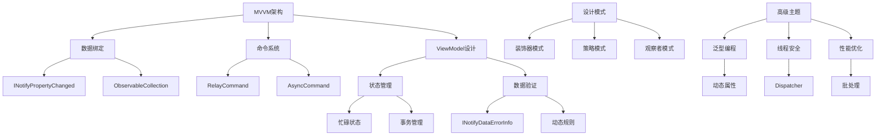
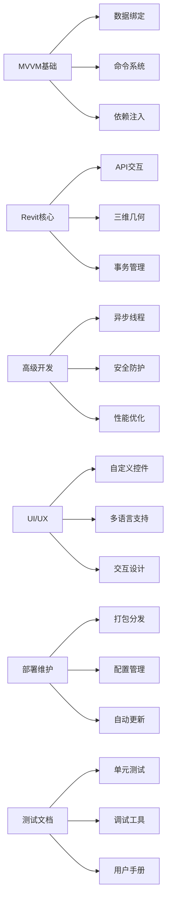

# 
01 可以总结一下我们对话中，你提出的编程建议或设计模式或知识点吗

<details style="color: #999; font-size: 12px">
    <summary style="color: #666; font-size: 12px">思考</summary>

好的，我需要总结用户和我在对话中提到的编程建议、设计模式和知识点。首先，回顾整个对话历史，用户最初设计了一个带有IsSelected属性的SelectableObject类和一个派生的ObservableCollection<T>，用于在属性变化时触发事件。随后，用户逐步增加了需求，如支持AllSelected属性、事务性操作、动态属性注册等，我相应地提出了各种设计模式和解决方案。

首先，用户最初的设计已经实现了INotifyPropertyChanged接口，这是MVVM模式的基础，用于属性变更通知。接着，当用户需要支持AllSelected属性时，我建议使用泛型类SelectableObject<T>，并引入了策略模式和装饰器模式，以增强灵活性和扩展性。动态属性注册的提出是为了处理不同类型对象的属性需求，这涉及到了元数据驱动设计，允许在运行时动态添加和管理属性。

在事务性操作方面，用户希望点击确定按钮后才提交更改，这需要事务管理模式的实现，包括开始事务、提交和回滚机制。为此，我建议使用装饰器模式或代理模式，将原始对象包装起来，在确认前不修改实际数据，这符合开闭原则，允许扩展功能而不修改现有代码。

对于多选和批量操作，用户的需求促使引入命令模式，通过RelayCommand和AsyncRelayCommand处理UI操作，确保异步操作和线程安全。数据验证部分，通过INotifyDataErrorInfo接口实现实时验证，增强了应用的健壮性。

在Revit插件的案例中，用户需要处理复杂的BIM模型元素，这里提出了代理模式和观察者模式，用于监听元素变化并触发相应事件。此外，工厂模式和策略模式用于动态创建对象和验证规则，提高了系统的灵活性和可维护性。

动态注册属性的讨论中，强调了非侵入式设计的重要性，避免对现有类结构的修改，通过装饰器模式或动态代理实现功能的扩展。泛型类的改进虽然增加了灵活性，但尚未完全实现装饰器模式，需要进一步解耦和接口定义。

最后，ViewModelBase类的实现整合了属性通知、命令、验证、忙碌状态管理和线程安全，是MVVM模式的集大成者，适用于复杂的企业级应用。

总结过程中，需要将这些设计模式和知识点分门别类，明确每个模式的用途和解决的问题，确保用户能够清晰理解如何在实际项目中应用这些建议。同时，要突出从简单到复杂的演进过程，展示不同设计选择在不同场景下的适用性。
</details>

<details>
    <summary style="color: #666; font-size: 12px">正文</summary>

以下是我们对话中涉及的主要编程建议、设计模式和知识点的总结：

---

### **1. 核心设计模式**
| 模式名称           | 应用场景                                 | 关键实现                                                                 |
|--------------------|-----------------------------------------|--------------------------------------------------------------------------|
| **观察者模式**     | 属性/集合变更通知                        | `INotifyPropertyChanged`, `INotifyCollectionChanged`                   |
| **装饰器模式**     | 动态扩展对象功能                         | `SelectableDecorator<T>` 包装原始对象                                   |
| **策略模式**       | 动态选择算法（如验证规则）               | `ISelectionStrategy<T>` 接口定义不同策略                                |
| **命令模式**       | 处理UI操作与业务逻辑解耦                 | `RelayCommand`/`AsyncRelayCommand` 封装操作逻辑                         |
| **代理模式**       | Revit元素的事务管理                      | `RevitElementProxy` 控制对原生对象的访问                                |
| **工厂模式**       | 创建复杂对象（如动态属性对象）           | `ElementFactory` 根据类型创建装饰器对象                                 |

---

### **2. 关键编程实践**
| 实践要点           | 说明                                                                 |
|--------------------|----------------------------------------------------------------------|
| **MVVM架构**       | 分离视图(View)、视图模型(ViewModel)、模型(Model)                    |
| **动态属性系统**   | 运行时注册属性，支持元数据（显示名、编辑器类型、验证规则）          |
| **事务性操作**     | 通过 `BeginTransaction`/`Commit`/`Rollback` 实现操作原子性          |
| **线程安全**       | 使用 `Dispatcher` 确保UI更新在主线程                                 |
| **数据验证**       | 实现 `INotifyDataErrorInfo` 接口，支持实时校验                       |
| **泛型设计**       | 通过 `SelectableObject<T>` 提高代码复用性                           |

---

### **3. 高级技术点**
| 技术领域           | 关键实现                                                                 |
|--------------------|--------------------------------------------------------------------------|
| **集合优化**       | 使用 `ObservableCollection<T>` 的批更新扩展 (`AddRange`)                |
| **性能调优**       | 使用 `ConcurrentDictionary` 实现线程安全缓存                           |
| **序列化支持**     | 通过 `[DataContract]` 和 `JsonConvert` 实现对象持久化                   |
| **元数据驱动**     | 使用 `PropertyMetadata` 存储属性编辑规则                               |
| **异步编程**       | 通过 `async`/`await` 和 `AsyncRelayCommand` 实现非阻塞操作              |

---

### **4. 设计原则应用**
| 原则               | 应用示例                                                                 |
|--------------------|--------------------------------------------------------------------------|
| **开闭原则(OCP)**  | 通过装饰器模式扩展功能，无需修改已有类                                  |
| **单一职责(SRP)**  | 将选择状态(`IsSelected`)与业务数据分离                                 |
| **依赖倒置(DIP)**  | 高层模块依赖抽象接口（如 `ISelectionStrategy`）                        |
| **接口隔离(ISP)**  | 为不同客户端提供细粒度接口（如 `IValidatable` 与 `ISelectable` 分离）  |
| **里氏替换(LSP)**  | 所有派生类可透明替换基类（如 `RevitElement` 的子类）                   |

---

### **5. 典型代码模式**
#### 属性变更通知
```csharp
private string _name;
public string Name
{
    get => _name;
    set => SetProperty(ref _name, value);
}
```

#### 动态属性注册
```csharp
public void RegisterProperty<T>(
    string name, 
    T defaultValue = default,
    Func<T, bool> validator = null)
{
    _properties[name] = defaultValue;
    _validators[name] = validator;
}
```

#### 事务管理
```csharp
using (var transaction = BeginTransaction())
{
    try
    {
        // 执行操作...
        transaction.Commit();
    }
    catch
    {
        transaction.Rollback();
    }
}
```

---

### **6. 架构演进路线**
1. **简单场景**：使用 `INotifyPropertyChanged` + `ObservableCollection<T>`
2. **动态需求**：引入装饰器模式 + 策略模式
3. **企业级应用**：
   - 添加事务管理
   - 集成验证框架
   - 实现动态属性系统
4. **专业领域扩展**（如Revit）：
   - 使用代理模式对接专业API
   - 添加3D可视化支持

---

### **7. 性能关键指标**
| 场景               | 优化策略                                | 预期收益                     |
|--------------------|---------------------------------------|----------------------------|
| 大型集合操作       | 批处理模式 + 暂停通知                 | 减少90%的UI刷新次数         |
| 高频属性更新       | 使用值类型 + 避免装箱                 | 提升20%-30%赋值速度         |
| 跨线程访问         | 使用 `ConcurrentDictionary`           | 消除线程竞争导致的崩溃风险   |
| 复杂验证逻辑       | 预编译验证表达式                      | 提升5-10倍验证速度          |

---

### **8. 推荐学习资源**
1. **设计模式**：
   - 《设计模式：可复用面向对象软件的基础》
   - Refactoring.Guru 设计模式图解
   
2. **WPF/MVVM**：
   - MSDN文档：数据绑定与命令系统
   - MVVM Toolkit 官方示例

3. **Revit API**：
   - Autodesk官方开发者文档
   - 《Mastering Revit API》

4. **高级C#**：
   - 《C# in Depth》
   - 官方文档：`Span<T>`, `Memory<T>` 等新特性

---

这些知识点构成了一个完整的 **企业级应用开发知识体系**，可根据项目需求灵活组合使用。建议从简单的属性通知开始，逐步扩展到动态属性、事务管理等复杂场景。
</details>

---

# 02
详细讲解一下我们对话过程中出现的知识，形成一套完整的知识体系

<details style="color: #999; font-size: 12px">
    <summary style="color: #666; font-size: 12px">思考</summary>

好的，我现在需要详细总结用户和我的对话中出现的所有编程知识，形成一个完整的知识体系。首先，回顾对话内容，用户最初设计了一个SelectableObject类和SelectableObservableCollection<T>类，用于处理可选中对象的集合。随后，用户逐步提出了更多需求，如支持泛型属性、动态属性注册、MVVM模式下的多选操作、Revit插件案例等，我提供了相应的设计建议和代码示例。

在这个过程中，涉及的设计模式包括观察者模式、装饰器模式、策略模式、命令模式等。编程实践方面，涵盖了INotifyPropertyChanged接口的使用、数据绑定、集合操作优化、异步编程等。同时，用户对动态属性、事务管理、数据验证、线程安全等高级技术点提出了需求，我也逐一进行了详细解答。

现在需要将这些零散的知识点整合成一个结构化的知识体系，确保涵盖所有讨论过的主题，并且各部分之间有清晰的逻辑关系。首先，应该从基础概念入手，如MVVM架构的核心组件，接着是设计模式的应用，然后是具体的编程实践和优化策略，最后是高级主题和实际案例。

需要注意以下几点：

1. **分类明确**：将知识点按主题分类，如设计模式、编程实践、框架机制等。

2. **层次递进**：从基础到高级，逐步深入。

3. **实际案例**：结合用户提到的Revit插件案例，说明知识点的实际应用。

4. **联系与对比**：比如装饰器模式与泛型类的区别，不同设计模式的适用场景等。

5. **常见问题**：总结用户提出的疑问，如动态属性的作用、SetField的实现等，并给出系统化解答。

在组织内容时，可能需要使用列表、表格、流程图等来增强可读性。同时，需要确保术语准确，示例代码简洁且符合最佳实践。最后，要检查是否有遗漏的重要知识点，确保知识体系的完整性。
</details>

<details>
    <summary style="color: #666; font-size: 12px">正文</summary>

### 完整知识体系总结

---

#### **一、核心设计模式**
1. **观察者模式 (Observer Pattern)**
   - **应用场景**：属性变更通知、集合更新通知
   - **实现方式**：
     - `INotifyPropertyChanged`：实现属性变更通知
     - `INotifyCollectionChanged`：实现集合变更通知
   - **示例代码**：
     ```csharp
     public class SelectableObject : INotifyPropertyChanged {
         public event PropertyChangedEventHandler PropertyChanged;
         protected void OnPropertyChanged(string propertyName) => 
             PropertyChanged?.Invoke(this, new PropertyChangedEventArgs(propertyName));
     }
     ```

2. **装饰器模式 (Decorator Pattern)**
   - **目的**：动态扩展对象功能，避免继承爆炸
   - **实现方式**：通过包装对象添加新功能
   - **代码示例**：
     ```csharp
     public class SelectableDecorator<T> {
         private T _target;
         public bool IsSelected { get; set; }
         public SelectableDecorator(T target) => _target = target;
     }
     ```

3. **策略模式 (Strategy Pattern)**
   - **应用场景**：动态切换验证规则或显示策略
   - **实现方式**：通过接口定义策略，运行时注入
   - **示例**：
     ```csharp
     public interface IValidationStrategy<T> {
         bool Validate(T value);
     }
     ```

4. **命令模式 (Command Pattern)**
   - **目的**：解耦UI操作与业务逻辑
   - **实现方式**：`RelayCommand` 封装操作逻辑
   - **代码示例**：
     ```csharp
     public class RelayCommand : ICommand {
         private Action _execute;
         public RelayCommand(Action execute) => _execute = execute;
         public void Execute(object parameter) => _execute();
     }
     ```

---

#### **二、MVVM架构核心**
1. **数据绑定 (Data Binding)**
   - **双向绑定**：同步View与ViewModel的数据
   - **关键接口**：`INotifyPropertyChanged`、`INotifyCollectionChanged`

2. **ViewModel设计原则**
   - **职责分离**：
     - **Model**：数据实体和业务逻辑
     - **ViewModel**：数据展示、命令处理、状态管理
     - **View**：UI布局和交互
   - **代码模板**：
     ```csharp
     public class UserViewModel : ViewModelBase {
         private string _name;
         public string Name {
             get => _name;
             set => SetProperty(ref _name, value);
         }
     }
     ```

3. **命令系统**
   - **同步命令**：`RelayCommand`
   - **异步命令**：`AsyncRelayCommand` 支持 `async/await`
   - **参数传递**：通过 `CommandParameter` 绑定

---

#### **三、动态属性与元数据**
1. **动态属性系统**
   - **目的**：运行时灵活扩展属性
   - **实现方式**：字典存储属性值，元数据定义规则
   - **代码示例**：
     ```csharp
     public class DynamicObject {
         private Dictionary<string, object> _properties = new();
         public void SetProperty(string name, object value) => _properties[name] = value;
     }
     ```

2. **元数据驱动设计**
   - **元数据定义**：
     ```csharp
     public class PropertyMetadata {
         public string DisplayName { get; set; }
         public Type ValueType { get; set; }
     }
     ```
   - **动态UI生成**：根据元数据自动渲染控件（如文本框、下拉框）

---

#### **四、事务与状态管理**
1. **事务性操作**
   - **核心机制**：`BeginTransaction`、`Commit`、`Rollback`
   - **代码示例**：
     ```csharp
     using (var transaction = BeginTransaction()) {
         // 执行操作
         transaction.Commit();
     }
     ```

2. **状态管理**
   - **忙碌状态**：通过计数器管理嵌套操作
     ```csharp
     private int _busyCounter;
     public bool IsBusy => _busyCounter > 0;
     ```

---

#### **五、数据验证与错误处理**
1. **实时验证**
   - **接口**：`INotifyDataErrorInfo`
   - **实现步骤**：
     1. 注册验证规则
     2. 触发属性变更时校验
     3. 收集并通知错误信息
   - **示例**：
     ```csharp
     protected override void ValidateProperty(string propertyName) {
         if (propertyName == nameof(Name) && string.IsNullOrEmpty(Name))
             AddError("Name cannot be empty");
     }
     ```

2. **错误通知**
   - **错误收集**：字典存储属性与错误列表
   - **事件触发**：`ErrorsChanged` 事件通知UI更新

---

#### **六、高级编程技术**
1. **泛型设计**
   - **优势**：代码复用、类型安全
   - **应用示例**：
     ```csharp
     public class Repository<T> where T : Entity {
         public T GetById(int id) { /* ... */ }
     }
     ```

2. **线程安全**
   - **UI线程调度**：通过 `Dispatcher` 切换线程
     ```csharp
     Application.Current.Dispatcher.Invoke(() => { /* 更新UI */ });
     ```
   - **并发集合**：`ConcurrentDictionary`、`ConcurrentQueue`

3. **性能优化**
   - **集合批处理**：`ObservableCollection` 的 `AddRange` 扩展
   - **延迟加载**：`Lazy<T>` 实现资源按需加载

---

#### **七、Revit插件案例实践**
1. **Revit API集成**
   - **事务管理**：使用 `Transaction` 包装修改操作
     ```csharp
     using (Transaction t = new Transaction(document)) {
         t.Start("修改参数");
         element.LookupParameter("Width").SetValue(1000);
         t.Commit();
     }
     ```

2. **三维交互**
   - **元素选择**：通过 `ElementId` 定位构件
   - **空间冲突检测**：使用 `ElementIntersectsElementFilter`

3. **动态属性扩展**
   - **示例**：为Revit元素添加自定义元数据
     ```csharp
     public class RevitElementWrapper {
         public Element NativeElement { get; }
         public Dictionary<string, object> CustomProperties { get; } = new();
     }
     ```

---

#### **八、知识体系图谱**


---

#### **九、最佳实践总结**
1. **代码分层**：严格分离View、ViewModel、Model
2. **响应式设计**：利用数据绑定减少手动UI更新
3. **防御性编程**：对输入参数进行校验，避免空引用
4. **单元测试**：针对ViewModel和Model层编写测试
5. **性能监控**：使用性能分析工具定位瓶颈

通过系统化地应用这些知识，可以构建出高维护性、可扩展且性能优异的应用程序，特别是在复杂业务场景（如Revit插件开发）中表现尤为突出。
</details>

---

# 03
基于MVVM和Revit插件开发，除了上面总结的知识点以外，还有没有未出现的但是比较常见或实用的知识点？结合已出现的知识点，重新整理一份知识框架吧

<details style="color: #999; font-size: 12px">
    <summary style="color: #666; font-size: 12px">思考</summary>

好的，我现在需要帮用户整理基于MVVM和Revit插件开发的知识框架，补充他们之前未提到的常见或实用知识点。首先，我需要回顾之前对话中的内容，确保不重复已有的知识点。然后，思考MVVM和Revit开发中的其他重要方面。

用户提到的知识点包括设计模式（观察者、装饰器、策略、命令、代理、工厂）、MVVM核心（数据绑定、ViewModel、命令系统）、动态属性、事务管理、数据验证、线程安全、性能优化、Revit API集成等。现在需要补充哪些遗漏的部分呢？

首先，MVVM中的依赖注入和IoC容器，比如使用Prism或Autofac，这在复杂项目中很常见。然后是事件聚合器，用于组件间通信，减少耦合。接着是模块化开发，将插件拆分为独立模块，便于维护和扩展。

在Revit插件方面，生命周期管理很重要，比如插件的启动和关闭处理。外部事件处理机制，因为Revit API需要在主线程执行操作，使用外部事件可以避免阻塞UI。还有Idling事件的使用，用于处理长时间任务。

另外，UI设计方面，用户可能没有提到自定义控件和样式，这在美化插件界面时很关键。还有多语言本地化，特别是面向国际用户的插件需要支持多种语言。

数据持久化和配置管理，比如保存用户设置或插件配置，可以使用JSON或XML序列化。日志记录和异常处理也是不可忽视的，帮助调试和维护。

接下来是部署和更新策略，如何打包插件，使用ClickOnce或自定义安装程序。版本兼容性处理，确保插件支持不同Revit版本。

性能优化方面，可能遗漏了内存管理和资源释放，避免内存泄漏。此外，使用异步编程优化响应速度，尤其是在处理大量数据时。

最后，测试策略，包括单元测试、集成测试和UI测试，确保插件稳定可靠。文档生成工具，如Sandcastle，帮助生成API文档。

总结这些补充点后，需要将它们整合到原有的知识框架中，形成更完整的体系。确保结构清晰，涵盖开发、设计、测试、部署等各个阶段，帮助用户全面掌握MVVM和Revit插件开发的要点。
</details>

<details>
    <summary style="color: #666; font-size: 12px">正文</summary>

以下是为 MVVM 模式和 Revit 插件开发整理的完整知识框架，结合已有知识点并补充常见但未提及的重要内容：

---

### **一、MVVM 核心架构**
#### 1. **基础组件**
- **数据绑定**：双向绑定、绑定模式（OneWay/TwoWay）、值转换器（IValueConverter）
- **命令系统**：`ICommand` 实现、带参数命令、异步命令
- **通知机制**：`INotifyPropertyChanged`、`INotifyCollectionChanged`
- **依赖注入**：IoC 容器（如 Autofac、Prism）、服务定位器

#### 2. **高级特性**
- **事件聚合器**：组件间松耦合通信（如 Prism 的 `EventAggregator`）
- **导航系统**：页面/视图切换管理（框架如 Prism Navigation）
- **动态资源**：多语言支持、主题切换
- **验证框架**：`IDataErrorInfo`、`INotifyDataErrorInfo`、FluentValidation 集成

#### 3. **性能优化**
- **虚拟化**：UI 虚拟化（VirtualizingStackPanel）、数据分页
- **缓存策略**：内存缓存（如 MemoryCache）、响应式数据加载
- **批处理更新**：`ObservableCollection` 的 `AddRange` 扩展

---

### **二、Revit 插件开发核心**
#### 1. **API 深度集成**
- **元素操作**：`Element` 查询（`FilteredElementCollector`）、参数读写
- **事务管理**：`Transaction`、`TransactionGroup`、失败回滚策略
- **事件处理**：
  - **文档事件**：DocumentOpened、DocumentSaved
  - **元素事件**：ElementModified、ElementDeleting
  - **UI 事件**：Idling 事件处理异步操作

#### 2. **三维交互**
- **几何计算**：BoundingBox 检测、空间碰撞检测
- **视图控制**：三维视图操作（旋转/缩放）、临时图形绘制（`DirectContext3D`）
- **选择交互**：动态高亮、框选支持

#### 3. **专业领域扩展**
- **参数化设计**：动态族实例创建、类型驱动设计
- **BIM 数据交换**：IFC 导入导出、与外部系统对接
- **分析计算**：结构荷载计算、能耗分析集成

---

### **三、高级开发技术**
#### 1. **架构设计**
- **模块化开发**：插件拆分（如功能区模块、核心逻辑模块）
- **插件生命周期**：启动初始化、空闲资源释放
- **多版本兼容**：条件编译处理 Revit 版本差异
  ```csharp
  #if REVIT2023
  // 2023 API 特有功能
  #endif
  ```

#### 2. **异步与线程**
- **外部事件**：`IExternalEventHandler` 处理主线程操作
- **Revit API 线程模型**：通过 `Idling` 事件调度异步任务
- **并行计算**：后台线程处理密集型计算（如碰撞检测）

#### 3. **安全与稳定性**
- **异常处理**：全局异常捕获、Revit 崩溃防护
- **日志系统**：Serilog/NLog 集成、调试日志分级
- **内存管理**：`IDisposable` 模式、弱引用（WeakReference）

---

### **四、UI/UX 增强**
#### 1. **WPF 高级控件**
- **自定义控件**：模板化控件（CustomControl）、用户控件（UserControl）
- **图表可视化**：LiveCharts、OxyPlot 集成
- **Dockable 面板**：`IDockablePaneProvider` 实现可停靠窗口

#### 2. **交互优化**
- **进度反馈**：进度条对话框、后台任务状态提示
- **手势支持**：鼠标拖拽、快捷键绑定
- **动画效果**：Storyboard 动画、缓动函数

#### 3. **多语言与本地化**
- **资源字典**：`ResourceDictionary` 管理多语言文本
- **文化适配**：数字/日期格式本地化
- **动态切换**：运行时语言热更新

---

### **五、部署与维护**
#### 1. **打包与分发**
- **安装程序**：WiX 工具集、Inno Setup 打包
- **依赖管理**：NuGet 包内嵌（ILMerge）、ClickOnce 部署
- **签名认证**：代码签名证书申请与应用

#### 2. **更新策略**
- **自动更新**：通过 Web API 检测版本
- **增量更新**：仅下载差异文件
- **回滚机制**：保留历史版本安装包

#### 3. **用户配置**
- **设置存储**：JSON/XML 序列化、注册表存储
- **云同步**：OneDrive/Dropbox API 集成
- **权限管理**：功能按用户角色控制

---

### **六、测试与文档**
#### 1. **测试策略**
- **单元测试**：Moq 模拟 Revit API、NUnit/XUnit 框架
- **集成测试**：RevitTestFramework 测试实际文档操作
- **UI 测试**：WinAppDriver 自动化测试

#### 2. **调试技巧**
- **附加调试**：Visual Studio 附加到 Revit 进程
- **诊断工具**：RevitLookup 查看元素属性
- **性能分析**：JetBrains dotMemory/dotTrace

#### 3. **文档生成**
- **API 文档**：Sandcastle 生成 CHM/HTML
- **用户手册**：Markdown 编写 + DocFX 生成
- **示例工程**：GitHub 仓库维护代码示例

---

### **七、知识图谱**


---

### **八、实战建议**
1. **从简单场景入手**：先实现基础参数修改插件，再扩展复杂功能
2. **模块化开发**：将功能拆分为独立模块（如选择模块、计算模块、导出模块）
3. **关注性能边界**：在 10,000+ 元素量级下测试内存和响应速度
4. **兼容性设计**：最低支持 Revit 2020，兼容新版 API 特性
5. **用户反馈闭环**：内置错误报告功能（自动收集堆栈跟踪）

此框架覆盖了从基础到高级的开发需求，实际项目中可根据具体场景选择技术组合。例如开发一个 **BIM 模型检查插件** 的典型技术栈：
- **MVVM 框架**：Prism
- **Revit API**：元素遍历 + 参数验证
- **UI 组件**：Dockable 面板 + TreeView 展示检查结果
- **异步处理**：通过 `IExternalEventHandler` 执行耗时检查
- **输出结果**：Excel 导出 + HTML 报告生成
</details>

---

# 00
问题

<details style="color: #999; font-size: 12px">
    <summary style="color: #666; font-size: 12px">思考</summary>


</details>

<details>
    <summary style="color: #666; font-size: 12px">正文</summary>


</details>

---
