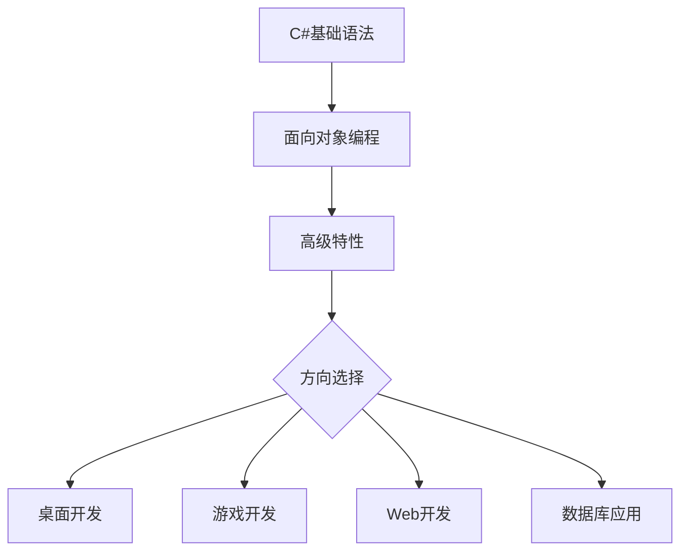

  
  
思考

  
    嗯，用户让我帮忙写一份学习C#的计划。首先，我得考虑用户的基础情况。他们可能有没有编程经验，或者是有一点其他语言的经验？不过问题里没说明，所以得做一个通用计划，适合大多数情况。
    
    接下来，C#的应用领域挺广的，比如桌面应用、游戏开发（Unity）、Web后端等等。计划里应该涵盖基础语法、面向对象、高级特性，然后分方向深入。这样用户可以根据兴趣选择，增加实用性。  
  
    时间安排方面，可能用户希望有一个明确的阶段划分，比如每周学什么。但也要提醒他们根据自身情况调整，避免压力太大。基础部分可能需要2-3周，然后是核心概念，再高级内容和实战项目。  
  
    资源推荐也很重要，官方文档、书籍、在线课程，还有练习平台。比如《C#入门经典》这样的书比较经典，适合推荐。练习平台如LeetCode、Exercism可以巩固知识。  
  
    还要考虑到用户可能会遇到的困难，比如调试、理解面向对象的概念，所以计划里应该包括实践和项目实战。项目实战部分可以分不同方向，让用户选择感兴趣的领域，比如用Unity做游戏或者用ASP.NET Core做Web应用。
  
    最后，学习建议部分，强调多写代码、参与社区、定期复习，这些都能帮助用户坚持下去。可能用户需要一些鼓励和方法，所以这部分不能少。
  
    总之，这个计划需要结构清晰，循序渐进，涵盖基础到进阶，结合实际项目，提供资源和支持，让用户能够系统地学习C#并根据兴趣深入。

以下是一份系统化的C#编程学习计划，分为基础、进阶和实战三个阶段，建议学习周期为3-6个月（根据每日投入时间调整）：

---
### **第一阶段：编程基础与C#语法（2-3周）**
1. **开发环境搭建**
   - 安装Visual Studio Community（推荐2022版）
   - 配置.NET SDK
   - 创建第一个Console程序（Hello World）

2. **基础语法**
   - 变量与数据类型（int, string, bool, double等）
   - 运算符与表达式
   - 流程控制（if/else, switch, for, while）
   - 数组与集合（List, Dictionary）
   - 方法定义与参数传递

3. **核心练习**
   - 实现简单计算器
   - 编写猜数字游戏
   - 处理字符串反转、统计等基础算法

---
### **第二阶段：面向对象与核心概念（4-6周）**
1. **面向对象编程（OOP）**
   - 类与对象
   - 继承与多态
   - 接口与抽象类
   - 封装与访问修饰符（public/private/protected）

2. **高级特性**
   - 异常处理（try/catch/finally）
   - 泛型编程（Generic Classes/Methods）
   - 委托与事件（Delegate, Event, Action/Func）
   - LINQ查询表达式
   - 异步编程（async/await）

3. **.NET核心库**
   - 文件操作（System.IO）
   - 时间处理（DateTime, TimeSpan）
   - 集合框架（List<T>, Dictionary<TKey,TValue>）
   - 反射基础（Type, Assembly）

4. **项目实践**
   - 开发学生管理系统（控制台版）
   - 实现文件内容分析工具
   - 构建简易聊天程序（网络通信基础）

---
### **第三阶段：专项突破与实战（4-8周）**
**根据兴趣选择方向：**
1. **桌面开发（Windows Forms/WPF）**
   - XAML基础
   - 数据绑定
   - MVVM模式
   - 项目：开发个人记账软件

2. **游戏开发（Unity）**
   - Unity基础界面操作
   - C#脚本控制游戏对象
   - 物理引擎与碰撞检测
   - 项目：制作2D平台跳跃游戏

3. **Web开发（ASP.NET Core）**
   - MVC模式
   - Razor页面
   - Web API开发
   - 项目：构建TODO List API

4. **数据库应用**
   - ADO.NET基础
   - Entity Framework Core
   - SQL Server/MySQL连接
   - 项目：图书馆管理系统

---
### **学习资源推荐**
1. **官方文档**
   - [Microsoft Learn C#路径](https://learn.microsoft.com/zh-cn/dotnet/csharp/)
   - [.NET官方文档](https://docs.microsoft.com/dotnet)

2. **书籍**
   - 《C#入门经典》（第9版）
   - 《CLR via C#》（进阶必读）

3. **在线课程**
   - Udemy: "Complete C# Masterclass"
   - Pluralsight: C#学习路径

4. **练习平台**
   - LeetCode（C#专项练习）
   - Exercism.io（C#训练营）

---
### **学习建议**
1. **代码量要求**
   - 基础阶段：每日50行代码
   - 进阶阶段：每周完成1个小项目
   - 实战阶段：持续参与GitHub开源项目

2. **效率提升**
   - 掌握Visual Studio调试技巧（断点/单步执行）
   - 学习使用NuGet包管理器
   - 熟悉Git版本控制

3. **社区参与**
   - 加入Stack Overflow讨论
   - 关注C# Subreddit和中文论坛
   - 参加本地.NET开发者聚会

---
### **学习路线图**

建议每周保持15-20小时的学习时间，遇到问题优先尝试通过调试和文档解决，定期复习代码并重构优化。坚持6个月后可达到中级开发者水平，能够独立完成中小型项目开发。
