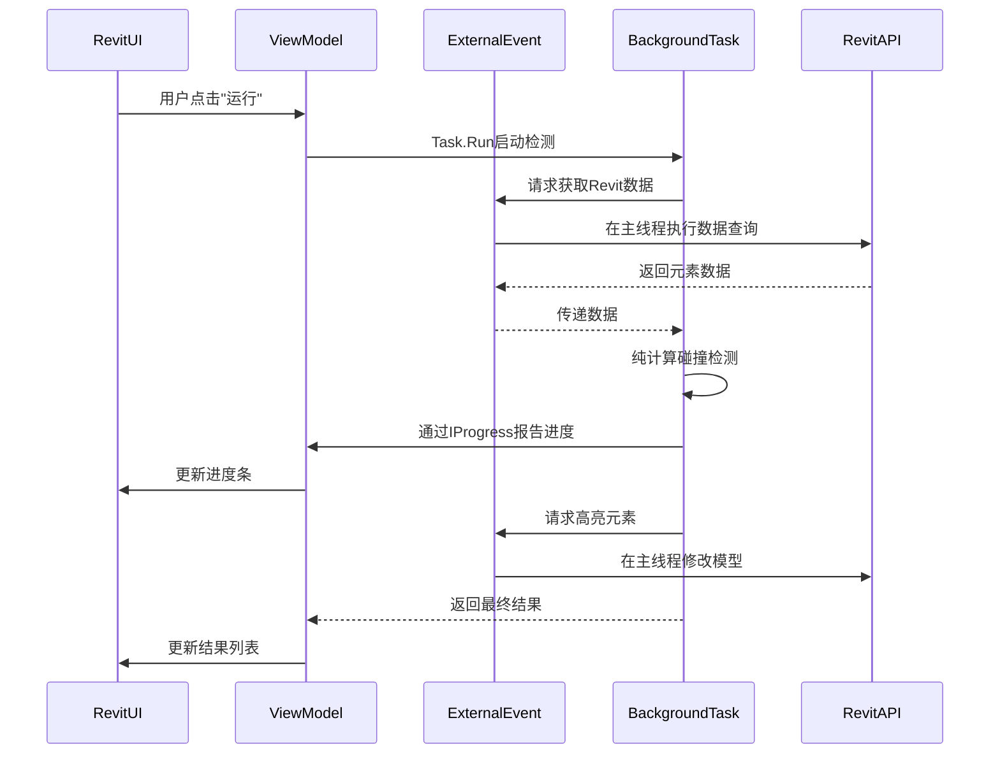

# 01
Revit IExternalEventHandler 有什么作用
<details style="color: #999">
    <summary style="color: #666; font-size: 12px">思考</summary>
    
好的，我现在需要回答用户关于Revit中IExternalEventHandler的作用的问题。首先，我得回忆一下自己对Revit API的了解，特别是关于外部事件处理的部分。

用户可能是一个刚开始学习Revit二次开发的开发者，或者在使用过程中遇到了需要处理异步操作的情况。他们可能想知道为什么需要使用这个接口，以及它在实际开发中的具体应用场景。

首先，我应该明确IExternalEventHandler的基本作用。根据之前的知识，Revit的API操作通常需要在主线程执行，而某些操作，特别是那些需要用户交互或长时间运行的任务，可能需要异步处理以避免阻塞UI。这时候，IExternalEventHandler就派上用场了，它允许开发者将代码的执行延迟到合适的时间，由Revit的内部事件机制来触发。

接下来，我需要详细解释这个接口的主要用途。比如，当执行一个需要用户交互（如弹窗选择文件）的操作时，直接在主线程执行可能会导致问题。使用IExternalEventHandler可以将这些操作封装起来，在外部事件处理程序中执行，确保线程安全。

然后，我应该提到接口的关键方法Execute和属性Name。Execute方法是实际执行操作的地方，而Name属性用于调试或日志记录，帮助识别不同的事件处理器。

此外，可能还需要说明如何实际使用这个接口。例如，创建一个实现该接口的类，然后在需要的时候通过ExternalEvent.Create方法创建ExternalEvent实例，并调用Raise方法来触发事件。

用户可能还想知道使用这个接口的好处，比如避免UI冻结、处理模态对话框时的限制，或者确保API调用在正确的上下文中执行。这些都是需要涵盖的点。

另外，可能需要举一个简单的例子，比如在按钮点击事件中触发一个外部事件，然后在Execute方法中执行具体的Revit操作，如修改模型或显示对话框。

还要注意可能的相关问题，比如ExternalEvent类和IExternalEvent接口之间的关系，以及为什么不能直接在非UI线程中调用Revit API。这里需要强调Revit API的线程模型要求大部分API调用必须在主线程执行，而外部事件处理机制正是为了满足这一要求而设计的。

最后，确保解释清晰，结构合理，用简洁的语言让用户能够理解IExternalEventHandler的作用和使用方法，同时覆盖常见的使用场景和注意事项。
</details>

<details>
    <summary style="color: #666; font-size: 12px">正文</summary>

在Revit API中，**`IExternalEventHandler`** 是一个用于处理异步操作和线程间调用的关键接口。它的主要作用是帮助开发者在**Revit主线程上下文**中安全地执行代码，尤其是在需要与用户交互或执行耗时操作时，避免阻塞Revit的UI线程或违反API的线程限制。

---

### **主要作用**
1. **异步执行API操作**  
   Revit API严格要求大多数操作必须在主线程执行（例如修改模型、访问文档数据）。  
   `IExternalEventHandler` 允许你将代码逻辑封装到一个事件处理器中，并通过**外部事件队列**异步触发，确保这些操作在正确的线程上下文中执行。

2. **处理用户交互**  
   当你的插件需要弹出对话框（如`OpenFileDialog`）或等待用户输入时，直接在主线程调用这些操作可能导致Revit无响应。通过`IExternalEventHandler`，可以将这类操作推迟到安全的时间点执行。

3. **避免UI冻结**  
   长时间运行的任务（如遍历大量元素、生成复杂几何体）如果直接在主线程运行，会导致Revit界面冻结。使用此接口可以将任务拆分或延迟执行，保持UI响应。

4. **兼容模态操作**  
   在Revit的模态状态下（例如用户正在编辑草图），某些API操作会被禁止。通过外部事件，可以绕过这些限制，选择合适时机执行代码。

---

### **核心方法**
- **`Execute(UIApplication app)`**  
  必须实现的方法，包含实际要执行的逻辑。当外部事件被触发时，Revit会在此方法内运行你的代码。

- **`string GetName()`**  
  返回事件处理器的名称（用于调试和日志）。

---

### **使用流程**
1. **创建事件处理器类**  
   实现`IExternalEventHandler`接口：
   ```csharp
   public class MyEventHandler : IExternalEventHandler
   {
       public void Execute(UIApplication app)
       {
           // 在这里写需要执行的Revit API操作
           TaskDialog.Show("提示", "Hello from Execute!");
       }

       public string GetName()
       {
           return "My Custom Event Handler";
       }
   }
   ```

2. **创建`ExternalEvent`实例**  
   在插件初始化时（如`OnStartup`），创建事件对象：
   ```csharp
   private ExternalEvent _myEvent;
   private MyEventHandler _handler;

   _handler = new MyEventHandler();
   _myEvent = ExternalEvent.Create(_handler);
   ```

3. **触发事件**  
   在需要的地方（如按钮点击事件）调用：
   ```csharp
   _myEvent.Raise();
   ```
   Revit会在下一个空闲时间点调用`Execute`方法。

---

### **典型场景**
- 用户点击按钮后弹出一个对话框选择文件，然后根据文件内容修改模型。
- 在后台执行耗时计算（如结构分析），完成后更新模型。
- 处理其他线程（如Task或Thread）中需要调用Revit API的操作。

---

### **注意事项**
- **线程安全**：`Execute`方法始终在Revit主线程执行，无需手动同步。
- **频率控制**：频繁调用`Raise()`可能导致事件队列堆积，需合理设计逻辑。
- **生命周期管理**：确保`ExternalEvent`实例在插件生命周期内有效（通常作为类成员变量）。

通过`IExternalEventHandler`，开发者可以更灵活地协调Revit API调用与用户交互，提升插件的稳定性和用户体验。
</details>

---

# 02
如何管理或设计其生命周期？
<details style="color: #999">
    <summary style="color: #666; font-size: 12px">思考</summary>
    
嗯，用户之前问了关于Revit的IExternalEventHandler有什么作用，现在又接着问如何管理或设计其生命周期。看来他们可能正在开发一个Revit插件，遇到了多线程或异步处理的问题，需要更深入的指导。用户可能已经了解了基本用法，现在想确保他们的实现是稳定和高效的。

首先，我需要回顾一下IExternalEventHandler的生命周期管理。生命周期管理的关键在于正确创建、使用和销毁ExternalEvent实例，避免内存泄漏或意外行为。用户可能关心的问题包括：何时创建ExternalEvent，如何确保它在需要时可用，如何处理多次触发，以及如何在插件卸载时正确清理资源。

接下来，用户可能是在实际开发中遇到了问题，比如事件处理器没有被正确触发，或者Revit崩溃，这可能是因为生命周期管理不当。例如，如果ExternalEvent实例被意外销毁，或者在错误的时机被调用，就会导致问题。需要强调将ExternalEvent作为类成员变量，保持其在整个插件生命周期中的有效性。

另外，用户可能想知道如何处理多次触发事件的情况。比如，用户多次点击按钮触发事件，是否需要队列机制或者防止重复执行。这时候，可以讨论ExternalEvent的Pending状态，以及如何通过禁用按钮或者检查状态来避免堆积。

还有，用户可能关心如何在不同的Revit文档或会话中管理事件处理器。比如，当用户切换文档时，是否需要重新创建ExternalEvent实例。需要说明ExternalEvent与特定文档无关，但需要注意文档状态的变化，比如在事件处理中检查文档是否仍然有效。

此外，用户可能对异步操作中的异常处理不太清楚，需要指导如何在Execute方法中捕获异常，避免导致Revit崩溃。同时，可能需要提醒在事件处理器中避免长时间运行的操作，以免阻塞主线程，尽管已经通过异步事件处理，但长时间任务仍需拆分。

最后，用户可能希望看到具体的代码示例和最佳实践，比如使用单例模式或依赖注入来管理事件处理器，或者如何在WPF窗口中集成ExternalEvent的触发。需要提供结构清晰的代码示例，并解释每一步的考虑因素，比如为什么要在OnStartup中初始化，如何在Dispose中释放资源。

总结下来，用户的需求不仅仅是了解生命周期管理的步骤，而是希望确保他们的实现是健壮的、高效的，并且能够处理各种边界情况，比如多次触发、资源释放、异常处理等。需要从实例化、使用、状态管理、资源清理等多个方面详细展开，同时结合实际场景和常见问题，给出具体的解决方案和最佳实践。
</details>

<details>
    <summary style="color: #666; font-size: 12px">正文</summary>

在Revit插件开发中，合理管理`IExternalEventHandler`及其关联的`ExternalEvent`实例的生命周期至关重要，这直接关系到插件的稳定性、资源占用和用户体验。以下是详细的设计和管理方法：

---

### **1. 生命周期管理核心原则**
- **持久性**：`ExternalEvent`实例需长期存活（通常与插件主类同生命周期）。
- **线程安全**：始终通过`ExternalEvent`机制触发主线程操作，避免直接跨线程调用。
- **资源释放**：在插件卸载时正确清理资源，防止内存泄漏。

---

### **2. 生命周期设计步骤**

#### **2.1 实例化阶段**
- **创建位置**：在插件初始化时（如`IExternalApplication.OnStartup`）或首次需要时创建。
- **推荐模式**：使用单例模式或依赖注入确保全局唯一性。

```csharp
public class MyPlugin : IExternalApplication
{
    private ExternalEvent _externalEvent;
    private MyEventHandler _eventHandler;

    public Result OnStartup(UIControlledApplication app)
    {
        // 初始化事件处理器和ExternalEvent
        _eventHandler = new MyEventHandler();
        _externalEvent = ExternalEvent.Create(_eventHandler);
        return Result.Succeeded;
    }
}
```

#### **2.2 使用阶段**
- **触发事件**：通过`Raise()`方法请求执行，但需注意频率控制。
- **状态监控**：利用`ExternalEvent.Status`属性判断事件状态：

| 状态 (`ExternalEvent.Status`) | 描述 |
|-------------------------------|------|
| `Pending`                     | 事件已加入队列，等待执行 |
| `NotAvailable`                | 事件未被创建或已被销毁 |
| `Succeeded`/`Failed`          | 最近一次执行结果 |

```csharp
// 示例：安全触发事件
if (_externalEvent.Status == ExternalEventStatus.Pending)
{
    TaskDialog.Show("警告", "已有事件待处理！");
}
else
{
    _externalEvent.Raise();
}
```

#### **2.3 资源释放阶段**
- **销毁时机**：在插件关闭时（如`IExternalApplication.OnShutdown`）或明确不再需要时销毁。
- **显式释放**：调用`Dispose()`（尽管Revit可能自动处理，但显式释放更安全）。

```csharp
public Result OnShutdown(UIControlledApplication app)
{
    // 显式释放资源
    _externalEvent.Dispose();
    _eventHandler = null;
    return Result.Succeeded;
}
```

---

### **3. 高级生命周期管理技巧**

#### **3.1 防止重复触发**
- **UI按钮禁用**：在事件处理期间禁用触发按钮：
```csharp
// 在Execute方法中控制UI状态
public void Execute(UIApplication app)
{
    try
    {
        // 禁用按钮
        MyRibbonButton.Enabled = false;
        
        // 核心逻辑...
    }
    finally
    {
        // 重新启用按钮
        MyRibbonButton.Enabled = true;
    }
}
```

- **状态标志位**：使用`bool isProcessing`标志阻止并发执行。

#### **3.2 异常处理**
- **全局异常捕获**：在`Execute`方法中包裹`try-catch`：
```csharp
public void Execute(UIApplication app)
{
    try
    {
        // 可能抛出异常的操作
        doc.Delete(elementId);
    }
    catch (Exception ex)
    {
        TaskDialog.Show("错误", $"操作失败: {ex.Message}");
        Logger.LogError(ex);
    }
}
```

#### **3.3 跨文档安全**
- **文档状态验证**：在执行操作前检查文档是否有效：
```csharp
public void Execute(UIApplication app)
{
    var doc = app.ActiveUIDocument?.Document;
    if (doc == null || doc.IsReadOnly)
    {
        TaskDialog.Show("错误", "文档不可用或只读！");
        return;
    }
    
    // 安全操作...
}
```

#### **3.4 异步协同**
- **与Task配合**：将耗时计算放在后台线程，仅通过事件处理器更新Revit模型：
```csharp
public void Execute(UIApplication app)
{
    // 触发后台任务
    Task.Run(() =>
    {
        var result = HeavyCalculation();
        
        // 通过事件处理器更新UI
        Application.Current.Dispatcher.Invoke(() =>
        {
            _externalEvent.Raise(); // 触发另一个事件更新模型
        });
    });
}
```

---

### **4. 典型生命周期管理架构**

#### **4.1 集中式事件管理器**
```csharp
public class EventManager : IDisposable
{
    private readonly Dictionary<string, ExternalEvent> _events = new();

    public void RegisterHandler(string key, IExternalEventHandler handler)
    {
        if (!_events.ContainsKey(key))
        {
            _events[key] = ExternalEvent.Create(handler);
        }
    }

    public void RaiseEvent(string key)
    {
        if (_events.TryGetValue(key, out var evt) && evt.Status != ExternalEventStatus.Pending)
        {
            evt.Raise();
        }
    }

    public void Dispose()
    {
        foreach (var evt in _events.Values)
        {
            evt.Dispose();
        }
        _events.Clear();
    }
}
```

#### **4.2 使用示例**
```csharp
// 初始化
var eventManager = new EventManager();
eventManager.RegisterHandler("ModelUpdate", new ModelUpdateHandler());

// 触发事件
eventManager.RaiseEvent("ModelUpdate");

// 销毁
eventManager.Dispose();
```

---

### **5. 常见问题与解决方案**

| 问题现象 | 原因 | 解决方案 |
|---------|------|----------|
| 点击按钮无响应 | `ExternalEvent`未正确初始化 | 确保在插件启动时创建实例 |
| Revit卡死 | 在`Execute`中执行耗时操作 | 拆分任务，使用`Task`+多事件处理器 |
| 内存泄漏 | 未调用`Dispose()` | 显式释放资源，尤其在动态创建事件时 |
| 事件重复执行 | 频繁调用`Raise()` | 检查`ExternalEvent.Status`或添加标志位 |

---

### **6. 最佳实践总结**
1. **单一职责原则**：每个事件处理器只处理一种类型的操作。
2. **早初始化晚释放**：在插件启动时创建，关闭时销毁。
3. **防御性编程**：始终验证文档状态和事件状态。
4. **日志记录**：在关键节点记录事件触发和执行情况。
5. **压力测试**：模拟高频次事件触发验证稳定性。

通过严谨的生命周期管理，可确保基于`IExternalEventHandler`的插件在复杂场景下仍能保持高效稳定运行。
</details>

---

# 03
再深入讲讲与Task配合的要点
<details style="color: #999">
    <summary style="color: #666; font-size: 12px">思考</summary>
    
好的，用户之前已经询问了关于Revit API中的IExternalEventHandler的作用以及如何管理其生命周期，现在他们希望更深入地了解如何将IExternalEventHandler与Task配合使用。我需要详细解释在异步编程中如何安全地结合这两者，尤其是在Revit的环境中。

首先，我需要回顾之前的内容，确保用户已经理解IExternalEventHandler的基本用法和生命周期管理。然后，重点转移到与Task的配合。可能用户在实际开发中遇到了性能问题，需要在后台执行耗时操作，同时保持UI响应，并最终在主线程更新Revit模型。这时候，Task可以用来处理后台计算，而IExternalEventHandler则负责将结果传回主线程。

接下来，需要考虑Revit API的线程限制。Revit的API大多数操作必须在主线程执行，因此在后台Task中不能直接调用这些API。需要明确划分哪些代码在Task中运行，哪些必须通过IExternalEventHandler在主线程执行。

用户可能想了解如何正确地在Task中启动异步操作，然后在完成后触发事件处理器。需要强调不能在Task中直接调用Revit API，必须通过Raise()方法将更新操作排入主线程队列。

另外，可能需要处理异步操作的异常，避免整个应用程序崩溃。还要考虑如何同步数据，确保后台线程和主线程之间的数据传递是线程安全的，比如使用锁或者其他同步机制。

用户可能还会关心如何优化性能，避免频繁地创建和销毁Task，或者如何管理多个并发的Task。这时候可以讨论使用任务调度器、取消令牌（CancellationToken）来控制任务的执行和取消。

另外，用户可能想知道如何处理长时间运行的任务，比如显示进度条或允许用户取消操作。这时候需要结合Task和IExternalEventHandler来实现进度更新和取消请求的处理。

还要提到一些常见的陷阱，比如在Task中直接修改Revit模型导致崩溃，或者忘记处理跨线程的UI更新。需要提供具体的代码示例，展示正确的模式，比如在后台计算完成后，通过事件处理器来执行Revit API调用。

最后，总结最佳实践，强调分离计算逻辑和Revit操作，使用事件处理器作为桥梁，确保线程安全，以及合理的异常处理和资源管理。这样用户能够全面理解如何有效结合Task和IExternalEventHandler，提升插件的性能和用户体验。
</details>

<details>
    <summary style="color: #666; font-size: 12px">正文</summary>

在 Revit 插件开发中，将 **`IExternalEventHandler`** 与 **`Task`** 结合使用，可以实现后台异步计算与主线程安全操作的完美协同。这种组合尤其适用于需要**长时间运行的计算**（如结构分析、数据生成）或**跨线程数据同步**的场景。以下是深入的技术要点和实践指南：

---

### **1. 核心设计原则**
- **职责分离**：  
  `Task` 负责**纯计算逻辑**（无Revit API调用），`IExternalEventHandler` 负责**主线程操作**（更新模型、UI交互）。
- **线程安全**：  
  **Revit API 只能在主线程调用**，后台线程（如`Task`）只能准备数据，最终通过`Raise()`触发主线程操作。
- **数据隔离**：  
  跨线程传递数据需通过**线程安全容器**（如 `ConcurrentQueue`、`BlockingCollection`）或**深拷贝**。

---

### **2. 基本协作流程**
#### **步骤 1：启动后台任务**
```csharp
public class CalculationHandler : IExternalEventHandler
{
    public List<double> Results { get; private set; } // 存储计算结果

    public void Execute(UIApplication app)
    {
        // 主线程中启动后台任务
        Task.Run(() => HeavyCalculation(app));
    }

    private void HeavyCalculation(UIApplication app)
    {
        // 纯计算逻辑（无Revit API）
        var tempResults = new List<double>();
        for (int i = 0; i < 1000000; i++)
        {
            tempResults.Add(Math.Sqrt(i));
        }

        // 将结果存入线程安全容器
        Results = new List<double>(tempResults);

        // 触发另一个事件处理器更新模型
        UpdateModelEvent.Raise();
    }
}
```

#### **步骤 2：通过事件处理器更新模型**
```csharp
public class UpdateModelHandler : IExternalEventHandler
{
    public void Execute(UIApplication app)
    {
        // 在主线程中安全使用Revit API
        var doc = app.ActiveUIDocument.Document;
        using (Transaction tx = new Transaction(doc, "Update Model"))
        {
            tx.Start();
            // 使用CalculationHandler.Results更新模型...
            tx.Commit();
        }
    }
}
```

---

### **3. 关键技术细节**

#### **3.1 异步上下文管理**
- **`TaskScheduler` 同步**：  
  若需在后台任务中访问 UI 元素（非Revit API），需切换至主线程上下文（如 WPF 的 `Dispatcher`）：
```csharp
Task.Run(() =>
{
    // 后台计算...
    Application.Current.Dispatcher.Invoke(() =>
    {
        // 更新WPF控件（非Revit UI）
        ProgressBar.Value = 100;
    });
});
```

- **避免 `async/await` 陷阱**：  
  `async` 方法默认会尝试在原始上下文恢复执行，需明确指定 `ConfigureAwait(false)`：
```csharp
public async void Execute(UIApplication app)
{
    await Task.Run(() => HeavyCalculation())
              .ConfigureAwait(false); // 禁止尝试返回主线程

    // 此处仍在后台线程！
    // 必须通过 Raise() 触发主线程操作
    _updateEvent.Raise();
}
```

#### **3.2 进度反馈机制**
- **线程安全进度报告**：  
  使用 `IProgress<T>` 接口实现跨线程进度更新：
```csharp
public class CalculationHandler : IExternalEventHandler
{
    private readonly IProgress<int> _progress;

    public CalculationHandler(IProgress<int> progress)
    {
        _progress = progress;
    }

    public void Execute(UIApplication app)
    {
        Task.Run(() =>
        {
            for (int i = 0; i < 100; i++)
            {
                // 计算...
                _progress.Report(i);
            }
        });
    }
}

// 在UI层（如WPF）：
var progress = new Progress<int>(percent =>
{
    ProgressBar.Value = percent;
});
var handler = new CalculationHandler(progress);
```

#### **3.3 取消长时间任务**
- **`CancellationToken` 集成**：  
  允许用户主动取消后台计算：
```csharp
private CancellationTokenSource _cts;

public void Execute(UIApplication app)
{
    _cts = new CancellationTokenSource();
    Task.Run(() =>
    {
        for (int i = 0; i < 100; i++)
        {
            if (_cts.Token.IsCancellationRequested)
            {
                // 清理资源并退出
                return;
            }
            // 计算...
        }
    }, _cts.Token);
}

// 在取消按钮事件中：
_cts?.Cancel();
```

---

### **4. 高级模式：管道式处理**
适用于多阶段异步任务（如数据获取 → 计算 → 模型更新）。

#### **架构设计**
```csharp
public class PipelineManager
{
    private readonly ExternalEvent _dataFetchEvent;
    private readonly ExternalEvent _calculateEvent;
    private readonly ExternalEvent _updateEvent;

    public PipelineManager()
    {
        // 初始化三个事件处理器
        _dataFetchEvent = ExternalEvent.Create(new DataFetchHandler());
        _calculateEvent = ExternalEvent.Create(new CalculateHandler());
        _updateEvent = ExternalEvent.Create(new UpdateHandler());
    }

    public void StartPipeline()
    {
        _dataFetchEvent.Raise();
    }
}

// 数据获取处理器
public class DataFetchHandler : IExternalEventHandler
{
    public void Execute(UIApplication app)
    {
        Task.Run(() =>
        {
            // 后台获取数据...
            _calculateEvent.Raise(); // 触发下一步
        });
    }
}

// 计算处理器
public class CalculateHandler : IExternalEventHandler
{
    public void Execute(UIApplication app)
    {
        Task.Run(() =>
        {
            // 后台计算...
            _updateEvent.Raise(); // 触发更新
        });
    }
}
```

---

### **5. 性能优化技巧**

#### **5.1 任务分块（Chunking）**
将大数据集拆分为小块，定期返回主线程更新进度：
```csharp
public void Execute(UIApplication app)
{
    Task.Run(() =>
    {
        var allElements = GetLargeElementList(); // 获取10万个元素
        const int chunkSize = 1000;
        
        for (int i = 0; i < allElements.Count; i += chunkSize)
        {
            var chunk = allElements.Skip(i).Take(chunkSize).ToList();
            
            // 处理当前块...
            
            // 定期触发UI更新
            if (i % 5000 == 0)
            {
                _progressEvent.Raise();
            }
        }
    });
}
```

#### **5.2 内存管理**
- **及时释放非托管资源**：  
  在 `Task` 中使用的临时文件、数据库连接等需显式释放。
- **避免大对象驻留**：  
  使用 `WeakReference` 或定期清理缓存。

---

### **6. 调试与监控**

#### **6.1 跨线程调试**
- **Visual Studio 线程窗口**：  
  监控后台线程状态。
- **日志标记线程ID**：  
```csharp
Debug.WriteLine($"当前线程: {Thread.CurrentThread.ManagedThreadId}");
```

#### **6.2 性能分析**
- **使用 `Stopwatch`**：  
  测量关键代码段耗时。
- **Revit 内置日志**：  
  通过 `Application.WriteJournalEntry` 记录事件触发时间。

---

### **7. 典型问题解决方案**

| 问题场景 | 解决方案 |
|---------|----------|
| 后台任务修改Revit模型崩溃 | 确保所有模型操作通过`IExternalEventHandler`执行 |
| 进度条更新延迟 | 使用 `IProgress<T>` + `Report` 高频更新 |
| 用户取消操作后数据不一致 | 实现事务回滚机制 |
| 内存泄漏 | 使用 `using` 块管理 `IDisposable` 对象 |

---

### **8. 完整示例：异步导入数据并生成墙体**
```csharp
// 主事件处理器
public class ImportDataHandler : IExternalEventHandler
{
    private readonly ExternalEvent _generateWallsEvent;
    public List<Line> WallLines { get; private set; }

    public ImportDataHandler(ExternalEvent generateWallsEvent)
    {
        _generateWallsEvent = generateWallsEvent;
    }

    public void Execute(UIApplication app)
    {
        Task.Run(() =>
        {
            // 后台读取外部文件（无API调用）
            var lines = File.ReadAllLines("data.csv")
                           .Select(ParseLineToGeometry)
                           .ToList();

            WallLines = lines;

            // 触发生成墙体事件
            _generateWallsEvent.Raise();
        });
    }
}

// 墙体生成处理器
public class GenerateWallsHandler : IExternalEventHandler
{
    public void Execute(UIApplication app)
    {
        var doc = app.ActiveUIDocument.Document;
        using (Transaction tx = new Transaction(doc, "Create Walls"))
        {
            tx.Start();
            foreach (var line in _importHandler.WallLines)
            {
                Wall.Create(doc, line, LevelId, false);
            }
            tx.Commit();
        }
    }
}
```

---

通过合理利用 `Task` 与 `IExternalEventHandler` 的协作，开发者可以构建出**响应迅速、稳定可靠**的 Revit 插件，同时充分利用多核 CPU 的计算能力。关键在于始终遵守 Revit API 的线程规则，并通过清晰的分层架构实现计算逻辑与模型操作的解耦。
</details>

---

# 04
详细讲讲Revit的线程知识
<details style="color: #999">
    <summary style="color: #666; font-size: 12px">思考</summary>
    
嗯，用户让我详细讲讲Revit的线程知识。我之前已经回答过关于IExternalEventHandler和如何与Task配合的问题，现在用户想更深入了解线程方面的内容。首先，我需要回顾一下之前的对话，确保这次回答能衔接上之前的讨论，同时深入展开线程相关的知识点。

用户可能是Revit插件开发者，遇到多线程问题，或者想优化插件的性能。他们可能在使用异步操作时遇到了崩溃或UI冻结的问题，所以需要理解Revit的线程模型来避免这些问题。用户的需求不仅仅是了解表面知识，而是想掌握背后的原理和最佳实践，以便在实际开发中应用。

Revit的线程模型与其他桌面应用程序类似，主线程负责UI和API调用，但Revit对线程有严格的限制，大部分API必须在主线程执行。用户可能知道这一点，但需要更详细的机制，比如为什么必须这样做，以及如何处理耗时操作而不阻塞UI。此外，用户可能对如何安全地在后台线程执行任务，然后更新Revit模型感兴趣，特别是在处理大量数据或复杂计算时。

我需要解释Revit的单线程模型，主线程的作用，以及违反线程规则的后果。然后，详细说明如何通过IExternalEventHandler和ExternalEvent来在正确的线程执行代码。可能还需要提到其他同步机制，比如使用Invoke或BeginInvoke在UI线程执行代码，但要注意这些在Revit中的适用性。

此外，用户可能对任务并行库（TPL）如Task.Run的使用感兴趣，但要强调在Revit环境中使用时的注意事项，比如确保不在后台线程调用API。需要提供示例代码，展示如何正确地将计算和API调用分离，使用事件处理器来桥接不同线程的操作。

还要讨论常见的陷阱，比如在后台线程中访问文档对象，或者错误地使用async/await导致线程上下文问题。可能还需要涉及异常处理，确保后台任务的异常能正确捕获并反馈到主线程，避免插件崩溃。

最后，总结最佳实践，比如始终在UI线程执行API调用，使用事件处理器进行线程间通信，合理分解任务以避免阻塞主线程，以及如何进行性能优化和调试多线程问题。这部分需要结构清晰，分点说明，便于用户理解和应用。

需要确保内容准确，参考Revit API官方文档，避免传播错误信息。同时，语言要通俗易懂，避免过于技术化的术语，或者至少解释清楚每个术语的含义。可能还需要对比其他框架的线程模型，帮助有不同背景的用户理解Revit的特殊性。

在组织内容时，可以按照线程模型概述、主线程的作用、后台线程的限制、线程间通信方法、常见问题与解决方案的结构展开。每个部分用例子和代码片段加以说明，让用户能够将理论应用到实际开发中。

另外，用户可能对如何调试多线程问题感兴趣，可以简要介绍调试工具和技术，比如日志记录、断点设置，以及如何利用Visual Studio的线程窗口来跟踪线程状态。

总之，需要全面覆盖Revit线程相关的知识点，结合之前的回答，提供深入但易于理解的内容，帮助用户构建稳健高效的插件。
</details>

<details>
    <summary style="color: #666; font-size: 12px">正文</summary>

在 Revit 插件开发中，**线程管理**是决定插件稳定性和性能的核心因素之一。Revit 的 API 对线程的访问有严格的限制，开发者必须深刻理解其线程模型才能避免崩溃、无响应或数据损坏等问题。以下从底层机制到实践技巧，系统剖析 Revit 的线程知识：

---

### **1. Revit 线程模型的核心原则**
#### **1.1 单线程公寓模型（STA）**
Revit 的主线程运行在 **单线程公寓（Single-Threaded Apartment, STA）** 模式下，这意味着：
- **所有 UI 操作和 API 调用必须通过主线程**。
- 其他线程直接访问 Revit API 会引发不可预知的错误（如 `AccessViolationException`）。

#### **1.2 主线程的职责**
- **用户界面（UI）更新**：按钮点击、对话框显示、视图刷新。
- **文档操作**：创建/修改元素、事务处理、模型读写。
- **事件响应**：处理用户输入、系统事件（如保存、关闭文档）。

#### **1.3 后台线程的限制**
- **禁止直接调用 Revit API**：任何涉及 `Document`、`Element`、`Transaction` 的操作均需通过主线程。
- **仅允许纯计算或外部 I/O**：如数学计算、文件读写、网络请求等。

---

### **2. Revit 线程同步机制**
#### **2.1 `IExternalEventHandler` 与 `ExternalEvent`**
- **作用**：将代码逻辑封装到事件处理器中，通过 `Raise()` 将其加入 Revit 的主线程队列。
- **执行时机**：Revit 主线程空闲时（如用户无操作期间）触发 `Execute` 方法。

```csharp
public class MyHandler : IExternalEventHandler
{
    public void Execute(UIApplication app)
    {
        // 此处运行在主线程，可安全调用API
        TaskDialog.Show("Info", "Hello from main thread!");
    }
}

// 触发事件
ExternalEvent.Create(new MyHandler()).Raise();
```

#### **2.2 `Application.Invoke` 与 `BeginInvoke`**
- **`Invoke`**：同步调用，阻塞当前线程直到主线程执行完毕。
- **`BeginInvoke`**：异步调用，将委托加入主线程队列后立即返回。

```csharp
// 在后台线程中请求主线程执行代码
Application.Invoke((Action)(() =>
{
    // 此处代码在主线程执行
    doc.Delete(elementId);
}));
```

---

### **3. 多线程协作的典型场景**
#### **3.1 后台计算 + 主线程更新**
```csharp
public class CalculationHandler : IExternalEventHandler
{
    public List<double> Results { get; private set; }

    public void Execute(UIApplication app)
    {
        // 启动后台任务
        Task.Run(() =>
        {
            Results = CalculateData(); // 纯计算
            ExternalEvent.Create(new UpdateHandler()).Raise(); // 触发更新
        });
    }
}

public class UpdateHandler : IExternalEventHandler
{
    public void Execute(UIApplication app)
    {
        // 在主线程更新模型
        using (Transaction tx = new Transaction(doc))
        {
            tx.Start("Update Elements");
            foreach (var value in CalculationHandler.Results)
            {
                // 修改元素参数...
            }
            tx.Commit();
        }
    }
}
```

#### **3.2 实时进度反馈**
使用 `IProgress<T>` 实现跨线程进度报告：
```csharp
public void Execute(UIApplication app)
{
    var progress = new Progress<int>(percent =>
    {
        // 此回调在主线程执行（自动同步）
        progressBar.Value = percent;
    });

    Task.Run(() =>
    {
        for (int i = 0; i < 100; i++)
        {
            Thread.Sleep(50);
            progress.Report(i); // 安全更新UI
        }
    });
}
```

---

### **4. Revit 线程的底层细节**
#### **4.1 消息循环（Message Pump）**
Revit 主线程通过 Windows 消息循环处理事件：
- **外部事件队列**：`ExternalEvent.Raise()` 本质是向此队列插入消息。
- **执行优先级**：外部事件优先级低于用户输入事件。

#### **4.2 线程本地存储（TLS）**
- Revit 通过 `ThreadLocal` 存储文档上下文。
- **错误示例**：在后台线程缓存 `Document` 对象可能导致跨文档污染。

#### **4.3 COM 互操作性**
- Revit API 基于 COM 组件，强制要求 STA 线程模型。
- **错误表现**：在 MTA（多线程公寓）线程调用 API 会抛出 `COMException`。

---

### **5. 高级线程技巧**
#### **5.1 多文档并行处理**
通过 `Application.Documents` 遍历文档，但需注意：
- **禁止跨文档事务**：每个文档的操作需独立事务。
- **隔离处理器实例**：为每个文档创建独立的事件处理器。

```csharp
public void ProcessAllDocuments(UIApplication app)
{
    foreach (Document doc in app.Application.Documents)
    {
        var handler = new DocSpecificHandler(doc);
        ExternalEvent.Create(handler).Raise();
    }
}
```

#### **5.2 动态事件处理器**
根据运行时条件创建处理器实例，并管理其生命周期：
```csharp
private readonly List<ExternalEvent> _dynamicEvents = new();

public void CreateDynamicHandler()
{
    var handler = new DynamicHandler();
    var evt = ExternalEvent.Create(handler);
    _dynamicEvents.Add(evt);
    evt.Raise();
}

public void Cleanup()
{
    foreach (var evt in _dynamicEvents)
    {
        evt.Dispose();
    }
    _dynamicEvents.Clear();
}
```

#### **5.3 异步等待模式**
结合 `async/await` 与 `TaskCompletionSource`：
```csharp
public class AsyncHandler : IExternalEventHandler
{
    private TaskCompletionSource<bool> _tcs;

    public async Task ExecuteAsync()
    {
        _tcs = new TaskCompletionSource<bool>();
        ExternalEvent.Create(this).Raise();
        return await _tcs.Task;
    }

    public void Execute(UIApplication app)
    {
        // 执行操作...
        _tcs.SetResult(true);
    }
}

// 使用示例
var result = await new AsyncHandler().ExecuteAsync();
```

---

### **6. 调试与故障排除**
#### **6.1 线程死锁检测**
- **症状**：Revit 无响应，CPU 占用低。
- **诊断工具**：  
  - Visual Studio 的 **并行堆栈** 视图。  
  - 日志输出线程 ID：  
    ```csharp
    Debug.WriteLine($"Current thread: {Thread.CurrentThread.ManagedThreadId}");
    ```

#### **6.2 常见异常与修复**
| 异常类型 | 原因 | 解决方案 |
|---------|------|----------|
| `InvalidOperationException` | 跨线程访问 UI 元素 | 使用 `Application.Invoke` |
| `COMException (0x8001010A)` | 后台线程调用 COM 组件 | 通过 `IExternalEventHandler` 中转 |
| `TransactionException` | 事务未在主线程提交 | 确保事务在 `Execute` 方法内 |

#### **6.3 性能分析**
- **Revit 日志**：通过 `Journal` 文件查看事件触发时间戳。
- **代码插桩**：使用 `Stopwatch` 测量关键代码段耗时。

---

### **7. 最佳实践总结**
1. **主线程仅处理轻量操作**：将超过 100ms 的任务移至后台线程。
2. **严格分离线程职责**：  
   - 后台线程：计算、I/O。  
   - 主线程：API 调用、UI 更新。
3. **防御性编程**：  
   - 始终检查 `Document.IsModifiable` 和 `IsReadOnly`。  
   - 使用 `try-catch` 包裹可能失败的操作。
4. **资源管理**：  
   - 及时释放 `IDisposable` 对象（如 `Transaction`）。  
   - 避免静态变量存储文档相关数据。
5. **用户反馈**：  
   - 长时间操作时显示进度条。  
   - 提供取消按钮中断任务。

---

### **8. Revit 2024 的线程改进**
- **异步 API 预览**：部分新 API 支持 `async` 方法（如云模型操作）。
- **增强的并行计算**：允许在特定上下文中使用多线程加速几何计算（需显式启用）。
- **线程安全只读操作**：某些查询方法（如 `FilteredElementCollector`）可在后台线程调用。

---

掌握 Revit 的线程知识，意味着能够在严格限制中寻找灵活性，通过合理的架构设计，既保证插件的稳定性，又充分利用现代 CPU 的多核能力。始终铭记：**Revit 的主线程是唯一真理，所有破坏这一原则的操作都将付出崩溃的代价**。
</details>

---

# 05
讲讲基于MVVM模式下，插件操作步骤为：打开窗口，窗口中控件设置参数，点击运行后，检测模型碰撞或统计构件明细并更新视图中的列表。这个过程的最佳实施路线与线程的控制是怎么样的？
<details style="color: #999">
    <summary style="color: #666; font-size: 12px">思考</summary>
    
好的，用户的问题是希望在Revit插件开发中，基于MVVM模式实现一个流程：打开窗口，设置参数，点击运行后进行模型碰撞检测或统计构件明细，并更新视图中的列表。用户想知道最佳实施路线以及如何控制线程。

首先，我需要回顾一下之前讨论的内容。之前已经详细讲解了Revit的线程模型，特别是IExternalEventHandler和ExternalEvent的使用，以及如何与Task配合进行异步操作。用户现在希望结合MVVM模式来实现这个流程，所以需要将MVVM的设计模式与Revit的线程限制结合起来考虑。

MVVM模式的核心是数据绑定、命令和视图模型，这在前端开发中很常见，但在Revit插件中应用需要注意线程安全问题。因为Revit的API只能在主线程调用，而MVVM中的UI操作通常涉及数据绑定，可能需要跨线程更新UI，这就需要特别注意。

接下来，用户提到的具体步骤包括打开窗口、设置参数、运行检测或统计、更新视图列表。最佳实施路线需要确保每个步骤都符合Revit的线程规则，同时保持UI的响应性。

首先，打开窗口应该在主线程中执行，因为涉及到UI的创建和显示。Revit的API要求所有UI操作必须在主线程进行，所以使用ExternalEvent来触发窗口的打开可能是必要的，尤其是如果窗口是在非主线程的上下文中触发的。

然后是参数设置，这部分通常在窗口的控件中进行，通过数据绑定到ViewModel的属性。在MVVM中，这通常是直接的，但需要确保属性更改通知是在正确的线程上触发，尤其是在后台线程中修改数据时，需要使用Dispatcher来同步到UI线程。

点击运行后的处理是关键部分，因为涉及到耗时的操作，比如碰撞检测或统计构件明细。这些操作不能在主线程执行，否则会导致UI冻结。因此，需要将计算部分放在后台线程（如Task.Run），然后通过IExternalEventHandler将结果更新回主线程，以安全地修改模型或更新UI列表。

更新视图中的列表需要将数据绑定到ViewModel的集合属性，并且要确保集合的修改是在UI线程上进行的，否则会引发跨线程访问异常。在WPF中，可以使用ObservableCollection，并在ViewModel中通过Dispatcher.Invoke来确保更新操作在UI线程执行。

线程控制方面，整个流程中需要多次在后台线程和主线程之间切换。例如，点击运行按钮后，ViewModel的命令处理会触发一个异步操作，启动后台任务进行计算，然后通过ExternalEvent或Dispatcher将结果传回主线程更新UI和Revit模型。

此外，需要考虑异常处理和用户反馈，比如在长时间操作时显示进度条，允许用户取消操作，这可能需要使用CancellationTokenSource和IProgress<T>接口来实现进度报告和取消功能。

在MVVM架构中，可能会使用RelayCommand或DelegateCommand来处理按钮点击事件，命令的实现需要启动后台任务，并在完成后更新数据。同时，要确保在操作过程中禁用按钮，防止重复提交，这可以通过绑定命令的CanExecute方法来实现。

最后，资源管理和生命周期控制也很重要，比如在窗口关闭时取消正在进行的任务，释放ExternalEvent实例，避免内存泄漏。

总结来说，最佳实施路线需要将MVVM的数据绑定和命令机制与Revit的线程模型结合，利用IExternalEventHandler处理主线程操作，使用Task进行后台计算，并通过Dispatcher或IProgress<T>同步UI更新。同时，确保所有Revit API调用都在主线程执行，保持UI响应性，并处理好异常和用户交互。
</details>

<details>
    <summary style="color: #666; font-size: 12px">正文</summary>

在 Revit 插件开发中，基于 **MVVM 模式**实现参数设置、后台计算和 UI 更新的流程，需要严格遵循 Revit 的线程规则，同时兼顾用户体验和代码可维护性。以下是分步骤的 **最佳实践路线** 和 **线程控制策略**：

---

### **1. 整体架构设计**
#### **层级划分**
| 层级 | 技术选型 | 职责 | 线程归属 |
|------|----------|------|----------|
| **View (UI)** | WPF/XAML | 窗口、控件布局、数据绑定 | 主线程 |
| **ViewModel** | C# + Prism/MVVM Light | 业务逻辑、命令处理、数据验证 | 主线程（通过 `Dispatcher` 跨线程同步） |
| **Model** | Revit API + 计算模块 | 数据模型、Revit 操作、碰撞检测算法 | 主线程（Revit API） + 后台线程（纯计算） |
| **桥梁层** | `IExternalEventHandler` | 主线程与后台线程通信 | 主线程 |

---

### **2. 分步骤实施流程**
#### **步骤 1：打开窗口**
- **触发方式**：通过 Revit 功能区按钮点击，使用 `IExternalEventHandler` 确保在主线程创建窗口：
```csharp
// 在按钮命令中触发
public ICommand OpenWindowCommand => new RelayCommand(() =>
{
    _externalEvent.Raise(); // 触发主线程操作
});

// 事件处理器
public class OpenWindowHandler : IExternalEventHandler
{
    public void Execute(UIApplication app)
    {
        var vm = new MainViewModel();
        var window = new MainView { DataContext = vm };
        window.Show(); // WPF窗口需用Show()而非ShowDialog()
    }
}
```

- **线程控制**：窗口必须在主线程创建，直接通过 `ExternalEvent` 触发。

---

#### **步骤 2：参数设置与数据绑定**
- **ViewModel 属性**：
```csharp
public class MainViewModel : INotifyPropertyChanged
{
    private double _tolerance;
    public double Tolerance
    {
        get => _tolerance;
        set => SetField(ref _tolerance, value, nameof(Tolerance));
    }

    private ObservableCollection<ClashResult> _results;
    public ObservableCollection<ClashResult> Results
    {
        get => _results;
        set => SetField(ref _results, value, nameof(Results));
    }
}
```

- **XAML 绑定**：
```xml
<TextBox Text="{Binding Tolerance, Mode=TwoWay}" />
<ListView ItemsSource="{Binding Results}">
    <ListView.View>
        <GridView>
            <GridViewColumn Header="元素ID" DisplayMemberBinding="{Binding ElementId}" />
        </GridView>
    </ListView.View>
</ListView>
```

- **线程安全**：属性修改通过 WPF 的 `Dispatcher` 自动同步到 UI 线程。

---

#### **步骤 3：点击运行 - 启动检测/统计**
- **命令绑定**：
```csharp
public ICommand RunCommand => new RelayCommand(async () =>
{
    IsRunning = true; // 禁用按钮
    try
    {
        // 触发后台任务（非Revit线程）
        await Task.Run(() => DetectClashesAsync());
    }
    finally
    {
        IsRunning = false;
    }
}, () => !IsRunning); // CanExecute条件
```

- **线程控制**：
  - `Task.Run` 在 **线程池线程** 执行耗时计算。
  - 禁止在 `Task.Run` 中直接调用 Revit API。

---

#### **步骤 4：后台碰撞检测/统计**
- **纯计算模块**：
```csharp
private void DetectClashesAsync()
{
    // 步骤1：从Revit获取数据（需通过事件处理器）
    var elementIds = GetElementsToCheck(); 

    // 步骤2：执行碰撞检测（纯计算）
    var clashes = CollisionDetector.FindClashes(elementIds, Tolerance);

    // 步骤3：通过事件处理器更新结果
    Application.Current.Dispatcher.Invoke(() =>
    {
        Results.Clear();
        foreach (var clash in clashes)
        {
            Results.Add(clash);
        }
    });

    // 步骤4：可选 - 通过事件处理器高亮元素
    _highlightEvent.Raise();
}
```

- **关键点**：
  - **数据获取**：通过 `IExternalEventHandler` 在主线程获取 Revit 元素数据。
  - **线程隔离**：计算模块完全无 Revit API 调用。

---

#### **步骤 5：更新 Revit 模型/视图**
- **模型更新处理器**：
```csharp
public class HighlightClashHandler : IExternalEventHandler
{
    public List<ClashResult> Clashes { get; set; }

    public void Execute(UIApplication app)
    {
        var doc = app.ActiveUIDocument.Document;
        using (Transaction tx = new Transaction(doc, "Highlight Clashes"))
        {
            tx.Start();
            foreach (var clash in Clashes)
            {
                var element = doc.GetElement(clash.ElementId);
                // 设置元素高亮参数...
            }
            tx.Commit();
        }
    }
}
```

- **触发更新**：
```csharp
// 在后台线程准备数据后触发
_highlightHandler.Clashes = clashes.ToList();
_highlightEvent.Raise();
```

---

### **3. 线程控制核心技术**
#### **3.1 数据获取与 Revit 交互**
- **安全获取元素数据**：通过 `IExternalEventHandler` 在主线程查询 Revit 模型：
```csharp
public class ElementDataFetcher : IExternalEventHandler
{
    public List<ElementId> Result { get; private set; }

    public void Execute(UIApplication app)
    {
        var collector = new FilteredElementCollector(app.ActiveUIDocument.Document);
        Result = collector.WhereElementIsNotElementType().ToElementIds().ToList();
    }
}

// 使用方式
var fetcher = new ElementDataFetcher();
ExternalEvent.Create(fetcher).Raise();
await Task.Delay(100); // 简单等待，实际应使用同步机制
var elementIds = fetcher.Result;
```

#### **3.2 UI 更新与线程同步**
- **ObservableCollection 线程安全**：通过 `Dispatcher` 确保集合操作在 UI 线程：
```csharp
Application.Current.Dispatcher.Invoke(() =>
{
    Results.Add(new ClashResult(...));
});
```

- **进度报告**：使用 `IProgress<T>` 实现跨线程进度更新：
```csharp
var progress = new Progress<int>(percent => ProgressValue = percent);
await Task.Run(() => LongOperation(progress));
```

---

### **4. 高级优化技巧**
#### **4.1 双缓存数据交换**
- **后台线程**：操作临时集合 `_tempResults`。
- **主线程**：通过 `Dispatcher.BeginInvoke` 批量替换 `Results` 集合：
```csharp
// 后台线程
_tempResults.AddRange(newClashes);

// 每1秒批量更新一次
if (DateTime.Now - _lastUpdate > TimeSpan.FromSeconds(1))
{
    Application.Current.Dispatcher.BeginInvoke(new Action(() =>
    {
        Results = new ObservableCollection<ClashResult>(_tempResults);
    }));
    _tempResults.Clear();
}
```

#### **4.2 取消操作支持**
- **ViewModel 中添加**：
```csharp
private CancellationTokenSource _cts;

public ICommand CancelCommand => new RelayCommand(() =>
{
    _cts?.Cancel();
});

private async Task DetectClashesAsync()
{
    _cts = new CancellationTokenSource();
    try
    {
        foreach (var item in items)
        {
            _cts.Token.ThrowIfCancellationRequested();
            // 处理逻辑...
        }
    }
    catch (OperationCanceledException)
    {
        // 清理部分结果...
    }
}
```

---

### **5. 完整线程控制流程图**


---

### **6. 关键注意事项**
1. **Revit API 绝对线程安全**：任何模型修改操作必须通过 `IExternalEventHandler`。
2. **WPF Dispatcher 优先级**：使用 `DispatcherPriority.Background` 避免阻塞 UI。
3. **内存泄漏防范**：及时解绑事件、释放 `ExternalEvent` 实例。
4. **事务嵌套**：避免在多个事件处理器中同时开启事务。
5. **多文档支持**：为每个 `Document` 创建独立处理器实例。

---

通过将 MVVM 的优雅数据绑定与 Revit 严格的线程模型结合，开发者既能实现响应式 UI，又能确保插件稳定性。记住：**所有与 Revit 模型的交互必须发生在主线程，所有耗时操作必须移至后台线程**，这是构建高性能 Revit 插件的黄金法则。
</details>

---

# 06
问题
<details style="color: #999">
    <summary style="color: #666; font-size: 12px">思考</summary>
    

</details>

<details>
    <summary style="color: #666; font-size: 12px">正文</summary>


</details>

---

# 07
问题
<details style="color: #999">
    <summary style="color: #666; font-size: 12px">思考</summary>
    

</details>

<details>
    <summary style="color: #666; font-size: 12px">正文</summary>


</details>

---

# 00
问题
<details style="color: #999">
    <summary style="color: #666; font-size: 12px">思考</summary>
    

</details>

<details>
    <summary style="color: #666; font-size: 12px">正文</summary>


</details>

---
