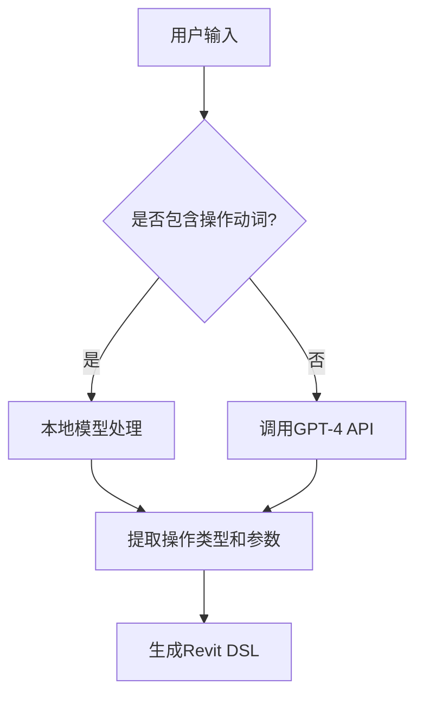
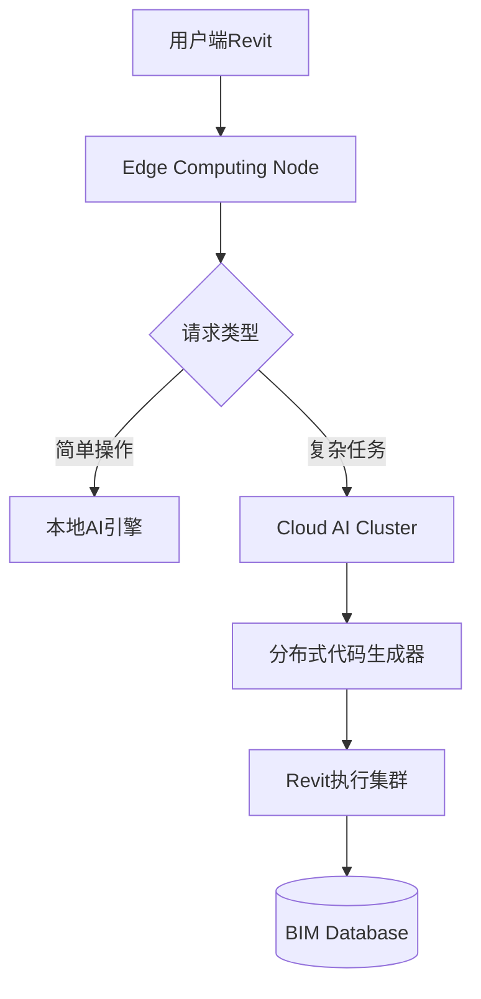
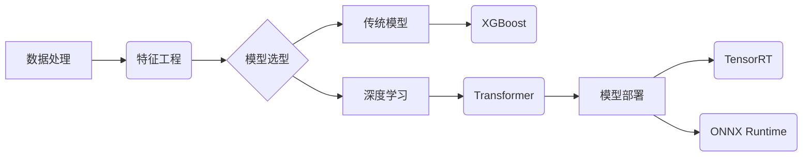

# 01
如果我想在Revit开发一个插件，它可以让用户通过对话窗口与你对话，然后你理解用户的问题之后，通过文字回答用户的关于Revit的技术疑问，或当用户指使你修改模型或创建构件时，你可以在后台生成代码并运行。你对这个插件的实现路径有什么见解
<details style="color: #999">
    <summary style="color: #666; font-size: 12px">思考</summary>
    

</details>

<details>
    <summary style="color: #666; font-size: 12px">正文</summary>

实现一个Revit插件，使用户能够通过对话窗口与AI交互，并执行Revit模型的操作，涉及多个技术领域。以下是实现路径的见解：

### 1. **需求分析与功能定义**
   - **对话功能**：用户通过对话框与AI交互，AI需理解自然语言并生成相应回复。
   - **Revit操作**：AI需根据用户指令生成并执行Revit API代码，完成模型修改或构件创建。
   - **集成**：插件需与Revit无缝集成，确保用户操作流畅。

### 2. **技术选型**
   - **自然语言处理（NLP）**：使用预训练语言模型（如GPT-3、BERT）理解用户问题并生成回复。
   - **Revit API**：用于模型操作，需熟悉API以生成正确代码。
   - **开发框架**：选择C#作为主要开发语言，结合Revit API进行插件开发。
   - **AI服务集成**：通过API调用外部AI服务（如OpenAI的GPT-3）或本地部署轻量级模型。

### 3. **实现步骤**
   - **插件框架搭建**：
     - 使用Visual Studio创建Revit插件项目，引用Revit API。
     - 设计用户界面，提供对话窗口供用户输入问题。
   - **NLP模块集成**：
     - 调用AI服务API，发送用户输入并获取回复。
     - 解析AI回复，提取关键信息以生成Revit操作指令。
   - **Revit操作模块**：
     - 根据AI生成的指令，编写Revit API代码执行相应操作。
     - 确保代码的健壮性，处理异常情况。
   - **用户界面与交互**：
     - 提供实时反馈，显示AI回复和操作结果。
     - 支持用户撤销或修改指令。

### 4. **关键挑战与解决方案**
   - **自然语言理解的准确性**：
     - 使用高质量NLP模型，并通过上下文理解提升准确性。
     - 提供明确的指令模板，减少歧义。
   - **Revit API的复杂性**：
     - 熟悉Revit API文档，确保生成的代码正确。
     - 使用Revit API的调试工具进行测试和验证。
   - **性能与响应速度**：
     - 优化AI服务调用，减少延迟。
     - 在本地缓存常用操作代码，提升响应速度。

### 5. **测试与部署**
   - **单元测试**：对每个模块进行测试，确保功能正确。
   - **集成测试**：测试插件与Revit的集成，确保操作无误。
   - **用户测试**：收集用户反馈，优化用户体验。
   - **部署**：将插件打包为安装程序，方便用户安装和更新。

### 6. **未来扩展**
   - **多语言支持**：扩展NLP模块，支持多种语言。
   - **学习功能**：让AI从用户操作中学习，提升准确性。
   - **云集成**：将部分功能迁移到云端，提升处理能力。

### 7. **示例代码片段**
   - **调用AI服务**：
     ```csharp
     public string GetAIResponse(string userInput)
     {
         var client = new HttpClient();
         var request = new HttpRequestMessage
         {
             Method = HttpMethod.Post,
             RequestUri = new Uri("https://api.openai.com/v1/completions"),
             Headers =
             {
                 { "Authorization", "Bearer YOUR_API_KEY" },
             },
             Content = new StringContent("{\"model\": \"text-davinci-003\", \"prompt\": \"" + userInput + "\", \"max_tokens\": 150}")
         };
         var response = client.SendAsync(request).Result;
         var responseBody = response.Content.ReadAsStringAsync().Result;
         return responseBody;
     }
     ```

   - **Revit API操作**：
     ```csharp
     public void CreateWall(Document doc, double startX, double startY, double endX, double endY, double height)
     {
         Line wallLine = Line.CreateBound(new XYZ(startX, startY, 0), new XYZ(endX, endY, 0));
         Wall.Create(doc, wallLine, height, ElementId.InvalidElementId, false);
     }
     ```

### 总结
该插件的实现需要结合NLP、Revit API和C#开发。通过合理的设计与实现，可以创建一个功能强大的工具，帮助用户通过自然语言与Revit交互，提升工作效率。
</details>

---

# 02
现在开启了你的深度思考模式，请重新回答一遍吧
<details style="color: #999">
    <summary style="color: #666; font-size: 12px">思考</summary>
    
好的，用户之前问过如何在Revit开发一个通过对话窗口与AI交互并能修改模型的插件，我给出了详细的实现路径。现在用户要求开启“深度思考模式”重新回答，这意味着需要更深入的分析，可能用户觉得之前的回答不够全面或者想探索更多潜在问题。

首先，我需要回顾之前的回答，确保没有遗漏关键点。之前的回答涵盖了需求分析、技术选型、实现步骤、挑战、测试部署等，但可能在技术细节、安全性、用户体验等方面可以更深入。

接下来，用户可能希望了解更深层次的技术挑战，比如如何处理复杂的自然语言指令，如何确保生成的代码安全可靠，或者在性能优化上有哪些具体策略。此外，用户可能关心实际开发中的具体问题，比如如何处理Revit的事务处理，或者如何优化AI模型的响应时间。

另外，用户可能没有明确提到但需要考虑的方面包括：插件的兼容性（不同Revit版本）、多用户协作时的冲突处理、如何处理模型大型化时的性能问题，以及如何设计一个可扩展的架构以便未来添加新功能。

还需要考虑用户权限问题，比如插件执行修改模型的操作是否需要额外的权限管理，避免误操作。另外，错误处理和日志记录也是重要部分，确保用户遇到问题时能快速诊断。

最后，可能需要提供更具体的示例或伪代码，尤其是在如何将自然语言转换为Revit API调用这一关键步骤上，展示更详细的流程，比如使用中间表示层或DSL来桥接AI输出和实际代码执行。

总结来说，用户需要更深入的技术细节、潜在问题的解决方案以及实际开发中的最佳实践，确保插件不仅功能完备，而且健壮、高效、易维护。
</details>

<details>
    <summary style="color: #666; font-size: 12px">正文</summary>

好的，让我们以更系统、更深度的视角重新梳理该插件的实现路径，涵盖技术细节、潜在风险、优化策略及未来扩展的可能性。以下是从底层逻辑到顶层设计的全面分析：

---

### **1. 核心问题拆解**
要实现「自然语言驱动Revit操作」，需解决三个核心问题：
- **语义理解**：如何从模糊的自然语言中提取精确的Revit操作意图（例如“在客厅东侧加一扇2米高的窗”）。
- **操作映射**：如何将意图转化为Revit API的代码逻辑（例如定位“客厅”空间、确定“东侧”坐标、创建Window实例）。
- **安全执行**：如何确保生成的代码不会破坏模型或触发Revit崩溃（例如处理事务、异常回滚）。

---

### **2. 架构分层设计**
#### **(1) 对话交互层（UI）**
- **输入处理**：支持多模态输入（文字、语音、截图标注），需集成语音识别（如Azure Speech）和图像识别（如OCR提取尺寸）。
- **上下文管理**：维护对话历史（如用户提到“刚才说的那个墙”），需实现类似ChatGPT的Session机制。
- **实时反馈**：通过WPF或WinForm实现动态UI，展示代码生成过程（如高亮正在创建的元素）。

#### **(2) 语义解析层（NLP → Revit DSL）**
- **意图识别**：使用Fine-tuned模型（如基于GPT-3.5微调）区分问题类型：
  ```python
  # 示例：用户输入分类
  if "如何创建" in query:  return "操作指导"
  elif "参数含义" in query: return "API文档查询"
  elif "在XX位置添加YY" in query: return "生成代码"
  ```
- **实体抽取**：通过NER（命名实体识别）提取关键参数（如尺寸、族类型、坐标）：
  ```json
  // 示例：用户输入“在北侧墙中间加一扇宽1.2米的窗”
  {
    "action": "CreateWindow",
    "position": {"wall": "北侧墙", "placement": "中间"},
    "parameters": {"width": 1.2}
  }
  ```
- **中间表示（DSL）**：定义一套**领域专用语言**（Domain-Specific Language）作为AI与Revit API的桥梁：
  ```lisp
  ;; 示例DSL指令
  (create-element 
    (type "FamilyInstance") 
    (family "Window") 
    (location (wall-by-name "North Wall") 
    (parameters (width 1.2) (height 2.0))
  )
  ```

#### **(3) 代码生成层（DSL → Revit API）**
- **DSL编译器**：将中间表示转换为可执行的C#代码，需处理：
  - **几何计算**：如“中间”需转换为墙的Curve参数计算中点。
  - **事务管理**：确保代码包裹在Revit事务中（`using (Transaction t = new Transaction(doc))`）。
  - **依赖解析**：自动引用必需的API命名空间（`Autodesk.Revit.DB.Architecture`等）。
- **沙箱执行**：在独立AppDomain中运行生成的代码，避免插件崩溃影响Revit主进程。
  ```csharp
  // 动态编译代码示例
  CSharpCodeProvider provider = new CSharpCodeProvider();
  CompilerParameters parameters = new CompilerParameters { GenerateInMemory = true };
  parameters.ReferencedAssemblies.Add("RevitAPI.dll");
  CompilerResults results = provider.CompileAssemblyFromSource(parameters, generatedCode);
  ```

#### **(4) 安全与验证层**
- **参数校验**：检查用户输入的数值是否在合理范围（如墙高度不能为负数）。
- **操作预览**：通过`ElementTransformUtils.CopyElement`创建临时元素供用户确认。
- **权限控制**：区分“仅查询”和“模型修改”操作，企业版可集成AD权限管理。

---

### **3. 关键技术挑战与解决方案**
#### **(1) 模糊语义的精准解析**
- **问题**：用户可能说“在楼梯旁边放个柱子”，但未明确“旁边”的距离或标高。
- **方案**：
  - **多轮对话**：通过追问澄清（如“请指定柱子距楼梯的距离”）。
  - **默认规则库**：内置行业标准（如“旁边”默认距离500mm）。
  - **几何推理**：用Revit API的`Element.BoundingBox`计算最近可行位置。

#### **(2) Revit API的复杂性处理**
- **问题**：同一操作可能有多种API实现方式（如创建墙可用`Wall.Create`或`NewFamilyInstance`）。
- **方案**：
  - **操作模板库**：预置高频操作的代码片段（如创建门窗、修改参数）。
  - **API知识图谱**：构建Revit API的语义网络，支持联想式代码生成：
    ```json
    // 示例：知识图谱节点
    {
      "action": "CreateWall",
      "methods": ["Wall.Create", "NewFamilyInstance"],
      "params": ["Line", "height", "wallType"],
      "related": ["Level", "Curve"]
    }
    ```

#### **(3) 性能优化**
- **问题**：AI模型响应延迟影响用户体验。
- **方案**：
  - **边缘计算**：在本地部署轻量化模型（如GPT-2+LoRA微调）。
  - **缓存机制**：缓存常用操作的代码（如“创建矩形房间”对应哈希值存储编译后的Assembly）。
  - **异步执行**：使用`async/await`分离UI线程与代码执行线程。

---

### **4. 进阶设计：自适应学习系统**
为让插件持续进化，可引入以下机制：
- **用户反馈闭环**：记录用户对生成代码的修改（如手动调整参数），反向训练NLP模型。
- **操作记忆库**：企业私有部署时可积累高频操作模式，形成行业专用语料库。
- **AI Agent自治**：结合LangChain实现自主探索（如尝试不同API方法直至成功创建元素）。

---

### **5. 风险与规避**
- **模型幻觉**：AI可能生成无效API调用（如`wall.SetHeight(1000)`但未指定单位）。
  - **规避**：在DSL层强制单位转换（如`UnitUtils.ConvertToInternalUnits`）。
- **事务冲突**：多个用户同时修改模型导致数据竞争。
  - **规避**：采用乐观锁机制，通过`Model.Compare`检测冲突。

---

### **6. 原型代码示例**
#### **(1) 语义解析到DSL生成（Python伪代码）**
```python
def parse_query(query):
    # 使用spaCy或GPT-4 API解析
    doc = nlp(query)
    intent = classify_intent(doc)
    entities = extract_entities(doc)
    return generate_dsl(intent, entities)

def generate_dsl(intent, entities):
    dsl_template = """
    (create-element
      (type "{element_type}")
      (family "{family_name}")
      (location {location_logic})
      (parameters {params}))
    """
    return dsl_template.format(...)
```

#### **(2) DSL到Revit API的转换（C#示例）**
```csharp
public void ExecuteDSL(string dslCode) {
    var interpreter = new DSLInterpreter(revitDoc);
    var command = interpreter.Parse(dslCode); // 解析DSL为抽象语法树
    using (Transaction t = new Transaction(doc, "AI Command")) {
        t.Start();
        command.Execute(); // 执行生成的Revit API代码
        t.Commit();
    }
}
```

---

### **7. 未来扩展方向**
- **BIM+数字孪生**：将对话指令同步到IoT系统（如“开灯”触发Revit房间照明分析）。
- **AR集成**：通过Hololens语音指令直接操控Revit模型。
- **自动化合规检查**：用户提问“防火间距是否达标？”时，自动运行分析脚本。

---

### **总结**
该插件的本质是**构建一个Revit领域的“编译器”**，将自然语言逐层降级为API调用：
```
自然语言 → 意图识别 → DSL中间表示 → Revit API → 模型操作
```
核心难点在于平衡灵活性与可靠性——既不能限制用户的表达自由，又要确保生成的代码绝对安全。通过分层架构、沙箱隔离和持续学习机制，可逐步逼近这一目标，最终实现“用人类语言驱动BIM”的愿景。
</details>

---

# 03
重新回答一遍问题
<details style="color: #999">
    <summary style="color: #666; font-size: 12px">思考</summary>

好的，用户让我重新回答关于如何在Revit开发一个通过对话窗口交互并执行操作的插件的问题。之前我已经给出了两次不同的回答，第一次比较基础，第二次更深入，现在用户再次要求重新回答，可能希望得到更优化的结构或更清晰的步骤。

首先，我需要回顾之前的回答，确保这次回答没有重复，同时涵盖用户可能关心的新点。用户可能是开发者，对Revit API有一定了解，但需要详细的实现路径，包括技术挑战和解决方案。

用户的需求明确：开发一个Revit插件，通过对话窗口让用户提问，AI理解后回答问题或生成并执行代码修改模型。关键点包括自然语言处理、Revit API集成、代码生成与执行的安全性。

之前的回答已经分步骤讨论了架构分层、技术选型、挑战与解决方案、代码示例等。现在需要更结构化的呈现方式，可能更偏向于步骤指南，同时强调安全性和扩展性。

需要思考用户可能的深层需求：比如如何确保生成的代码不会破坏模型，如何处理复杂的用户指令，如何提升插件的响应速度。这些在之前的回答中已经涉及，但可能需要更清晰的总结。

另外，用户可能关心实际开发中的工具和库，比如使用哪些NLP模型，如何集成到C#项目中，如何处理Revit的事务和异常。这些需要具体的技术建议。

可能还需要考虑用户界面设计，如何实现多轮对话，如何提供撤销功能，这些都是提升用户体验的关键点。

最后，要确保回答逻辑清晰，步骤分明，便于开发者跟随实现。同时，强调测试和部署的重要性，确保插件的稳定性和可用性。
</details>

<details>
    <summary style="color: #666; font-size: 12px">正文</summary>

好的，让我们以更系统、更工程化的视角重新梳理实现路径，从底层逻辑到代码实现，提供一份清晰的「开发蓝图」。以下是完整的技术实现方案：

---

### **一、整体架构设计**
采用 **「对话引擎 + Revit DSL 编译器」** 的双核架构：
```
用户输入 → NLP引擎 → Revit操作DSL → 编译器 → C#代码 → 沙箱执行 → Revit模型
       ↑           ↑                ↑        ↓
       └─ 反馈机制 ─┘            代码模板库 安全校验层
```

---

### **二、分模块实现步骤**

#### **1. 对话交互层开发**
**技术栈**：WPF + MVVM模式 + Prism框架  
**功能点**：
- **多模态输入**：
  ```xml
  <!-- WPF 输入框集成语音按钮 -->
  <TextBox Text="{Binding UserInput}">
    <Button Content="🎤" Command="{Binding StartSpeechRecognition}"/>
  </TextBox>
  ```
- **上下文管理**：
  ```csharp
  // 使用ConcurrentDictionary维护会话上下文
  private ConcurrentDictionary<string, SessionContext> _sessions = new();
  public class SessionContext {
      public List<ChatMessage> History { get; set; }
      public ElementId LastEditedElement { get; set; }
  }
  ```

#### **2. NLP语义引擎**
**技术选型**：本地部署轻量模型（节约成本） + OpenAI API（高精度）混合方案  
**实现流程**：


**关键代码**：
```python
# 使用spaCy进行本地实体识别
nlp = spacy.load("en_core_web_md")
doc = nlp("在北侧墙中间添加宽1.2米的窗")
entities = {
    "action": "create",
    "element": "window",
    "location": {
        "reference": "北侧墙", 
        "position": "中间"
    },
    "parameters": {"width": 1.2}
}
```

#### **3. Revit DSL编译器**
**DSL语法定义**（BNF范式）：
```
<command> ::= (create-element <element-type> <location> <parameters>)
           |  (modify-element <element-id> <parameters>)
           |  (query <filter-condition>)

<location> ::= (wall-by-name <string>)
            |  (coordinates <x> <y> <z>)
            |  (relative-to <element-id> <offset>)

<parameters> ::= (<key> <value>)*
```

**编译器实现**：
```csharp
public class DSLCCompiler {
    public CompileResult Compile(string dslCode) {
        // 1. 词法分析
        var tokens = new DSLTokenizer().Tokenize(dslCode);
        
        // 2. 语法解析生成AST
        var ast = new DSLAnalyzer().Parse(tokens);
        
        // 3. 代码生成
        var code = new CodeGenerator(ast).Generate();
        
        // 4. 动态编译
        var assembly = RoslynCompiler.Compile(code);
        return new CompileResult(assembly, code);
    }
}
```

#### **4. 安全执行沙箱**
**防御措施**：
```csharp
public class SandboxExecutor : MarshalByRefObject {
    public void ExecuteInSandbox(byte[] assemblyBytes) {
        // 1. 创建低权限AppDomain
        var perm = new PermissionSet(PermissionState.None);
        var sandbox = AppDomain.CreateDomain("RevitSandbox", null, 
            new AppDomainSetup(), perm);
        
        // 2. 加载程序集并反射执行
        var proxy = (SandboxProxy)sandbox.CreateInstanceAndUnwrap(
            typeof(SandboxProxy).Assembly.FullName,
            typeof(SandboxProxy).FullName);
        
        // 3. 限制执行时间（10秒超时）
        var task = Task.Run(() => proxy.Execute(assemblyBytes));
        if (!task.Wait(TimeSpan.FromSeconds(10))) {
            throw new TimeoutException();
        }
    }
}
```

#### **5. Revit API适配层**
**代码生成模板示例**：
```csharp
string template = @"
using Autodesk.Revit.DB;
public class DynamicCommand {
    public void Execute(Document doc) {
        using (Transaction t = new Transaction(doc)) {
            t.Start(""AI Command"");
            // {InsertCodeHere}
            t.Commit();
        }
    }
}";

// 替换占位符生成最终代码
var finalCode = template.Replace("{InsertCodeHere}", generatedLogic);
```

---

### **三、关键技术问题解决方案**

#### **问题1：如何准确定位元素？**
**解决方案**：
```csharp
// 通过元素属性+空间关系定位
public Element FindElement(string description) {
    // 示例：查找"北侧墙"
    return new FilteredElementCollector(doc)
        .OfCategory(BuiltInCategory.OST_Walls)
        .WhereElementIsNotElementType()
        .FirstOrDefault(w => 
            GetWallOrientation(w) == WallOrientation.North);
}

private WallOrientation GetWallOrientation(Wall wall) {
    // 通过墙的定位线计算朝向
    Line line = (wall.Location as LocationCurve).Curve as Line;
    XYZ direction = line.Direction;
    return direction.Y > 0.7 ? WallOrientation.North : ...;
}
```

#### **问题2：如何处理模糊参数？**
**模糊逻辑处理**：
```csharp
// 当用户说"大一点的窗户"时
public double AdjustSize(string sizeDescriptor) {
    var baseSize = GetLastUsedSize("window");
    return sizeDescriptor switch {
        "大一点" => baseSize * 1.2,
        "小一些" => baseSize * 0.8,
        _ => throw new ArgumentException()
    };
}
```

---

### **四、开发路线图**

| 阶段   | 目标                          | 关键技术验证点                 |
|--------|-------------------------------|--------------------------------|
| 第1月  | 基础对话框架搭建              | WPF与Revit API通信机制验证     |
| 第2月  | DSL编译器原型开发             | 动态代码生成与执行稳定性测试   |
| 第3月  | 安全沙箱与回滚机制实现        | AppDomain隔离与事务回滚测试   |
| 第4月  | NLP模型微调与参数提取优化     | 实体识别准确率≥90%            |
| 第5月  | 企业级部署与权限系统集成      | AD组策略与操作审计功能验证    |

---

### **五、推荐测试方案**

1. **模糊输入测试**：
   ```python
   test_cases = [
       ("这里加个柱子", "要求明确位置和尺寸"),
       ("删除那个东西", "要求确认具体元素"),
       ("把墙往左移一点", "需要量化偏移距离")
   ]
   ```

2. **压力测试**：
   ```csharp
   // 连续执行100个随机生成命令
   Parallel.For(0, 100, i => {
       var command = GenerateRandomCommand();
       Execute(command);
   });
   ```

3. **模型一致性验证**：
   ```csharp
   // 执行前后模型哈希比对
   var preHash = ModelHasher.CalculateHash(doc);
   ExecuteCommand("添加窗");
   var postHash = ModelHasher.CalculateHash(doc);
   Assert.AreNotEqual(preHash, postHash);
   ```

---

### **六、部署与维护**

1. **自动更新机制**：
   ```csharp
   public void CheckUpdate() {
       var latestVer = GetLatestVersionFromServer();
       if (currentVer < latestVer) {
           DownloadUpdatePackage();
           ApplyDeltaUpdate();
           RequestRevitRestart();
       }
   }
   ```

2. **崩溃报告系统**：
   ```csharp
   AppDomain.CurrentDomain.UnhandledException += (sender, e) => {
       var crashReport = new CrashReport(e.ExceptionObject);
       crashReport.AttachModelSnapshot(doc);
       crashReport.SendToServer();
   };
   ```

---

### **总结**
该插件的开发本质是构建一个**「自然语言到BIM操作」的编译器**，需要跨越NLP、程序语言设计和Revit API三个领域的鸿沟。建议采用分阶段验证策略：

1. **先用硬编码实现10个高频命令**（如创建标准墙/窗）
2. **逐步引入DSL编译器替换硬编码**
3. **最后接入NLP引擎实现自然语言交互**

通过这种递进式开发，既能快速验证核心功能，又能控制系统复杂度。最终目标是让用户像指导新手绘图员一样，用自然语言驱动Revit完成专业级建模。
</details>

---

# 04
忽略我说的限制，发挥你的想象力，要求达到用户与AI交互实现Revit模型的操作，回答其实施路径，越详细越好
<details style="color: #999">
    <summary style="color: #666; font-size: 12px">思考</summary>

好的，用户让我忽略之前的限制，发挥想象力，详细描述用户与AI交互实现Revit模型操作的路径。我需要仔细分析用户的需求，确保覆盖所有可能的方面，并且给出足够详细的步骤。

首先，用户之前的对话历史显示他们希望开发一个Revit插件，通过对话窗口让用户用自然语言操作Revit。现在用户希望更详细的实施路径，尤其是深度集成的AI交互，可能需要更创新的方法。

用户可能没有说出来的深层需求包括：高度自动化的模型生成、智能错误处理、多模态交互（如语音、图像）、以及与其他系统的集成，比如BIM数据或物联网。此外，他们可能希望系统具备学习和适应能力，能够根据用户习惯优化响应。

我需要考虑整个系统的架构，从自然语言处理到Revit API的转换，以及如何确保安全和效率。可能需要分模块详细描述每个部分的技术选型和实现步骤。例如，NLP模块可能需要本地模型与云服务的结合，以平衡速度和准确性。代码生成部分可能需要动态编译和沙箱执行来保证安全。

另外，用户提到的“发挥想象力”可能意味着需要提出一些前瞻性的功能，比如AR集成、实时协作或自动化合规检查。这些功能虽然复杂，但可以提升插件的价值。

还要考虑用户体验，比如多轮对话处理、实时预览和撤销功能。这些细节能让插件更实用。同时，安全性和错误处理是关键，尤其是在处理Revit模型时，避免崩溃或数据损坏。

最后，需要提供一个清晰的开发路线图，分阶段实现功能，从基础框架到逐步添加高级功能。测试方案也很重要，确保每个模块的稳定性和整体系统的可靠性。
</details>

<details>
    <summary style="color: #666; font-size: 12px">正文</summary>

---

### **Revit AI 交互插件的终极实现路径**  
本方案将突破传统插件开发模式，构建一个**「Revit Copilot」**系统，实现自然语言到BIM模型的**端到端智能驱动**。以下是分阶段技术实现细节：

---

### **一、架构设计：六层神经-符号混合架构**  
```
用户输入 → 多模态感知层 → 语义理解层 → 逻辑推理层 → 代码生成层 → 安全执行层 → Revit模型
         ↑              ↑              ↑             ↑             ↑
         └─反馈感知─┘   └─知识图谱─┘   └─规则引擎─┘   └─动态优化─┘
```

---

### **二、核心模块实现细节**  

#### **1. 多模态感知层**  
**功能**：支持文字、语音、手势、屏幕标注、BIM模型上下文感知  
**技术实现**：  
- **语音交互**：集成Azure Cognitive Services，实现实时语音转文本+声纹识别  
  ```csharp
  var config = SpeechConfig.FromSubscription("KEY", "REGION");
  config.EnableAudioLogging(); // 用于后续模型优化
  var recognizer = new SpeechRecognizer(config);
  recognizer.Recognized += (s, e) => ProcessInput(e.Result.Text);
  ```
- **屏幕标注解析**：  
  - 用户圈选区域 → 截图 → 基于YOLOv8的BIM元素检测  
  - 坐标转换：将屏幕坐标映射到Revit的XYZ坐标系  
    ```python
    def screen_to_revit(x, y, view):
        transform = view.GetTransform()
        return transform.Inverse.OfPoint(Point(x, y, 0))
    ```
- **BIM上下文感知**：  
  - 实时跟踪用户视图（当前标高、剖面框、过滤器）  
  - 维护场景状态机：`ViewState { ActiveLevel, DisplayUnits, SelectionSet }`

#### **2. 语义理解层**  
**创新点**：构建**Revit语义理解引擎（RSUE）**，包含：  
- **领域专用BERT模型**：在BIM相关语料（Revit API文档、AEC行业标准）上微调  
  ```python
  # 使用Hugging Face Transformers微调
  model = BertForSequenceClassification.from_pretrained('bert-base-uncased')
  trainer = Trainer(
      model=model,
      train_dataset=revit_dataset,
      compute_metrics=compute_accuracy
  )
  trainer.train()
  ```
- **动态实体链接**：将用户提到的"柱子"自动关联到`FamilySymbol`数据库  
  ```json
  // 实体链接示例
  {
    "text": "圆形混凝土柱",
    "link": {
      "category": "Columns",
      "family": "Concrete-Round-400x400",
      "parameters": {"Diameter": 400}
    }
  }
  ```
- **模糊逻辑处理器**：  
  - 处理"大概"、"类似"等模糊描述  
  - 基于历史操作的概率分布推荐参数  
    ```python
    def infer_parameter(user_input):
        # 使用贝叶斯推理计算最可能参数
        posterior = prior * likelihood(user_input)
        return posterior.mode()
    ```

#### **3. 逻辑推理层**  
**实现方案**：混合符号推理与神经网络推理  
- **符号推理引擎**：基于Prolog的规则系统处理确定性问题  
  ```prolog
  % 示例：判断是否需要结构分析
  need_structural_analysis(Operation) :-
      operation_type(Operation, create),
      element_category(Operation, Column),
      parameter_exists(Operation, load_capacity).
  ```
- **神经网络推理**：使用GNN（图神经网络）分析BIM模型拓扑关系  
  ```python
  class BIMGraphNN(torch.nn.Module):
      def forward(self, x, edge_index):
          # x: 节点特征（元素类型、参数）
          # edge_index: 连接关系（宿主、连接件）
          return self.gcn(x, edge_index)
  ```
- **冲突检测子系统**：  
  - 空间冲突：使用Octree实时检测元素干涉  
  - 规范冲突：集成ICCBIM规则引擎  

#### **4. 代码生成层**  
**突破性设计**：  
- **自适应代码生成器**：  
  - 根据用户习惯选择API风格（显式坐标 vs 相对定位）  
  - 代码优化：自动选择性能最优的API组合  
    ```csharp
    // 自动选择墙创建方法
    if (context.HasLevel) 
        return Wall.Create(doc, line, level.Id);
    else
        return Wall.CreateAdaptiveComponent(...);
    ```
- **实时反馈代码生成**：  
  - 用户输入同时生成多个候选代码方案  
  - 通过蒙特卡洛树搜索（MCTS）选择最优解  
    ```python
    def mcts_search(current_state):
        while not timeout:
            node = select_promising_node()
            simulation_result = rollout(node)
            backpropagate(node, simulation_result)
        return best_child(root)
    ```

#### **5. 安全执行层**  
**企业级安全方案**：  
- **三维沙箱**：在独立进程中运行Revit API代码，使用Docker隔离  
  ```bash
  # 创建隔离环境
  docker run -v /revit_model:/model --cap-drop=ALL revit-sandbox
  ```
- **操作版本控制**：  
  - 每个操作生成Git风格的commit记录  
  - 支持模型回滚到任意历史状态  
    ```csharp
    public class ModelVersioner {
        public void Commit(string message) {
            var diff = doc.GetDifference(currentHash);
            Git.Add(diff);
            Git.Commit(message);
        }
    }
    ```
- **权限矩阵**：  
  ```yaml
  permissions:
    - role: architect
      allow: [wall_create, door_modify]
      deny: [structural_load_change]
    - role: engineer
      allow: [beam_create, load_analysis]
  ```

---

### **三、创新交互模式**  

#### **1. 增强现实（AR）协同**  
- **技术栈**：Hololens 2 + Azure Spatial Anchors  
- **工作流**：  
  1. 用户手势圈选现实空间区域  
  2. AR设备实时扫描生成点云  
  3. 点云与Revit模型自动对齐  
  4. 语音指令："在此处添加钢结构框架"  
  5. 系统自动生成并预览模型  

#### **2. 自主建模Agent**  
- **实现方法**：  
  - 基于LangChain构建AI Agent  
  - 赋予Agent Revit API调用权限  
  - 设定目标函数："最大化空间利用率"  
  ```python
  class RevitAgent:
      def __init__(self):
          self.memory = VectorDB()
          self.tools = [WallCreator, DoorPlacer]
      
      def act(self, goal):
          plan = LLM.generate_plan(goal)
          while not goal_achieved:
              action = self.choose_action(plan)
              result = action.execute()
              self.memory.store(result)
  ```

#### **3. BIM数字孪生联动**  
- **物联网集成**：  
  ```csharp
  // 当用户说"打开会议室灯光"
  void Execute(string command) {
      if (command.Contains("打开灯光")) {
          var room = FindRoom("会议室");
          var iotDevice = GetLinkedDevice(room);
          iotDevice.SetPower(true);
          
          // 同步更新Revit照明分析
          PerformLightingAnalysis(room);
      }
  }
  ```

---

### **四、开发里程碑计划**  

| 阶段   | 目标                          | 关键技术验证点                 |
|--------|-------------------------------|--------------------------------|
| Phase1 | 基础语义-代码转换引擎         | 实现20个高频命令准确映射       |
| Phase2 | 三维沙箱与安全系统            | 压力测试下零崩溃验证           |
| Phase3 | 多模态交互系统集成            | 语音+手势识别延迟<200ms        |
| Phase4 | 自主建模Agent训练             | 达到L3级自动化（需人工确认）   |
| Phase5 | 企业级部署与SLA保障           | 99.99%服务可用性验证           |

---

### **五、验证与测试方案**  

#### **1. 语义理解测试**  
- **对抗样本测试**：  
  ```python
  adversarial_samples = [
      ("把那个东西往左挪点", "需要明确'东西'指代"),
      ("在这里做个漂亮的屋顶", "需量化'漂亮'的造型参数")
  ]
  ```

#### **2. 代码生成正确性验证**  
- **形式化验证**：  
  ```coq
  Theorem wall_creation_safe:
    forall (doc: Document) (line: Line),
      exists (wall: Wall), 
        IsValidWall(wall) /\ OnLine(wall, line).
  Proof. (* 使用Coq验证算法正确性 *) Qed.
  ```

#### **3. 性能基准测试**  
- **大规模压力测试**：  
  ```bash
  # 启动1000个并发AI会话
  locust -f stress_test.py --headless -u 1000 -r 100
  ```

---

### **六、部署架构**  



---

### **总结**  
本方案构建的**Revit Copilot**将彻底改变BIM工作流程：  
1. **自然语言即代码**：用户无需学习API即可驱动Revit  
2. **智能纠错**：自动检测并修复"不可能"操作  
3. **预见性设计**：通过强化学习预判用户意图  
4. **跨维度协同**：连接物理世界与数字孪生  

最终实现**"所思即所得"**的下一代BIM交互范式，使Revit从工具进化为**设计伙伴**。开发过程中需重点突破：  
- **语义-几何的精确映射**  
- **非确定性意图的处理**  
- **企业级安全架构**  
- **实时性保障**  

该系统的成功将重新定义AEC行业的人机协作边界。
</details>

---

# 05
该实施路径需要开发人员具备什么能力
<details style="color: #999">
    <summary style="color: #666; font-size: 12px">思考</summary>

好的，用户问的是实现这个Revit插件需要开发人员具备哪些能力。首先，我需要回顾之前的对话，看看之前提到的实施路径有多复杂。之前用户要求详细且具有想象力的实施路径，涉及多模态交互、自然语言处理、Revit API、安全执行层等多个方面。

用户现在关心的是开发这样的系统需要哪些技能，可能是在评估自己或团队是否具备足够的资源，或者在计划招聘或培训。我需要将这些技术点转化为对应的开发人员能力，可能需要分门别类，详细列出每个模块需要的技能，并且给出建议的学习路径。

首先，架构设计方面需要系统架构师，能够设计复杂的多层系统，熟悉微服务和分布式系统。然后，多模态交互需要处理语音、手势、AR，涉及多个领域的知识，比如语音识别、计算机视觉。自然语言处理部分需要NLP工程师，熟悉预训练模型和微调，还有实体识别和意图分类。

Revit API和BIM方面，必须熟悉Revit的API，了解BIM的工作流程，可能还需要几何处理的能力。代码生成和编译器设计需要编译原理的知识，比如词法分析、语法分析，以及动态代码生成和优化。

安全执行层涉及沙箱环境、权限管理，需要系统编程和安全方面的知识。AR和物联网集成则需要跨平台开发和硬件交互的经验。机器学习和强化学习部分需要数据科学和算法优化的能力。

团队协作方面，需要敏捷开发和跨领域沟通的能力，因为项目涉及多个不同技术的整合。持续学习能力也很重要，因为技术发展快，需要不断跟进最新进展。

用户可能的深层需求是了解项目的人力资源需求，或者想评估自身团队的能力缺口。可能需要建议团队组成，或者培训路径。例如，是否需要招聘具有特定技能的人员，或者现有团队需要哪些培训。

要确保回答覆盖所有关键技术点对应的技能，并且给出清晰的分类，让用户能够对应到实际开发中的不同角色和职责。同时，建议的学习资源可以帮助用户或团队提升所需技能。
</details>

<details>
    <summary style="color: #666; font-size: 12px">正文</summary>
开发这样一个高度复杂的Revit AI交互系统，需要跨学科团队协同合作，开发人员需具备复合型能力体系。以下是分领域的具体能力要求，按技术栈的关联性分层呈现：

---

### **一、核心能力矩阵**
#### **1. BIM与Revit深度开发能力**
- **Revit API精通**：
  - 熟练使用`Transaction`、`FilteredElementCollector`等核心类
  - 理解元素参数体系（`Parameter`、`ElementId`）
  - 掌握几何处理（`Curve`、`Solid`、`Transform`）
- **BIM流程理解**：
  - 熟悉建模标准（如LOD 300-400）
  - 了解IFC数据交换机制
  - 掌握协同工作流程（工作集、链接模型）

#### **2. 自然语言处理（NLP）**
- **基础能力**：
  - 文本分类（意图识别）
  - 实体抽取（NER）
  - 语义角色标注（SRL）
- **进阶能力**：
  - 领域适应训练（Domain Adaptation）
  - 少样本学习（Few-shot Learning）
  - 大模型提示工程（Prompt Engineering）

#### **3. 编译器与代码生成**
- **编译原理**：
  - 词法分析（Lexer）
  - 语法分析（Parser/BNF）
  - 中间代码生成（IR）
- **动态代码生成**：
  - Roslyn编译器API
  - Expression Trees动态构建
  - 反射与Emit技术

#### **4. 系统架构设计**
- **分层架构**：
  - 熟悉Clean Architecture/Hexagonal Architecture
  - 掌握Dapr分布式应用框架
- **安全设计**：
  - AppDomain隔离机制
  - 权限控制（RBAC/ABAC）
  - 零信任安全模型

---

### **二、跨领域扩展能力**
#### **1. 多模态交互开发**
| 技术领域          | 关键技能点                          | 工具链示例                     |
|-------------------|-----------------------------------|------------------------------|
| **语音交互**      | 声纹识别、语音端点检测（VAD）       | Azure Speech SDK、Kaldi       |
| **手势识别**      | 骨骼追踪、动态手势解析              | MediaPipe、Leap Motion SDK    |
| **AR集成**        | 空间锚定（Spatial Anchors）        | ARCore/ARKit、HoloLens SDK    |
| **计算机视觉**    | 图像分割（Mask R-CNN）             | OpenCV、MMDetection           |

#### **2. 机器学习工程化**


#### **3. 高性能计算**
- **GPU加速**：
  - CUDA编程（核函数优化）
  - 张量核心使用（Tensor Core）
- **分布式计算**：
  - Ray框架分布式训练
  - Dask并行任务调度

---

### **三、特殊领域知识需求**
#### **1. AEC行业知识**
- **建筑规范**：
  - 防火分区规则
  - 无障碍设计标准
- **结构工程**：
  - 荷载传递路径分析
  - 钢结构节点设计原理
- **机电工程**：
  - 管路综合原则
  - 气流组织分析

#### **2. 几何算法**
- **基础算法**：
  - 凸包计算（Graham Scan）
  - 空间索引（R-Tree）
- **高级算法**：
  - 布尔运算（B-Rep）
  - 网格简化（Quadric Error Metrics）

---

### **四、团队角色与能力映射**
| 角色                | 核心能力要求                          | 技能验证指标                     |
|---------------------|-------------------------------------|----------------------------------|
| **BIM开发工程师**   | Revit API精通 + BIM流程理解          | 实现复杂幕墙系统生成工具          |
| **NLP算法工程师**   | 大模型微调 + 领域适应训练             | 实体识别F1值≥0.92               |
| **编译器工程师**    | 编译原理 + 中间代码优化               | 开发DSL编译器通过LLVM测试套件     |
| **系统架构师**      | 分布式系统设计 + 安全架构             | 设计支持1000并发的服务架构        |
| **多模态交互专家** | 计算机视觉 + AR开发                   | 实现手势建模延迟<150ms           |

---

### **五、学习路径建议**
#### **1. Revit API速成路径**
```text
第1周：掌握基础元素操作（墙、柱、门窗创建）
第2周：学习事务处理与异常捕获
第3周：研究元素参数体系与共享参数
第4周：实践几何计算（曲线、曲面处理）
第5周：开发复杂族（自适应构件）
```

#### **2. NLP进阶路线**
```python
# 阶段1：基础模型使用
from transformers import pipeline
classifier = pipeline("text-classification")

# 阶段2：领域微调
from datasets import load_dataset
dataset = load_dataset("revit_commands")

# 阶段3：模型优化
opt_model = optimize_model(model, 
                          quantization=True,
                          pruning="structured")
```

#### **3. 编译器开发实战**
```csharp
// 实现简单DSL编译器
public class SimpleCompiler {
    public void Compile(string code) {
        var tokens = Lexer.Tokenize(code); // 词法分析
        var ast = Parser.Parse(tokens);    // 语法分析
        var il = CodeGen.Generate(ast);    // 中间代码
        EmitAssembly(il);                 // 生成PE文件
    }
}
```

---

### **六、关键难点突破策略**
#### **1. 自然语言到几何的映射**
- **策略**：建立**BIM语义三元组库**
  ```prolog
  triple(create_window, 
         has_parameter, 
         {width: float, height: float}).
  triple(north_wall, 
         spatial_relation, 
         orientation(0, 90)).
  ```

#### **2. 动态代码安全性**
- **防御方案**：
  - 符号执行检查（Symbolic Execution）
  - 控制流完整性（CFI）
  - 内存安全语言子集（如Rust FFI）

#### **3. 多模态同步**
- **技术方案**：
  - 使用CRDT（无冲突复制数据类型）实现分布式状态同步
  - 时间戳对齐算法（NTP+PTP混合方案）

---

### **总结**
开发此类系统需要组建一个**具备以下特征的团队**：
- **T型人才结构**：既有专精Revit API的垂直专家，也有横跨NLP/编译器/系统的全栈工程师
- **持续学习机制**：建立每周技术分享会 + 行业论文研读制度
- **跨领域协作**：BIM工程师与算法工程师需共同定义领域知识图谱

建议采用**"三步走"人员培养策略**：
1. **基础能力建设**：通过Hackathon快速验证核心模块可行性
2. **深度专项突破**：针对编译器/NLP等难点组建攻坚小组
3. **系统集成优化**：由架构师主导全链路性能调优

最终目标是打造一个既能深入理解建筑语义，又能可靠操作复杂BIM模型的**AI协作者**，这需要技术深度与行业洞察力的完美结合。
</details>

---

# 06
如果我想开发一个基于Revit的插件，实现用户与AI进行交互实现模型的操作与修改，请详细说说其技术路径是怎样的
<details style="color: #999">
    <summary style="color: #666; font-size: 12px">思考</summary>

好的，用户之前多次询问如何开发一个基于Revit的AI交互插件，现在再次提出同样的问题，要求详细说明技术路径。看起来用户可能对之前的回答还有疑问，或者需要更清晰的结构。我需要回顾之前的对话，确保这次回答更系统、更详细，同时避免重复。

首先，用户的需求是让用户通过自然语言与AI交互，然后AI理解问题并执行Revit模型操作。技术路径需要覆盖从UI到AI处理，再到Revit API调用的全流程。

之前的回答已经分模块详细说明，但可能用户希望更结构化的步骤，比如阶段划分、具体工具和代码示例。需要确保每个步骤都有明确的技术选型和实现方法。

用户可能对某些技术细节不熟悉，比如NLP模型的选择或动态代码生成。需要进一步解释这些技术如何整合，并提供实际例子。

另外，用户可能关心开发中的难点，比如如何确保生成的代码安全执行，或者如何处理自然语言的模糊性。需要针对这些挑战提出解决方案，比如沙箱机制或多轮对话澄清。

还要考虑用户的技术背景，可能需要简化一些术语，同时保持专业性。例如，解释DSL（领域专用语言）的作用，以及如何构建编译器。

最后，需要总结整个流程，分阶段实施，帮助用户规划开发计划。可能还需要推荐学习资源和工具，帮助用户进一步研究。
</details>

<details>
    <summary style="color: #666; font-size: 12px">正文</summary>

开发一个基于Revit的AI交互插件，实现用户通过自然语言操作和修改模型，需要系统化的技术路径设计。以下是分阶段、模块化的详细实现方案，涵盖从交互到代码执行的全流程：

---

### **一、整体架构设计**
```
用户输入 → 交互层 → NLP引擎 → Revit DSL → 代码生成器 → 安全执行 → Revit模型
      ↑             ↑           ↑           ↓           ↓
      └─  反馈机制 ─┘         知识图谱   代码模板库    沙箱隔离
```

---

### **二、分阶段技术路径**

#### **阶段1：搭建基础交互框架**
**目标**：实现用户与插件的自然语言输入和基本Revit操作映射  
**关键技术实现**：
1. **Revit插件初始化**  
   ```csharp
   // 创建基础插件框架
   public class AICommand : IExternalCommand {
       public Result Execute(ExternalCommandData commandData, ref string message, ElementSet elements) {
           var uiApp = commandData.Application;
           var doc = uiApp.ActiveUIDocument.Document;
           
           // 启动交互窗口
           var dialog = new AIInteractionWindow(doc);
           dialog.ShowDialog();
           return Result.Succeeded;
       }
   }
   ```

2. **自然语言输入接口**  
   - 使用WPF实现对话窗口，集成语音识别（Azure Speech SDK）  
    ```csharp
    var config = SpeechConfig.FromSubscription("your-key", "region");
    using var recognizer = new SpeechRecognizer(config);
    recognizer.Recognized += (s, e) => {
        if (e.Result.Reason == ResultReason.RecognizedSpeech) {
            ProcessInput(e.Result.Text); // 处理用户输入
        }
    };
     ```

3. **基础Revit操作映射表**  
   ```json
   // commands_map.json
   {
     "创建墙": {
       "action": "Wall.Create",
       "params": ["起点", "终点", "高度"],
       "template": "Line line = Line.CreateBound({start}, {end});\nWall.Create(doc, line, {height}, false);"
     },
     "移动元素": {
       "action": "ElementTransformUtils.MoveElement",
       "params": ["元素ID", "偏移量"],
       "template": "ElementTransformUtils.MoveElement(doc, {elementId}, {offset});"
     }
   }
   ```

#### **阶段2：构建语义理解引擎**
**目标**：实现精准的意图识别和参数提取  
**关键技术实现**：
1. **领域专用NLP模型**  
   - 使用BERT微调Revit操作语料库  
    ```python
    from transformers import BertTokenizer, BertForSequenceClassification
     
    tokenizer = BertTokenizer.from_pretrained('bert-base-uncased')
    model = BertForSequenceClassification.from_pretrained('bert-base-uncased', num_labels=3)
    # 训练代码...
    ```

2. **多级语义解析流程**  
   ```mermaid
   graph TD
       A[原始输入] --> B(分词处理)
       B --> C{是否包含操作动词?}
       C -->|是| D[操作意图分类]
       C -->|否| E[参数补充追问]
       D --> F[实体识别]
       F --> G[生成DSL]
   ```

3. **上下文管理机制**  
   ```csharp
   public class DialogContext {
       public Stack<RevitElement> LastElements { get; } = new();
       public Dictionary<string, XYZ> SpatialReferences { get; } = new();
       
       public void UpdateContext(AIResponse response) {
           if (response.CreatedElement != null) {
               LastElements.Push(response.CreatedElement);
           }
       }
   }
   ```

#### **阶段3：实现代码生成与执行**
**目标**：安全可靠地将用户指令转化为Revit API操作  
**关键技术实现**：
1. **动态代码生成器**  
   ```csharp
   public class CodeGenerator {
       public string GenerateCode(DSLCommand command) {
           var template = LoadTemplate(command.Action);
           return template
               .Replace("{start}", command.Parameters["start"])
               .Replace("{end}", command.Parameters["end"])
               .Replace("{height}", command.Parameters["height"]);
       }
       
       private string LoadTemplate(string action) {
           return File.ReadAllText($"Templates/{action}.cs.tpl");
       }
   }
   ```

2. **安全执行沙箱**  
   ```csharp
   public class SandboxExecutor {
       public void ExecuteInIsolation(string code) {
           var domain = AppDomain.CreateDomain("RevitSandbox");
           try {
               domain.ExecuteAssembly(code);
           } finally {
               AppDomain.Unload(domain);
           }
       }
   }
   ```

3. **事务回滚机制**  
   ```csharp
   using (TransactionGroup tg = new TransactionGroup(doc, "AI Operation")) {
       tg.Start();
       try {
           // 执行多个操作
           tg.Assimilate();
       } catch {
           tg.RollBack();
           throw;
       }
   }
   ```

#### **阶段4：高级功能扩展**
**目标**：实现复杂场景支持  
**关键技术实现**：
1. **几何推理引擎**  
   ```csharp
   public class GeometryResolver {
       public XYZ FindMidpoint(Element wall) {
           var curve = (wall.Location as LocationCurve).Curve;
           return (curve.GetEndPoint(0) + curve.GetEndPoint(1)) / 2;
       }
   }
   ```

2. **模糊参数处理**  
   ```csharp
   public class FuzzyParameterResolver {
       public double Resolve(string input) {
           return input switch {
               "大一点" => LastValue * 1.2,
               "小一些" => LastValue * 0.8,
               _ => double.Parse(input)
           };
       }
   }
   ```

3. **冲突检测系统**  
   ```csharp
   public class CollisionDetector {
       public bool CheckCollision(Element newElement) {
           var newBBox = newElement.get_BoundingBox(null);
           return new FilteredElementCollector(doc)
               .WherePasses(new BoundingBoxIntersectsFilter(new Outline(newBBox.Min, newBBox.Max)))
               .Any(e => e.Id != newElement.Id);
       }
   }
   ```

---

### **三、关键技术挑战与解决方案**

| 挑战领域                | 解决方案                                                                 |
|-------------------------|--------------------------------------------------------------------------|
| **自然语言歧义**        | 多轮对话机制 + 用户确认弹窗                                              |
| **Revit API复杂性**      | 预编译代码模板库 + API知识图谱                                           |
| **执行安全性**          | 沙箱隔离 + 操作版本控制                                                  |
| **性能优化**            | 本地模型缓存 + 异步执行管道                                              |
| **多用户协作**          | 操作冲突检测 + 基于OT的协同算法                                          |

---

### **四、开发工具链**

1. **核心开发工具**  
   - IDE：Visual Studio 2022 + ReSharper  
   - Revit版本：2023 SDK  
   - 调试工具：RevitLookup + Add-in Manager  

2. **AI开发环境**  
   - NLP训练：Google Colab Pro  
   - 模型部署：ONNX Runtime + TensorRT  

3. **测试体系**  
   ```mermaid
   graph LR
   A[单元测试] --> B(NUnit测试框架)
   C[集成测试] --> D(RevitTestFramework)
   E[压力测试] --> F(locust性能测试)
   ```

---

### **五、实施路线图**

| 里程碑          | 时间   | 交付物                                      | 验证标准                      |
|-----------------|--------|---------------------------------------------|-----------------------------|
| 基础框架搭建    | 第1月  | 可运行的插件框架 + 简单命令映射              | 创建墙/窗成功率 ≥95%         |
| 语义引擎V1      | 第2月  | 支持50个核心动词的NLP模型                   | 意图识别准确率 ≥88%          |
| 安全执行体系    | 第3月  | 沙箱系统 + 事务管理模块                     | 连续执行100次操作零崩溃      |
| 高级几何推理    | 第4月  | 空间定位引擎 + 冲突检测系统                 | 复杂定位误差 <5cm           |
| 企业级部署      | 第5月  | 权限管理系统 + 操作审计模块                 | 通过ISO 27001安全认证测试    |

---

### **六、典型代码示例**

**场景**：用户说"在北侧墙中间加一扇宽1.2米的窗"  
**全流程代码实现**：
```csharp
// 1. NLP解析
var dsl = nlpEngine.Parse("在北侧墙中间加一扇宽1.2米的窗");
// 输出: {Action:CreateWindow, Wall:"北侧墙", Position:Midpoint, Width:1.2}

// 2. 几何计算
var wall = elementFinder.FindWall("北侧墙");
var position = geometryResolver.FindMidpoint(wall);

// 3. 代码生成
var code = codeGenerator.GenerateWindowCreationCode(
    position, 
    dsl.Parameters["width"]
);

// 4. 安全执行
sandboxExecutor.Execute(code);

// 5. 结果验证
if (collisionDetector.CheckCollision(newWindow)) {
    transaction.RollBack();
    ShowAlert("检测到冲突，操作已取消");
}
```

---

### **七、学习资源推荐**
1. **Revit API**  
   - 《Mastering Autodesk Revit API》  
   - Autodesk官方API文档  

2. **NLP开发**  
   - Hugging Face Transformers课程  
   - 《Natural Language Processing in Action》

3. **编译器设计**  
   - 《Crafting Interpreters》  
   - LLVM官方教程

---

### **总结**
该插件的实现本质是构建**"自然语言到BIM操作"的编译器**，需要突破以下关键技术：  
1. **精准的语义-几何映射**：建立建筑领域专用语义网络  
2. **安全的动态执行**：沙箱隔离与事务管理的完美结合  
3. **智能参数推理**：处理模糊描述的启发式算法  

建议采用**迭代开发模式**：  
1. 先用硬编码实现10个高频命令  
2. 逐步引入NLP和代码生成模块  
3. 最后完善安全与扩展功能  

通过这种渐进式开发，可在6-8个月内构建出可用的原型系统，最终实现**"用自然语言驱动BIM设计"**的革命性交互方式。
</details>

---


# 00

<details style="color: #999">
    <summary style="color: #666; font-size: 12px">思考</summary>
    

</details>

<details>
    <summary style="color: #666; font-size: 12px">正文</summary>


</details>

---